# BE Layer Graph

> Auto-generated by /codebase-graph. Re-run to refresh.
> Last generated: 2026-06-05 (P-BEDOC-1 — added Tasks, Training, Marketing domains)

## be — Backend Layer Graph

```mermaid
graph LR

    subgraph auth ["Auth Domain"]
        auth_h["auth_handler.go"]
        auth_s["auth_service.go"]
        auth_r["auth_repo.go"]
        db_staff[("staff")]
        db_rt[("refresh_tokens")]
        redis_auth[("Redis: sessions")]
        auth_h --> auth_s
        auth_s --> auth_r
        auth_r --> db_staff
        auth_r --> db_rt
        auth_s --> redis_auth
    end

    subgraph products ["Products Domain"]
        prod_h["product_handler.go"]
        prod_s["product_service.go"]
        prod_r["product_repo.go"]
        db_prod[("products")]
        db_cat[("categories")]
        db_top[("toppings")]
        db_combo[("combos")]
        redis_prod[("Redis: product cache")]
        prod_h --> prod_s
        prod_s --> prod_r
        prod_r --> db_prod
        prod_r --> db_cat
        prod_r --> db_top
        prod_r --> db_combo
        prod_s --> redis_prod
    end

    subgraph orders ["Orders Domain"]
        order_h["order_handler.go"]
        order_s["order_service.go"]
        order_r["order_repo.go"]
        db_ord[("orders + order_items")]
        db_seq[("order_sequences")]
        redis_ord[("Redis: SSE events")]
        order_h --> order_s
        order_s --> order_r
        order_r --> db_ord
        order_r --> db_seq
        order_s --> redis_ord
    end

    subgraph groups ["Groups Domain"]
        group_h["group_handler.go"]
        group_s["group_service.go"]
        redis_grp[("Redis: group events")]
        group_h --> group_s
        group_s --> order_r
        group_s --> redis_grp
    end

    subgraph payments ["Payments Domain"]
        pay_h["payment_handler.go"]
        pay_s["payment_service.go"]
        pay_r["payment_repo.go"]
        db_pay[("payments")]
        redis_pay[("Redis: payment events")]
        pay_h --> pay_s
        pay_s --> pay_r
        pay_r --> db_pay
        pay_s --> redis_pay
    end

    subgraph tables ["Tables Domain"]
        table_h["table_handler.go"]
        table_r["table_repo.go"]
        db_tbl[("tables")]
        table_h -->|"direct — no service"| table_r
        table_r --> db_tbl
    end

    subgraph staff ["Staff Domain"]
        staff_h["staff_handler.go"]
        staff_s["staff_service.go"]
        staff_r["staff_repo.go"]
        db_stf[("staff")]
        redis_stf[("Redis: staff cache")]
        staff_h --> staff_s
        staff_s --> staff_r
        staff_r --> db_stf
        staff_s --> redis_stf
    end

    subgraph analytics ["Analytics Domain"]
        analytics_h["analytics_handler.go"]
        analytics_s["analytics_service.go"]
        analytics_r["analytics_repo.go"]
        db_anl[("orders + payments + staff")]
        analytics_h --> analytics_s
        analytics_s --> analytics_r
        analytics_r --> db_anl
    end

    subgraph ingredients ["Ingredients Domain"]
        ingr_h["ingredient_handler.go"]
        ingr_s["ingredient_service.go"]
        ingr_r["ingredient_repo.go"]
        db_ingr[("ingredients")]
        db_stock[("stock_movements")]
        db_pi[("product_ingredients")]
        ingr_h --> ingr_s
        ingr_s --> ingr_r
        ingr_r --> db_ingr
        ingr_r --> db_stock
        ingr_r --> db_pi
    end

    subgraph files ["Files Domain"]
        file_h["file_handler.go"]
        file_r["file_repo.go"]
        db_fil[("file_attachments")]
        file_h -->|"direct — no service"| file_r
        file_r --> db_fil
    end

    subgraph tasks ["Tasks Domain"]
        task_h["task_handler.go"]
        task_s["task_service.go"]
        task_r["task_repo.go"]
        db_task[("staff_tasks")]
        task_h --> task_s
        task_s --> task_r
        task_r --> db_task
    end

    subgraph training ["Training Domain"]
        train_h["training_handler.go"]
        train_s["training_service.go"]
        train_r["training_repo.go"]
        db_tg[("training_guides")]
        db_tgr[("training_guide_roles")]
        db_tp[("training_progress")]
        db_qa[("quiz_attempts")]
        train_h --> train_s
        train_s --> train_r
        train_r --> db_tg
        train_r --> db_tgr
        train_r --> db_tp
        train_r --> db_qa
    end

    subgraph marketing ["Marketing Domain"]
        mkt_h["marketing_handler.go<br/>(static data — no service/DB)"]
    end

    subgraph realtime ["Realtime Layer"]
        sse_ord["sse.StreamOrder"]
        sse_grp["sse.StreamGroup"]
        sse_adm["sse.StreamAdmin"]
        sse_mon["sse.StreamOrderMonitor"]
        ws_kds["ws.KDSHandler"]
        ws_live["ws.LiveHandler"]
        ws_hub["WebSocket Hub"]
        redis_rt[("Redis pub/sub")]
        sse_ord --> redis_rt
        sse_grp --> redis_rt
        sse_adm --> redis_rt
        sse_mon --> redis_rt
        ws_kds --> ws_hub
        ws_live --> ws_hub
        ws_hub --> redis_rt
    end

    subgraph jobs ["Background Jobs"]
        job_pay["StartPaymentTimeoutWatcher"]
        job_fil["StartFileCleanup"]
        db_jobs[("MySQL")]
        redis_jobs[("Redis")]
        job_pay --> db_jobs
        job_pay --> redis_jobs
        job_fil --> db_jobs
    end

    order_s -->|"ProductLookup"| prod_s
    order_s -->|"TableLookup"| table_r
    pay_s   -->|"OrderLookup + StatusUpdate"| order_s
```

## Domain Summary

| Domain | Handler | Service | Repository | DB Tables | Redis |
|---|---|---|---|---|---|
| Auth | auth_handler.go | auth_service.go | auth_repo.go | staff, refresh_tokens | sessions |
| Products | product_handler.go | product_service.go | product_repo.go | products, categories, toppings, combos | product cache |
| Orders | order_handler.go | order_service.go | order_repo.go | orders, order_items, order_sequences | SSE events |
| Groups | group_handler.go | group_service.go | order_repo.go (shared) | orders.group_id | group events |
| Payments | payment_handler.go | payment_service.go | payment_repo.go | payments | payment events |
| Tables | table_handler.go | — direct | table_repo.go | tables | — |
| Staff | staff_handler.go | staff_service.go | staff_repo.go | staff | staff cache |
| Analytics | analytics_handler.go | analytics_service.go | analytics_repo.go | orders + payments + staff (read-only) | — |
| Ingredients | ingredient_handler.go | ingredient_service.go | ingredient_repo.go | ingredients, stock_movements, product_ingredients | — |
| Tasks | task_handler.go | task_service.go | task_repo.go | staff_tasks | — |
| Training | training_handler.go | training_service.go | training_repo.go | training_guides, training_guide_roles, training_progress, quiz_attempts | — |
| Marketing | marketing_handler.go | — static | — | none (hardcoded campaign data) | — |
| Files | file_handler.go | — direct | file_repo.go | file_attachments | — |

## Route Groups

| Route Prefix | Handler | Auth Level |
|---|---|---|
| POST /api/v1/auth/login | auth_handler | public |
| POST /api/v1/auth/guest | auth_handler | public |
| POST /api/v1/auth/refresh | auth_handler | public |
| GET /api/v1/products | product_handler | public |
| POST/PATCH /api/v1/products | product_handler | manager+ |
| GET /api/v1/categories, /toppings, /combos | product_handler | public |
| POST/PATCH/DELETE /api/v1/categories, /toppings, /combos | product_handler | manager+ / admin |
| * /api/v1/orders | order_handler + group_handler | JWT required |
| GET /api/v1/orders/:id/events | sse.StreamOrder | JWT required |
| POST /api/v1/payments | payment_handler | cashier+ |
| POST /api/v1/payments/webhook/* | payment_handler | public (HMAC verified) |
| * /api/v1/tables | table_handler | cashier+ / manager+ |
| * /api/v1/staff | staff_handler | manager+ |
| GET /api/v1/admin/summary, /top-dishes, /staff-performance | analytics_handler | manager+ |
| * /api/v1/admin/ingredients | ingredient_handler | manager+ |
| POST /api/v1/files/upload | file_handler | cashier+ |
| GET /api/v1/sse/admin | sse.StreamAdmin | manager+ |
| GET /api/v1/ws/kds | ws.KDSHandler | public (JWT via query param) |
| GET /api/v1/ws/orders-live | ws.LiveHandler | public (JWT via query param) |

---

## Route Index

> **Single source of truth for routes: [`BE_STRUCTURE.md` → Route Table](BE_STRUCTURE.md#route-table)** (87 routes, kept in sync with `main.go`).
> Duplicate route list removed 2026-06-05 to avoid two-copy drift.

---

## Service Index

> Source: `be/internal/service/*.go`. Public methods only (lowercase helpers omitted).

| Func Name | File |
|---|---|
| NewAuthService | internal/service/auth_service.go |
| Login | internal/service/auth_service.go |
| Refresh | internal/service/auth_service.go |
| Logout | internal/service/auth_service.go |
| GetMe | internal/service/auth_service.go |
| GuestLogin | internal/service/auth_service.go |
| DeactivateStaff | internal/service/auth_service.go |
| IsStaffActive | internal/service/auth_service.go |
| ReactivateStaff | internal/service/auth_service.go |
| NewProductService | internal/service/product_service.go |
| GetProductSnapshot | internal/service/product_service.go |
| GetToppingSnapshot | internal/service/product_service.go |
| GetComboSnapshot | internal/service/product_service.go |
| ListProducts | internal/service/product_service.go |
| ListAllProducts | internal/service/product_service.go |
| GetProduct | internal/service/product_service.go |
| CreateProduct | internal/service/product_service.go |
| UpdateProduct | internal/service/product_service.go |
| DeleteProduct | internal/service/product_service.go |
| ListCategories | internal/service/product_service.go |
| CreateCategory | internal/service/product_service.go |
| UpdateCategory | internal/service/product_service.go |
| DeleteCategory | internal/service/product_service.go |
| ListToppings | internal/service/product_service.go |
| CreateTopping | internal/service/product_service.go |
| UpdateTopping | internal/service/product_service.go |
| DeleteTopping | internal/service/product_service.go |
| ListCombos | internal/service/product_service.go |
| CreateCombo | internal/service/product_service.go |
| DeleteCombo | internal/service/product_service.go |
| NewOrderService | internal/service/order_service.go |
| GetOrderForPayment | internal/service/order_service.go |
| MarkOrderDelivered | internal/service/order_service.go |
| GetOrder | internal/service/order_service.go |
| ListActiveOrders | internal/service/order_service.go |
| CreateOrder | internal/service/order_service.go |
| AddItemsToOrder | internal/service/order_service.go |
| UpdateOrderStatus | internal/service/order_service.go |
| CancelOrder | internal/service/order_service.go |
| UpdateItemServed | internal/service/order_service.go |
| NewPaymentService | internal/service/payment_service.go |
| CreatePayment | internal/service/payment_service.go |
| GetPayment | internal/service/payment_service.go |
| HandleVNPayWebhook | internal/service/payment_service.go |
| HandleMoMoWebhook | internal/service/payment_service.go |
| HandleZaloPayWebhook | internal/service/payment_service.go |
| NewGroupService | internal/service/group_service.go |
| CreateGroup | internal/service/group_service.go |
| AddToGroup | internal/service/group_service.go |
| GetGroupOrders | internal/service/group_service.go |
| RemoveFromGroup | internal/service/group_service.go |
| DisbandGroup | internal/service/group_service.go |
| HasOrderInGroup | internal/service/group_service.go |
| NewStaffService | internal/service/staff_service.go |
| ListStaff | internal/service/staff_service.go |
| GetStaff | internal/service/staff_service.go |
| CreateStaff | internal/service/staff_service.go |
| UpdateStaff | internal/service/staff_service.go |
| SetStaffStatus | internal/service/staff_service.go |
| DeleteStaff | internal/service/staff_service.go |
| NewAnalyticsService | internal/service/analytics_service.go |
| GetSummary | internal/service/analytics_service.go |
| GetTopDishes | internal/service/analytics_service.go |
| GetStaffPerformance | internal/service/analytics_service.go |
| NewIngredientService | internal/service/ingredient_service.go |
| ListIngredients | internal/service/ingredient_service.go |
| ListLowStock | internal/service/ingredient_service.go |
| GetIngredient | internal/service/ingredient_service.go |
| CreateIngredient | internal/service/ingredient_service.go |
| UpdateIngredient | internal/service/ingredient_service.go |
| DeleteIngredient | internal/service/ingredient_service.go |
| CreateStockMovement | internal/service/ingredient_service.go |
| ListStockMovements | internal/service/ingredient_service.go |
| ListTodayHistory | internal/service/order_service.go |
| UpdateOrderItemQuantity | internal/service/order_service.go |
| CancelItem | internal/service/order_service.go |
| NewTaskService | internal/service/task_service.go |
| GetTaskStats | internal/service/task_service.go |
| GetStaffTasks | internal/service/task_service.go |
| CreateTask | internal/service/task_service.go |
| NewTrainingService | internal/service/training_service.go |
| ListGuides | internal/service/training_service.go |
| GetGuide | internal/service/training_service.go |
| CreateGuide | internal/service/training_service.go |
| UpdateGuide | internal/service/training_service.go |
| DeleteGuide | internal/service/training_service.go |
| ListGuideProgress | internal/service/training_service.go |
| GetStaffProgressDetail | internal/service/training_service.go |
| UpdateManagerNotes | internal/service/training_service.go |

---

## Repository Index

> Source: `be/internal/repository/*.go`. Public methods only (constructors + helpers omitted).

| Func Name | File |
|---|---|
| GetStaffByUsername | internal/repository/auth_repo.go |
| GetStaffByID | internal/repository/auth_repo.go |
| CreateRefreshToken | internal/repository/auth_repo.go |
| GetRefreshToken | internal/repository/auth_repo.go |
| DeleteRefreshToken | internal/repository/auth_repo.go |
| DeleteRefreshTokensByStaff | internal/repository/auth_repo.go |
| SetStaffActive | internal/repository/auth_repo.go |
| ListActiveSessionsByStaff | internal/repository/auth_repo.go |
| CountActiveSessionsByStaff | internal/repository/auth_repo.go |
| DeleteOldestSessionByStaff | internal/repository/auth_repo.go |
| UpdateRefreshTokenLastUsed | internal/repository/auth_repo.go |
| GetTableByQRToken | internal/repository/auth_repo.go |
| CreateProduct | internal/repository/product_repo.go |
| GetProductByID | internal/repository/product_repo.go |
| UpdateProduct | internal/repository/product_repo.go |
| SoftDeleteProduct | internal/repository/product_repo.go |
| ToggleProductAvailability | internal/repository/product_repo.go |
| ListProducts | internal/repository/product_repo.go |
| ListProductsAvailable | internal/repository/product_repo.go |
| GetToppingsByProductID | internal/repository/product_repo.go |
| AttachToppingToProduct | internal/repository/product_repo.go |
| ClearProductToppings | internal/repository/product_repo.go |
| CreateCategory | internal/repository/product_repo.go |
| GetCategoryByID | internal/repository/product_repo.go |
| UpdateCategory | internal/repository/product_repo.go |
| SoftDeleteCategory | internal/repository/product_repo.go |
| ListCategories | internal/repository/product_repo.go |
| CreateTopping | internal/repository/product_repo.go |
| GetToppingByID | internal/repository/product_repo.go |
| UpdateTopping | internal/repository/product_repo.go |
| SoftDeleteTopping | internal/repository/product_repo.go |
| ListToppings | internal/repository/product_repo.go |
| ListToppingsAvailable | internal/repository/product_repo.go |
| CreateCombo | internal/repository/product_repo.go |
| GetComboByID | internal/repository/product_repo.go |
| UpdateCombo | internal/repository/product_repo.go |
| SoftDeleteCombo | internal/repository/product_repo.go |
| ListCombos | internal/repository/product_repo.go |
| ListCombosAvailable | internal/repository/product_repo.go |
| CreateComboItem | internal/repository/product_repo.go |
| DeleteComboItemsByComboID | internal/repository/product_repo.go |
| GetComboItems | internal/repository/product_repo.go |
| CreateOrderWithItems | internal/repository/order_repo.go |
| AppendOrderItems | internal/repository/order_repo.go |
| GetOrderByID | internal/repository/order_repo.go |
| GetOrderItemsByOrderID | internal/repository/order_repo.go |
| GetOrderItemByID | internal/repository/order_repo.go |
| GetActiveOrderByTable | internal/repository/order_repo.go |
| ListAllOrders | internal/repository/order_repo.go |
| ListActiveOrders | internal/repository/order_repo.go |
| UpdateOrderStatus | internal/repository/order_repo.go |
| UpdateQtyServed | internal/repository/order_repo.go |
| RecalculateTotalAmount | internal/repository/order_repo.go |
| SoftDeleteOrder | internal/repository/order_repo.go |
| SumQtyServedAndQuantity | internal/repository/order_repo.go |
| SetOrderGroupID | internal/repository/order_repo.go |
| ClearOrderGroupID | internal/repository/order_repo.go |
| ListOrdersByGroupID | internal/repository/order_repo.go |
| CreatePayment | internal/repository/payment_repo.go |
| GetPaymentByID | internal/repository/payment_repo.go |
| GetPaymentByOrderID | internal/repository/payment_repo.go |
| UpdatePaymentStatus | internal/repository/payment_repo.go |
| IncrementPaymentAttempt | internal/repository/payment_repo.go |
| SoftDeletePayment | internal/repository/payment_repo.go |
| CreateFileAttachment | internal/repository/file_repo.go |
| GetFileAttachmentByID | internal/repository/file_repo.go |
| DeleteOrphanFilesOlderThan24h | internal/repository/file_repo.go |
| ListTables | internal/repository/table_repo.go |
| GetTableByID | internal/repository/table_repo.go |
| GetTableByQRToken (table_repo) | internal/repository/table_repo.go |
| CreateTable | internal/repository/table_repo.go |
| UpdateTable | internal/repository/table_repo.go |
| ListStaff | internal/repository/staff_repo.go |
| GetStaffByID (staff_repo) | internal/repository/staff_repo.go |
| GetStaffByUsername (staff_repo) | internal/repository/staff_repo.go |
| CreateStaff | internal/repository/staff_repo.go |
| UpdateStaff | internal/repository/staff_repo.go |
| SetStaffActiveByID | internal/repository/staff_repo.go |
| SoftDeleteStaff | internal/repository/staff_repo.go |
| CountAdmins | internal/repository/staff_repo.go |
| GetSummary | internal/repository/analytics_repo.go |
| GetTopDishes | internal/repository/analytics_repo.go |
| GetStaffPerformance | internal/repository/analytics_repo.go |
| ListIngredients | internal/repository/ingredient_repo.go |
| ListLowStock | internal/repository/ingredient_repo.go |
| GetIngredientByID | internal/repository/ingredient_repo.go |
| CreateIngredient | internal/repository/ingredient_repo.go |
| UpdateIngredient | internal/repository/ingredient_repo.go |
| SoftDeleteIngredient | internal/repository/ingredient_repo.go |
| CreateStockMovement | internal/repository/ingredient_repo.go |
| ListStockMovements | internal/repository/ingredient_repo.go |
| ListTodayHistory | internal/repository/order_repo.go |
| UpdateItemQuantity | internal/repository/order_repo.go |
| CountActiveOrderItems | internal/repository/order_repo.go |
| GetDailyMetrics | internal/repository/task_repo.go |
| GetStaffStats | internal/repository/task_repo.go |
| GetTasksByStaffDate | internal/repository/task_repo.go |
| CreateTask (task_repo) | internal/repository/task_repo.go |
| ListGuides | internal/repository/training_repo.go |
| ListGuidesByRole | internal/repository/training_repo.go |
| GetGuide | internal/repository/training_repo.go |
| CreateGuide | internal/repository/training_repo.go |
| UpdateGuide | internal/repository/training_repo.go |
| SoftDeleteGuide | internal/repository/training_repo.go |
| GetGuideRoles · DeleteGuideRoles · InsertGuideRole | internal/repository/training_repo.go |
| ListGuideProgress · CountGuideProgress | internal/repository/training_repo.go |
| GetStaffProgress · UpsertStaffProgress · UpdateManagerNotes | internal/repository/training_repo.go |
| ListQuizAttempts · CountQuizAttempts · InsertQuizAttempt | internal/repository/training_repo.go |
