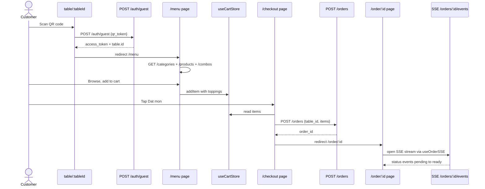
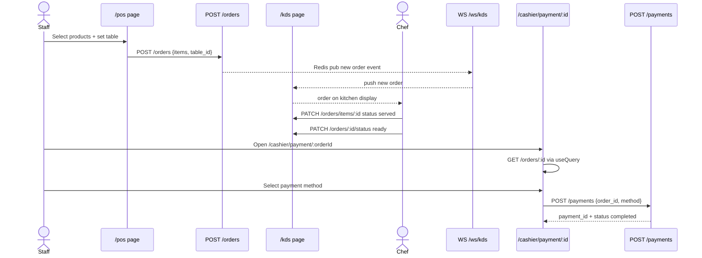
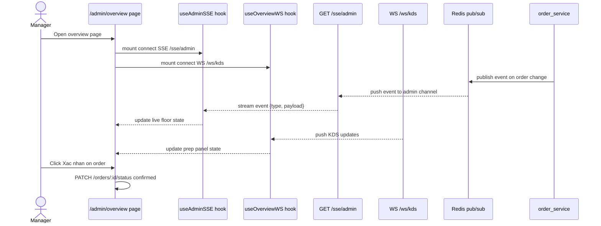

# Codebase Architecture

> Auto-generated by /codebase-graph. Re-run to refresh.
> Last generated: 2026-05-28
>
> Layer-specific graphs:
> - BE layer → `CODEBASE_GRAPH_BE.md`
> - FE layer → `CODEBASE_GRAPH_FE.md`

---

## arch — Full System Architecture

```mermaid
graph TD
    subgraph Client [Client]
        C1[Customer Browser - QR Scan]
        C2[Staff / Cashier Browser]
        C3[Kitchen Display Browser]
    end

    subgraph FE [Next.js Frontend :3000]
        subgraph Shop [shop - Customer]
            S1[table/:tableId - QR landing]
            S2[/menu - Browse + Cart]
            S3[/checkout - Place order]
            S4[/order/:id - Track order]
            S5[/menu/product/:id]
            S6[/menu/combo/:id]
        end
        subgraph Dashboard [dashboard - Staff]
            D1[/kds - Kitchen Display WS]
            D2[/pos - Point of Sale]
            D3[/cashier/payment/:id]
            D4[/orders/live - Live feed WS]
            D5[/admin/overview - Live floor SSE]
            D6[/admin/* - CRUD products + staff + etc]
            D7[/admin/summary - Analytics]
        end
        AUTH[/login - Staff Auth]
    end

    subgraph BE [Go Backend :8080]
        subgraph auth_d [Auth]
            AH[auth_handler.go]
        end
        subgraph products_d [Products / Menu]
            PH[product_handler.go]
        end
        subgraph orders_d [Orders]
            OH[order_handler.go]
        end
        subgraph payment_d [Payment]
            PAH[payment_handler.go]
        end
        subgraph staff_d [Staff]
            SH[staff_handler.go]
        end
        subgraph admin_d [Admin / Analytics]
            ANH[analytics_handler.go]
            IH[ingredient_handler.go]
        end
        subgraph infra_d [Infra]
            FH[file_handler.go]
            TH[table_handler.go]
        end
        subgraph realtime_d [Realtime]
            SSE[SSE - /orders/:id/events + /sse/admin]
            WS[WS - /ws/kds + /ws/orders-live]
        end
    end

    subgraph Data [Data Layer]
        DB[(MySQL :3306)]
        RD[(Redis Stack :6379)]
    end

    C1 -->|QR scan| S1
    C2 --> Dashboard
    C3 --> D1

    S1 -->|POST /auth/guest| AH
    S2 -->|GET /products /categories /combos| PH
    S3 -->|POST /orders| OH
    S4 -->|GET /orders/:id| OH
    S4 -->|SSE stream| SSE
    S5 -->|GET /products/:id| PH
    S6 -->|GET /combos| PH
    AUTH -->|POST /auth/login| AH

    D1 -->|WS /ws/kds| WS
    D2 -->|GET /products + POST /orders| OH
    D3 -->|POST /payments| PAH
    D4 -->|WS /ws/orders-live| WS
    D5 -->|SSE /sse/admin| SSE
    D6 -->|CRUD /products /categories /staff| PH
    D7 -->|GET /admin/summary| ANH

    AH --> DB
    PH --> DB
    OH --> DB
    OH --> RD
    PAH --> DB
    SH --> DB
    ANH --> DB
    IH --> DB
    TH --> DB
    FH --> DB
    SSE --> RD
    WS --> RD
```

---

## api — FE ↔ BE API Connection Map

```mermaid
graph LR
    subgraph FE_Pages [FE Pages]
        fp1[table/:tableId]
        fp2[/menu]
        fp3[/checkout]
        fp4[/order/:id]
        fp5[/kds]
        fp6[/pos]
        fp7[/cashier/payment/:id]
        fp8[/orders/live]
        fp9[/admin/products + categories + toppings + combos]
        fp10[/admin/staff]
        fp11[/admin/overview]
        fp12[/admin/summary]
        fp13[/admin/ingredients]
        fp14[/login]
    end

    subgraph BE_Endpoints [BE Endpoint Groups]
        be1[Auth - POST /auth/login + /auth/guest + /auth/refresh]
        be2[Products - GET /products + /categories + /toppings + /combos]
        be3[Orders - POST + GET + PATCH + DELETE /orders]
        be4[SSE - GET /orders/:id/events + /sse/admin]
        be5[WS - /ws/kds + /ws/orders-live]
        be6[Payments - POST + GET + PATCH /payments]
        be7[Staff - GET + POST + PATCH + DELETE /staff]
        be8[Analytics - GET /admin/summary + /top-dishes]
        be9[Ingredients - CRUD /admin/ingredients + /stock-movements]
        be10[Tables - GET /tables + /tables/qr/:token]
    end

    fp1 -->|POST /auth/guest| be1
    fp2 -->|GET /products /categories /combos| be2
    fp3 -->|POST /orders| be3
    fp4 -->|GET + DELETE /orders/:id| be3
    fp4 -->|SSE events| be4
    fp5 -->|GET /orders| be3
    fp5 -->|WS /ws/kds| be5
    fp5 -->|PATCH /orders/items/:id status| be3
    fp6 -->|GET /products /categories| be2
    fp6 -->|POST /orders| be3
    fp7 -->|GET /orders/:id| be3
    fp7 -->|POST + PATCH /payments| be6
    fp8 -->|WS /ws/orders-live| be5
    fp9 -->|CRUD /products /categories /toppings /combos| be2
    fp10 -->|CRUD /staff| be7
    fp11 -->|SSE /sse/admin| be4
    fp11 -->|WS /ws/kds| be5
    fp11 -->|GET + PATCH /orders| be3
    fp12 -->|GET /admin/summary /top-dishes| be8
    fp13 -->|CRUD /admin/ingredients| be9
    fp14 -->|POST /auth/login| be1
```

---

## flow — User Journey Sequence Diagrams

### Journey 1 — Customer: QR Scan → Order → Tracking



### Journey 2 — Staff: POS Order → KDS → Cashier Payment



### Journey 3 — Manager: Live Floor Monitor (SSE + WS)


