# FE Page Graph

> Auto-generated by /codebase-graph. Re-run to refresh.
> Last generated: 2026-05-28

## FE View

```mermaid
graph TD

    subgraph auth_grp ["/login - Staff Auth"]
        login_p["login/page.tsx"]
        login_api["auth.api.ts"]
        login_store["useAuthStore"]
        login_p --> login_api
        login_api -->|"POST /auth/login"| login_store
    end

    subgraph qr_grp ["/table/:tableId - QR Guest Entry"]
        qr_p["table/[tableId]/page.tsx"]
        qr_auth["useAuthStore"]
        qr_cart["useCartStore"]
        qr_p -->|"POST /auth/guest"| qr_auth
        qr_p --> qr_cart
    end

    subgraph menu_grp ["/menu - Customer Menu"]
        menu_p["menu/page.tsx"]
        prod_detail["menu/product/[id]/page.tsx"]
        combo_detail["menu/combo/[id]/page.tsx"]
        menu_settings_p["menu/settings/page.tsx"]
        menu_cart["useCartStore"]
        menu_fav["useFavouritesStore"]
        menu_settings_s["useSettingsStore"]
        menu_cat_be["BE: GET /categories"]
        menu_prod_be["BE: GET /products"]
        menu_combo_be["BE: GET /combos"]
        menu_p --> menu_cart
        menu_p --> menu_fav
        menu_p --> menu_settings_s
        menu_p -->|"useQuery"| menu_cat_be
        menu_p -->|"useQuery"| menu_prod_be
        menu_p -->|"useQuery"| menu_combo_be
        prod_detail -->|"useQuery GET /products/:id"| menu_prod_be
        combo_detail -->|"useQuery GET /combos"| menu_combo_be
    end

    subgraph checkout_grp ["/checkout - Order Placement"]
        checkout_p["checkout/page.tsx"]
        checkout_cart["useCartStore"]
        checkout_be["BE: POST /orders"]
        checkout_p --> checkout_cart
        checkout_p -->|"useMutation RHF+Zod"| checkout_be
    end

    subgraph order_grp ["/order/:id - Order Tracking"]
        order_p["order/[id]/page.tsx"]
        order_sse_hook["useOrderSSE"]
        order_sse_be["BE: SSE GET /orders/:id/events"]
        order_cancel_be["BE: DELETE /orders/:id"]
        order_item_be["BE: DELETE /orders/items/:id"]
        order_p --> order_sse_hook
        order_sse_hook -->|"SSE stream + reconnect"| order_sse_be
        order_p -->|"useMutation"| order_cancel_be
        order_p -->|"useMutation"| order_item_be
    end

    subgraph kds_grp ["/kds - Kitchen Display"]
        kds_p["kds/page.tsx"]
        kds_orders_be["BE: GET /orders"]
        kds_ws_be["BE: WS /ws/kds"]
        kds_patch_be["BE: PATCH /orders/items/:id/status"]
        kds_status_be["BE: PATCH /orders/:id/status"]
        kds_p -->|"useQuery"| kds_orders_be
        kds_p -->|"WebSocket"| kds_ws_be
        kds_p -->|"useMutation"| kds_patch_be
        kds_p -->|"useMutation"| kds_status_be
    end

    subgraph pos_grp ["/pos - Point of Sale"]
        pos_p["pos/page.tsx"]
        pos_auth["useAuthStore"]
        pos_cat_be["BE: GET /categories"]
        pos_prod_be["BE: GET /products"]
        pos_order_be["BE: POST /orders"]
        pos_p --> pos_auth
        pos_p -->|"useQuery"| pos_cat_be
        pos_p -->|"useQuery"| pos_prod_be
        pos_p -->|"useMutation"| pos_order_be
    end

    subgraph cashier_grp ["/cashier/payment/:id - Payment"]
        cashier_p["cashier/payment/[id]/page.tsx"]
        cashier_auth["useAuthStore"]
        cashier_order_be["BE: GET /orders/:id"]
        cashier_pay_be["BE: POST /payments"]
        cashier_proof_be["BE: PATCH /payments/:id/proof"]
        cashier_p --> cashier_auth
        cashier_p -->|"useQuery"| cashier_order_be
        cashier_p -->|"useMutation"| cashier_pay_be
        cashier_p -->|"useMutation"| cashier_proof_be
    end

    subgraph live_grp ["/orders/live - Live Order Feed"]
        live_p["orders/live/page.tsx"]
        live_ws_be["BE: WS /ws/orders-live"]
        live_p -->|"WebSocket"| live_ws_be
    end

    subgraph overview_grp ["/admin/overview - Live Floor Monitor"]
        overview_p["admin/overview/page.tsx"]
        overview_sse_hook["useAdminSSE"]
        overview_ws_hook["useOverviewWS"]
        overview_admin_api["admin.api.ts"]
        overview_sse_be["BE: SSE GET /sse/admin"]
        overview_ws_be["BE: WS /ws/kds"]
        overview_orders_be["BE: GET /orders/:id + PATCH /orders/:id/status"]
        overview_p --> overview_sse_hook
        overview_p --> overview_ws_hook
        overview_p --> overview_admin_api
        overview_sse_hook -->|"SSE stream"| overview_sse_be
        overview_ws_hook -->|"WebSocket"| overview_ws_be
        overview_admin_api -->|"REST"| overview_orders_be
    end

    subgraph admin_grp ["/admin/* - Admin CRUD (8 pages)"]
        admin_products["admin/products/page.tsx"]
        admin_categories["admin/categories/page.tsx"]
        admin_toppings["admin/toppings/page.tsx"]
        admin_combos["admin/combos/page.tsx"]
        admin_staff["admin/staff/page.tsx"]
        admin_ingredients["admin/ingredients/page.tsx"]
        admin_marketing["admin/marketing/page.tsx"]
        admin_summary["admin/summary/page.tsx"]
        admin_api_mod["admin.api.ts"]
        admin_be_products["BE: /products /categories /toppings /combos"]
        admin_be_staff["BE: /staff"]
        admin_be_analytics["BE: /admin/summary /top-dishes /staff-performance"]
        admin_be_ingredients["BE: /admin/ingredients /stock-movements"]
        admin_products --> admin_api_mod
        admin_categories --> admin_api_mod
        admin_toppings --> admin_api_mod
        admin_combos --> admin_api_mod
        admin_staff --> admin_api_mod
        admin_ingredients --> admin_api_mod
        admin_marketing --> admin_api_mod
        admin_summary --> admin_api_mod
        admin_api_mod -->|"CRUD"| admin_be_products
        admin_api_mod -->|"CRUD"| admin_be_staff
        admin_api_mod -->|"GET"| admin_be_analytics
        admin_api_mod -->|"CRUD"| admin_be_ingredients
    end
```

## Stores

| Store | File | Used By |
|---|---|---|
| `useAuthStore` | `features/auth/auth.store.ts` | login, qr-entry, pos, cashier, overview |
| `useCartStore` | `store/cart.ts` | menu, checkout, order-tracking, qr-entry |
| `useSettingsStore` | `store/settings.ts` | menu, menu/settings |
| `useFavouritesStore` | `store/favourites.ts` | menu |
| `summary.store.ts` | `features/admin/summary.store.ts` | admin/summary |

## Shared Hooks

| Hook | File | Transport | Endpoint |
|---|---|---|---|
| `useOrderSSE` | `hooks/useOrderSSE.ts` | SSE + auto-reconnect (5 attempts) | `GET /orders/:id/events` |
| `useAdminSSE` | `hooks/useAdminSSE.ts` | SSE | `GET /sse/admin` |
| `useOverviewWS` | `hooks/useOverviewWS.ts` | WebSocket | `WS /ws/kds` |

## Shared Components

| Group | Components |
|---|---|
| `components/menu/` | `ProductCard`, `ComboCard`, `CartDrawer`, `CategoryTabs`, `ToppingModal`, `ComboModal` |
| `components/order/` | `OrderDetailSheet` |
| `components/shared/` | `ConnectionErrorBanner`, `EmptyState`, `StatusBadge`, `CookieConsent` |
| `components/guards/` | `AuthGuard`, `RoleGuard` |
| `components/ui/` | `Button`, `Input`, `Card`, `Badge`, `Label` |

## API Modules

| Module | File | Purpose |
|---|---|---|
| `auth.api.ts` | `features/auth/auth.api.ts` | Login, refresh, logout, me |
| `admin.api.ts` | `features/admin/admin.api.ts` | All admin CRUD — products, categories, toppings, combos, staff, ingredients, analytics, QR |
| `api` (axios) | `lib/api-client.ts` | Base axios instance with JWT interceptor + guest-aware 401 handling |

---

## Component Index

> Source: `fe/src/app/` (pages) + `fe/src/components/` + `fe/src/features/admin/components/`. Zone = route group.

| Component / Page | File | Zone / Page |
|---|---|---|
| Root redirect | `app/page.tsx` | Root |
| Welcome | `app/welcome/page.tsx` | Misc |
| Privacy Policy | `app/privacy-policy/page.tsx` | Misc |
| Terms | `app/terms/page.tsx` | Misc |
| Login | `app/(auth)/login/page.tsx` | Auth |
| QR Guest Entry | `app/table/[tableId]/page.tsx` | Shop — QR entry |
| Menu | `app/(shop)/menu/page.tsx` | Shop — menu |
| Product Detail | `app/(shop)/menu/product/[id]/page.tsx` | Shop — menu |
| Combo Detail | `app/(shop)/menu/combo/[id]/page.tsx` | Shop — menu |
| Menu Settings | `app/(shop)/menu/settings/page.tsx` | Shop — menu |
| Checkout | `app/(shop)/checkout/page.tsx` | Shop — checkout |
| Order Tracking | `app/(shop)/order/[id]/page.tsx` | Shop — order |
| Order List (guest) | `app/(shop)/order/page.tsx` | Shop — order |
| KDS | `app/(dashboard)/kds/page.tsx` | Dashboard — kitchen |
| Live Orders | `app/(dashboard)/orders/live/page.tsx` | Dashboard — live feed |
| POS | `app/(dashboard)/pos/page.tsx` | Dashboard — POS |
| Cashier Payment | `app/(dashboard)/cashier/payment/[id]/page.tsx` | Dashboard — payment |
| Admin Root | `app/(dashboard)/admin/page.tsx` | Dashboard — admin |
| Admin Overview | `app/(dashboard)/admin/overview/page.tsx` | Dashboard — admin |
| Admin Products | `app/(dashboard)/admin/products/page.tsx` | Dashboard — admin |
| Admin Categories | `app/(dashboard)/admin/categories/page.tsx` | Dashboard — admin |
| Admin Toppings | `app/(dashboard)/admin/toppings/page.tsx` | Dashboard — admin |
| Admin Combos | `app/(dashboard)/admin/combos/page.tsx` | Dashboard — admin |
| Admin Staff | `app/(dashboard)/admin/staff/page.tsx` | Dashboard — admin |
| Admin Ingredients | `app/(dashboard)/admin/ingredients/page.tsx` | Dashboard — admin |
| Admin Summary | `app/(dashboard)/admin/summary/page.tsx` | Dashboard — admin |
| Admin Marketing | `app/(dashboard)/admin/marketing/page.tsx` | Dashboard — admin |
| AuthGuard | `components/guards/AuthGuard.tsx` | Guards |
| RoleGuard | `components/guards/RoleGuard.tsx` | Guards |
| ProductCard | `components/menu/ProductCard.tsx` | Menu components |
| ComboCard | `components/menu/ComboCard.tsx` | Menu components |
| CartDrawer | `components/menu/CartDrawer.tsx` | Menu components |
| CategoryTabs | `components/menu/CategoryTabs.tsx` | Menu components |
| ToppingModal | `components/menu/ToppingModal.tsx` | Menu components |
| ComboModal | `components/menu/ComboModal.tsx` | Menu components |
| OrderDetailSheet | `components/order/OrderDetailSheet.tsx` | Order components |
| ConnectionErrorBanner | `components/shared/ConnectionErrorBanner.tsx` | Shared |
| CookieConsent | `components/shared/CookieConsent.tsx` | Shared |
| EmptyState | `components/shared/EmptyState.tsx` | Shared |
| StatusBadge | `components/shared/StatusBadge.tsx` | Shared |
| Button | `components/ui/button.tsx` | UI atoms |
| Input | `components/ui/input.tsx` | UI atoms |
| Card | `components/ui/card.tsx` | UI atoms |
| Badge | `components/ui/badge.tsx` | UI atoms |
| Label | `components/ui/label.tsx` | UI atoms |
| OrderDetail | `features/admin/components/OrderDetail.tsx` | Admin feature |
| PrepPanel | `features/admin/components/PrepPanel.tsx` | Admin feature |
| StatCards | `features/admin/components/StatCards.tsx` | Admin feature |
| TableGrid | `features/admin/components/TableGrid.tsx` | Admin feature |
| WaitingSection | `features/admin/components/WaitingSection.tsx` | Admin feature |

---

## Store Field Index

> Source: `fe/src/store/` + `fe/src/features/*/`. State fields only (actions omitted for brevity).

| Store | Export | State Fields | Persisted (key) |
|---|---|---|---|
| Auth | `useAuthStore` | `user: User \| null`, `accessToken: string \| null` | No (memory only) |
| Cart | `useCartStore` | `items: CartItem[]`, `tableId: string \| null`, `activeOrderId: string \| null`, `paymentMethod: string \| null` | No (memory only) |
| Settings | `useSettingsStore` | `customerName: string`, `tableLabel: string` | Yes (`customer-settings`) |
| Favourites | `useFavouritesStore` | `ids: string[]` | Yes (`favourites`) |
| Summary range | `useSummaryStore` | `range: SummaryRange` | No (memory only) |

---

## Storage Keys Index

> `fe/src/lib/storage-keys.ts` does NOT exist yet — pending P-ARCH-1. Keys below are currently hardcoded at their source.

| Key (constant / literal) | Value string | Source file |
|---|---|---|
| `STORAGE_KEY` (local const) | `'cookie_consent_accepted'` | `components/shared/CookieConsent.tsx` |
| `cacheKey(orderId)` (dynamic) | `` `order_cache_${orderId}` `` | `hooks/useOrderSSE.ts` |
| Zustand persist name | `'customer-settings'` | `store/settings.ts` |
| Zustand persist name | `'favourites'` | `store/favourites.ts` |
