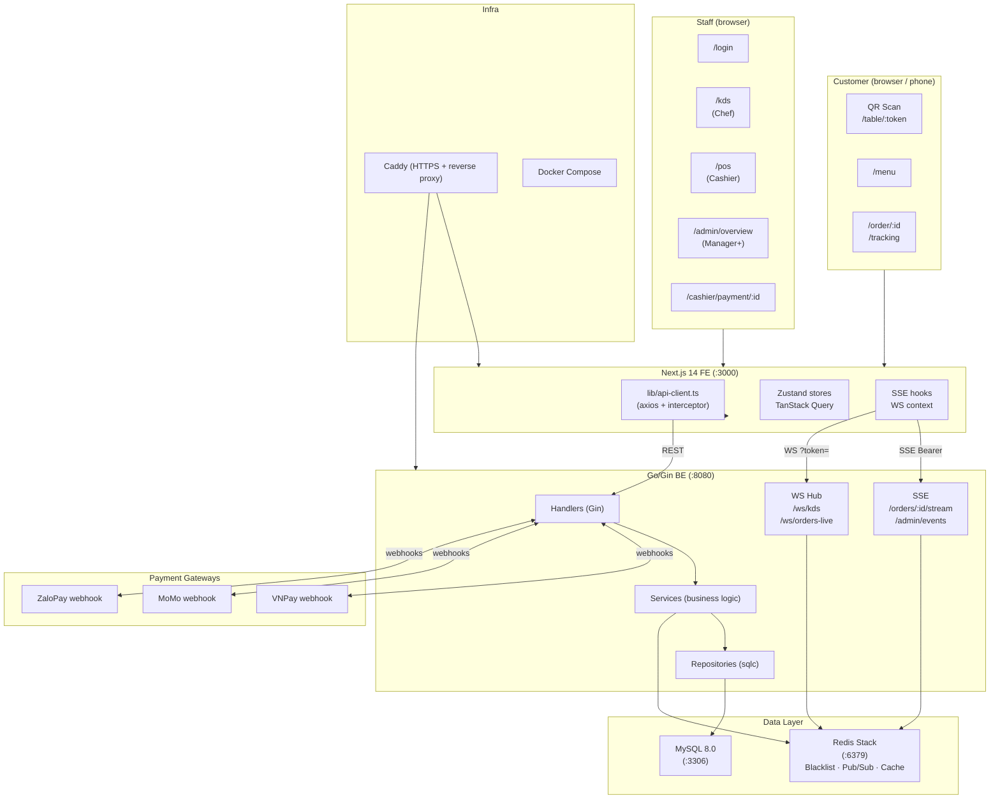

# System Overview — Hệ Thống Quản Lý Quán Bánh Cuốn

> **TL;DR:** A full-stack restaurant management platform for a bánh cuốn shop. User types —
> customers (QR scan, no login — plus a 🔮 planned online-account path for ordering from home),
> kitchen staff (KDS), and cashier/manager (POS + overview). Orders flow
> QR scan / online order (🔮) → confirm → kitchen cooking (KDS) → ready → cashier payment,
> with realtime updates via WebSocket and SSE throughout. Built on Go/Gin backend + Next.js 14 frontend.
>
> Status markers: ✅ implemented · 🔮 PLANNED (owner decision 2026-06-12, not in code yet) ·
> ⚠️ DRIFT (target rule differs from current code).

---

## 1. What the System Does

Digitises the entire order lifecycle for a dine-in bánh cuốn restaurant:

| Problem (manual) | Solution |
|---|---|
| Orders written on paper, errors at handoff | Digital order submitted from customer's phone |
| Kitchen doesn't know order priority | KDS (fullscreen kitchen display) with colour-coded urgency |
| Cashier manually totals bills | POS auto-calculates; payment via VNPay / MoMo / ZaloPay / cash |
| No real-time order tracking for customers | SSE-based live progress view on customer's phone |
| No sales data or staff management | Admin dashboard: revenue reports, staff CRUD, QR marketing |

---

## 2. The User Types

| Type | Entry Point | Role | Key Screens |
|---|---|---|---|
| **Customer (dine-in)** ✅ | Scan QR code at table | `customer` (guest JWT, no login) | `/menu` → `/order/:id` → `/tracking` |
| **Customer (online)** 🔮 PLANNED | Register/login a customer account from home | `customer` (account) | login → menu → order → track → pay (pickup/delivery) |
| **Staff** (chef — cooking) ✅ | `/login` → `/kds` | `chef` | Kitchen Display System — cooking board (`confirmed → preparing` "cooking" `→ ready`) |
| **Staff** (cashier) ✅ | `/login` → `/pos` | `cashier` | POS, `/cashier/payment/:id` |
| **Staff** (generic) ✅ | `/login` → `/pos` | `staff` | `/pos` + `/kds` — cashier rights + cancel rights |
| **Staff** (manager/admin) ✅ | `/login` → `/admin/overview` | `manager` / `admin` | Floor view, order confirm, reports |

> Customer is completely isolated from the staff role hierarchy. A guest never sees a login page.
>
> 🔮 PLANNED: a customer with no phone can have the cashier at POS log in / create the session and
> place the order on the customer's behalf.

---

## 3. Feature List by Area

### 3.1 Customer (QR Path)
- Scan table QR → instant guest JWT (no account creation)
- Browse menu: products, combos, toppings
- Cart → `TableConfirmModal` (no name/phone) → order submitted
- Live order tracking via SSE (item-by-item progress)
- Cancel items/order — ⚠️ DRIFT: target rule (owner decision 2026-06-12) = customer can cancel at
  any time before payment is completed; current code still enforces the < 30% served rule
- Add more items to an active order

### 3.2 Customer (Online Path) — 🔮 PLANNED
- Register/login a customer account (not QR-only)
- Browse the menu and order food online from home (pickup/delivery)
- Track order progress and pay online
- Mirrors the QR flow after order creation: same state machine, same kitchen cooking pipeline

### 3.3 Kitchen Display System (KDS) — Chef Cooking
- Fullscreen order board: colour-coded by urgency (pending / preparing / done)
- WebSocket real-time: new orders appear instantly with audio beep
- Chef cooks: marks items done → `qty_served` increments → auto-transitions order to "ready"
- Manual cooking status change: `confirmed → preparing ("cooking") → ready`

### 3.4 POS + Payment
- Cashier builds walk-in orders (source: `pos`)
- 🔮 PLANNED: order on customer's behalf — for customers with no phone, the cashier logs in /
  creates the session and places the order for them
- WS notifies when kitchen marks order "ready" → auto-redirect to payment
- Payment methods: COD (cash, instant), VNPay QR, MoMo QR, ZaloPay QR
- Optional: upload payment proof screenshot
- Browser print receipt after payment completion

### 3.5 Admin / Manager
- Live floor view: table grid + active order per table
- Confirm new orders (pending → confirmed) via popup
- Force-cancel any order — ⚠️ DRIFT: current code applies the < 30% rule; target rule allows
  cancel any time before payment
- Staff CRUD: create accounts, assign roles, activate/deactivate
- QR code generation per table (marketing)
- Admin dashboard: revenue stats, product analytics
- 🔮 PLANNED: Storage page (`/admin/storage`) — ingredient/inventory management

### 3.6 System-wide
- RBAC: 6 roles (customer, chef, cashier, staff, manager, admin)
- JWT auth: staff (24 h access + 30 d refresh cookie); guest (2 h, stateless)
- One active order per table enforced server-side
- Payment webhooks from VNPay / MoMo / ZaloPay with HMAC verification
- File upload with orphan-cleanup job (6 h interval)

---

## 4. High-Level Architecture

> Drawing version (all entry points + all 4 data channels on one canvas):
> [system_data_flow.excalidraw](system_data_flow.excalidraw)

---

## 5. Key Screens Per Role

| Role | Screen | URL | Purpose |
|---|---|---|---|
| Customer | Welcome 🔮 PLANNED | `/welcome` | Landing page after QR scan or site entry |
| Customer | Introduction 🔮 PLANNED | `/introduction` | About the restaurant — story, location, hours |
| Customer | Menu | `/menu` | Browse + add to cart |
| Customer | Order detail | `/order/:id` | Live item progress via SSE |
| Customer | Tracking | `/tracking` | Full live table/queue view |
| Customer (online) | Online ordering 🔮 PLANNED | login → `/menu` | Order from home (pickup/delivery), track, pay |
| Chef | KDS | `/kds` | Kitchen cooking board |
| Cashier | POS | `/pos` | Walk-in order creation (🔮 PLANNED: order on customer's behalf) |
| Cashier | Payment | `/cashier/payment/:id` | Bill + payment method select |
| Manager+ | Overview | `/admin/overview` | Floor view + order confirm |
| Manager+ | Staff admin | `/admin/staff` | Staff CRUD |
| Manager+ | Marketing | `/admin/marketing` | QR code generation |
| Manager+ | Storage 🔮 PLANNED | `/admin/storage` | Ingredient/inventory management |

> Detailed page drawings for the 🔮 PLANNED pages live in [`../08_pages/PAGES_INDEX.md`](../08_pages/PAGES_INDEX.md).

---

## Deep Dive Sources

| Topic | File |
|---|---|
| Full business rules | `../02_spec/BUSINESS_RULES.md` + `../07_business_logic/LOGIC_INDEX.md` |
| All API endpoints | `../02_spec/API_SPEC.md` |
| Error codes | `../02_spec/ERROR_SPEC.md` |
| Per-flow details | `../01_flow/FLOW_INDEX.md` |
| BE code patterns | `../03_be/BE_TECH_SUMMARY.md` + `../03_be/BE_CODE_SUMMARY.md` |
| FE code patterns | `../04_fe/FE_TECH_SUMMARY.md` + `../04_fe/FE_CODE_SUMMARY.md` |
| DB schema | `../02_spec/DB_SCHEMA.md` |
| Page drawings (planned pages) | `../08_pages/PAGES_INDEX.md` |
