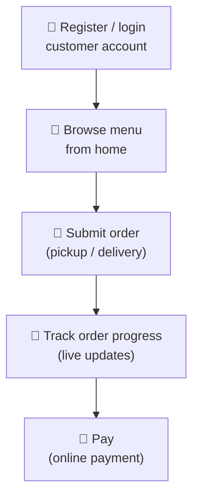

# Client Flow — QR Scan to Order Tracking

> **TL;DR:** Customer scans a table QR → receives a stateless 2 h guest JWT (no login, no account)
> → browses menu → submits order via `TableConfirmModal` (no name/phone — staff handles identity)
> → watches real-time progress via SSE. One active order per table is enforced server-side.
> A second entry path is 🔮 PLANNED: customers register/login an account and order online from
> home (pickup/delivery) — see the "Online Ordering Flow" section below.
>
> Status markers: ✅ implemented · 🔮 PLANNED (owner decision 2026-06-12, not in code yet) ·
> ⚠️ DRIFT (target rule differs from current code).

---

## Flow Diagram

```
QR Scan → /table/:qr_token
    │
    POST /api/v1/auth/guest { qr_token }
    │ guest JWT → Zustand memory only (NEVER localStorage)
    │ tableId, tableName → cartStore
    │
    Redirect → /menu
    │
    Browse products / combos
    Add to cart (Zustand)
    │
    "Thanh toán" button (appears when cart has items)
    │
    ┌─────────────────────────────────────────────┐
    │ cartStore.tableId present?                  │
    │   YES → TableConfirmModal (QR path)         │
    │   NO  → /checkout page (walk-in / web)      │
    └─────────────────────────────────────────────┘
    │ (QR path)
    TableConfirmModal: item list + total + optional note
    NO name / NO phone — staff handles identity
    │
    POST /api/v1/orders { source:"qr", table_id, items, note }
    │
    On success:
      GET /orders/:id → cache to localStorage[order_cache_<id>]
      cartStore.clearCart()  ← clears items + tableId + tableName
      window.location.replace('/order/<id>')
    │
    /order/:id  ← live SSE updates (useOrderSSE)
    │
    /order      ← order list (reads localStorage cache, no API call)
    │
    /tracking   ← live queue view (reads activeOrderId from cartStore)
```

---

## Step Table

| # | Step | Actor | FE Page / Component | BE Endpoint | State Change |
|---|---|---|---|---|---|
| 1 | Scan QR | Customer | `/table/[tableId]/page.tsx` | `POST /api/v1/auth/guest` | guest JWT → Zustand; tableId → cartStore |
| 2 | Error: table has active order | — | — | returns `TABLE_HAS_ACTIVE_ORDER` | redirect to existing `/order/:id` or `/order` |
| 3 | Browse menu | Customer | `/menu/page.tsx` | `GET /api/v1/products` `GET /api/v1/combos` | items added to Zustand cart |
| 4 | Open checkout | Customer | `TableConfirmModal` | — | shows cart items + total + optional note |
| 5 | Submit order | Customer | `TableConfirmModal` → submit | `POST /api/v1/orders` | order created, status = `pending` |
| 6 | Cache order | FE | — | `GET /api/v1/orders/:id` | order written to `localStorage[order_cache_<id>]` |
| 7 | Clear cart | FE | — | — | `clearCart()` → tableId/tableName/items wiped |
| 8 | View order | Customer | `/order/[id]/page.tsx` | `GET /api/v1/orders/:id/stream` (SSE) | real-time item progress |
| 9 | Add more items | Customer | `/menu?add_to_order=<id>` | `POST /api/v1/orders/:id/items` | new items appended to active order |
| 10 | Cancel item | Customer | `/order/[id]` | `DELETE /api/v1/orders/items/:itemId` | item removed — current code: only if < 30% served (⚠️ DRIFT, see "Cancel Rule" section below) |
| 11 | View order list | Customer | `/order/page.tsx` | none (localStorage read) | shows all cached orders |
| 12 | Live tracking | Customer | `/tracking/page.tsx` | `GET /api/v1/orders/monitor/stream` (SSE) | table map + queue view |

---

## SSE Events (customer receives)

| Event Type | When | What FE Does |
|---|---|---|
| `order_init` | On connect (immediate) | Populate initial order state — no separate GET needed |
| `order_status_changed` | Status transition | Update status badge; show toast |
| `item_progress` | Chef marks item done (`qty_served++`) | Update item progress bar inline |
| `order_completed` | Order → `delivered` | Show completion screen |
| `order_cancelled` | Order cancelled (by staff or self) | Redirect to `/menu` |

---

## Online Ordering Flow — 🔮 PLANNED

> Owner decision 2026-06-12. Nothing below exists in code yet — every step is 🔮 PLANNED.

Customers are not QR-only: a customer can register/login a customer account and order food online
from home (pickup or delivery), then track and pay — same order state machine and kitchen cooking
pipeline as the QR path after order creation.



| # | Step | Status | Notes |
|---|---|---|---|
| 1 | Login / register customer account | 🔮 PLANNED | Customer account ≠ guest JWT; persistent login |
| 2 | Browse menu | 🔮 PLANNED | Same product/combo catalogue as the QR menu |
| 3 | Submit order | 🔮 PLANNED | New order source (no `table_id`); pickup/delivery details TBD |
| 4 | Track order | 🔮 PLANNED | Live progress, mirroring the SSE tracking of the QR path |
| 5 | Pay | 🔮 PLANNED | Online payment before/at handoff; gateway reuse TBD |

Open design questions (to be settled in `../07_business_logic/LOGIC_INDEX.md` before implementation):
order source value, delivery vs pickup states, and how "one active order per table" maps to
table-less orders.

---

## Cancel Rule — ⚠️ DRIFT

| | Rule |
|---|---|
| **Target rule (owner decision 2026-06-12)** | A customer can cancel their meal/order (items or whole order) at **any time before payment is completed**. |
| **Current code behaviour** | `SUM(qty_served) / SUM(quantity) < 0.30` must hold, and cancel is blocked at `ready` / `delivered` — ⚠️ DRIFT, BE change pending. |

Until the BE change lands, the FE will still receive `422 CANCEL_THRESHOLD` under the current
rule. Full detail: [ORDER_STATE_MACHINE.md — cancel rules](ORDER_STATE_MACHINE.md#cancel-rules).

---

## State & Storage Rules

| Data | Where Stored | Reason |
|---|---|---|
| Guest JWT | Zustand `authStore` — **memory only** | XSS prevention — never localStorage |
| `tableId`, `tableName` | Zustand `cartStore` — not persisted | Cleared on `clearCart()` after order submit |
| `activeOrderId` | Zustand `cartStore` — **persisted** via `STORAGE_KEYS.CART_CONFIG` | Survives page refresh; needed for `/tracking` |
| Order cache | `localStorage[STORAGE_KEYS.ORDER_CACHE + id]` | Powers `/order` list without any API call |
| Cart config, drinkConfig, orderNote | `localStorage[STORAGE_KEYS.CART_CONFIG]` | Survives page refresh |

All localStorage keys come from `fe/src/lib/storage-keys.ts` — no hardcoded strings anywhere.

---

## Offline QR Rule (Critical)

> The QR path uses `TableConfirmModal`, **not** the `/checkout` page.
>
> - **No name field** — customer identity is handled by staff
> - **No phone field** — same reason
> - **Only an optional note field** is shown
> - `source: "qr"` in the order payload signals the backend to validate `table_id` against the JWT claim

Violating this rule (adding name/phone inputs to the QR path) breaks the design intent and the spec.

---

## Invariants — Never Break

1. The customer **never sees a login page** during the QR flow.
2. Guest JWT is **memory-only** — never written to localStorage or a cookie.
3. `TableConfirmModal` has **no name or phone input** on the QR path.
4. `/order` list works **without an API call** — it reads localStorage cache.
5. `clearCart()` resets `tableId` — after submit, tableId is gone until the next QR scan.
6. `TABLE_HAS_ACTIVE_ORDER` error **redirects to that order** — never shows a generic error.
7. `activeOrderId` **persists** across page reloads (in `CART_CONFIG`) so `/tracking` survives a refresh.

---

## Deep Dive Sources

| File | Purpose |
|---|---|
| `../07_business_logic/LOGIC_INDEX.md` | Business-logic index — consult + update before changing this flow |
| `../02_spec/BUSINESS_RULES.md §5` | Guest JWT spec and rules |
| `../02_spec/BUSINESS_RULES.md §2.3` | One active order per table rule |
| `../02_spec/API_SPEC.md` | Endpoint contracts used in this flow |
| `../04_fe/STATE_MANAGEMENT.md` | Cart store: tableId, activeOrderId, clearCart |
| `../04_fe/FE_CODE_SUMMARY.md` | localStorage key constants (`storage-keys.ts`) |
