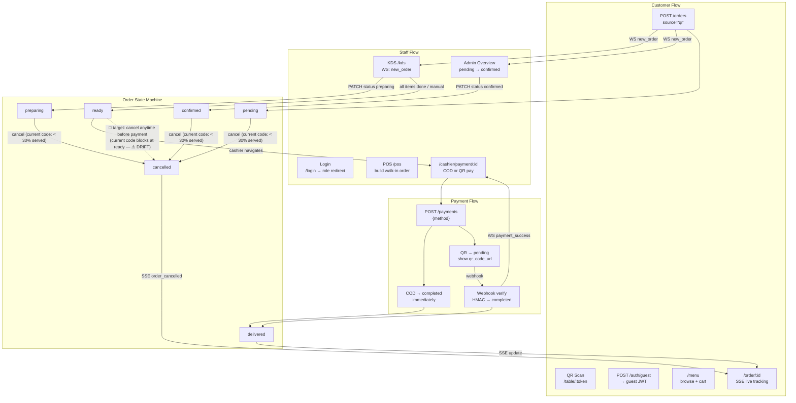

# Flow Index — System Handbook

> **TL;DR:** Five major flows: customer QR journey (plus 🔮 planned online ordering), staff
> operations (KDS + POS), order state machine, payment, and cancellation. All flows share one
> order lifecycle and intersect at the realtime layer (WS/SSE). Start here, then open the
> specific flow file.
>
> Status markers: ✅ implemented · 🔮 PLANNED (owner decision 2026-06-12, not in code yet) ·
> ⚠️ DRIFT (target rule differs from current code).
>
> **Any change to business logic or flow MUST first consult and update
> `docs/system/07_business_logic/` ([LOGIC_INDEX.md](../07_business_logic/LOGIC_INDEX.md)).**

---

## Flow Documents in This Folder

| # | File | What It Covers |
|---|---|---|
| 1 | [CLIENT_FLOW.md](CLIENT_FLOW.md) | QR scan → menu → cart → order → live tracking · 🔮 planned online ordering flow |
| 2 | [STAFF_FLOW.md](STAFF_FLOW.md) | Login → KDS cooking / POS / Overview → bill → payment confirm |
| 3 | [ORDER_STATE_MACHINE.md](ORDER_STATE_MACHINE.md) | All order status transitions + cancellation rules |
| 4 | [PAYMENT_FLOW.md](PAYMENT_FLOW.md) | COD + VNPay / MoMo / ZaloPay webhook flows |
| — | [../02_spec/BUSINESS_RULES.md](../02_spec/BUSINESS_RULES.md) | RBAC, cancel rule, JWT rules, realtime config |

---

## Flow Intersection Map

The diagram below shows how the four major flows connect at runtime.

> ⚠️ DRIFT — cancel rule: target rule (owner decision 2026-06-12) lets a customer cancel at any
> time before payment is completed. Current code still enforces the < 30% served rule and blocks
> cancel at `ready`. Detail: [ORDER_STATE_MACHINE.md — cancel rules](ORDER_STATE_MACHINE.md#cancel-rules).

---

## Quick Reference

| Question | Where to look |
|---|---|
| Customer → which staff screen reacts? | Flow Intersection Map above + [STAFF_FLOW.md](STAFF_FLOW.md) |
| What statuses can an order be in? | [ORDER_STATE_MACHINE.md](ORDER_STATE_MACHINE.md) |
| Can this order be cancelled? | [ORDER_STATE_MACHINE.md — cancel rules](ORDER_STATE_MACHINE.md#cancel-rules) |
| Why does WS use `?token=` but SSE uses a header? | [../02_spec/BUSINESS_RULES.md §6](../02_spec/BUSINESS_RULES.md) + [STAFF_FLOW.md](STAFF_FLOW.md) realtime section |
| When does payment happen and how? | [PAYMENT_FLOW.md](PAYMENT_FLOW.md) |

---

## Deep Dive Sources

| File | Purpose |
|---|---|
| `../02_spec/BUSINESS_RULES.md` | Business rules (cancel, payment, one-active-order, RBAC, realtime) |
| `../07_business_logic/LOGIC_INDEX.md` | Business-logic index — consult + update before any logic/flow change |
| `../02_spec/API_SPEC.md` | All API endpoints referenced by the flows |
