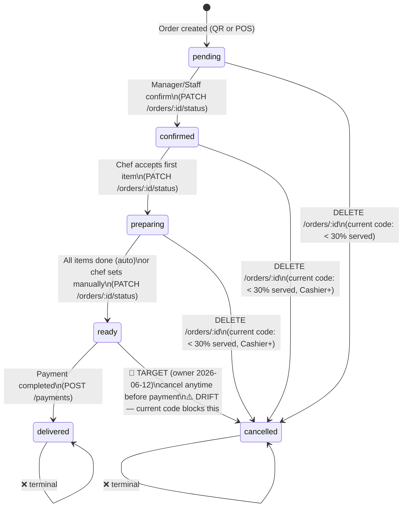

# Order State Machine

> **TL;DR:** Five happy-path statuses (`pending → confirmed → preparing → ready → delivered`) plus
> one terminal failure path (`cancelled`). **Cancel rule is in transition:** the target rule (owner
> decision 2026-06-12) lets a customer cancel at any time before payment is completed; the current
> code still only allows cancel from the first three statuses when < 30% of item quantity has been
> served — ⚠️ DRIFT, BE change pending. All transitions are server-enforced; invalid transitions
> return 422.
>
> Status markers: ✅ implemented · 🔮 PLANNED (owner decision 2026-06-12, not in code yet) ·
> ⚠️ DRIFT (target rule differs from current code).

---

## State Diagram



> `ready → cancelled` is the **target** transition only — the current code still rejects any
> cancel at `ready` (and applies the < 30% rule at earlier statuses). See [Cancel Rules](#cancel-rules).

---

## Transition Table

| From | To | Trigger | Endpoint | Who Can Do It | Side Effects |
|---|---|---|---|---|---|
| — | `pending` | Order created | `POST /api/v1/orders` | customer, cashier, staff | WS `new_order` → KDS board + Admin Overview popup |
| `pending` | `confirmed` | Manager/Staff confirm | `PATCH /api/v1/orders/:id/status` | cashier, staff, manager | SSE `order_status_changed` → customer's `/order/:id` |
| `confirmed` | `preparing` | Chef accepts order in KDS | `PATCH /api/v1/orders/:id/status` | chef, staff | SSE update → customer |
| `preparing` | `ready` | All items `qty_served = quantity` (auto) OR chef manually | `PATCH /api/v1/orders/:id/status` | chef, staff (auto: server) | WS `order_status_changed` → Cashier POS auto-redirect to payment |
| `ready` | `delivered` | Payment completed | via `POST /api/v1/payments` | cashier+ (via payment) | SSE `order_completed` → customer |
| `pending` | `cancelled` | Cancel request | `DELETE /api/v1/orders/:id` | customer (own), cashier, staff, manager | SSE `order_cancelled` → customer redirected to `/menu` |
| `confirmed` | `cancelled` | Cancel request | `DELETE /api/v1/orders/:id` | cashier, staff, manager | SSE `order_cancelled` |
| `preparing` | `cancelled` | Cancel request | `DELETE /api/v1/orders/:id` | cashier, staff, manager | SSE `order_cancelled`; refund triggered if payment exists |
| `ready` | `cancelled` 🔮 TARGET | Cancel request (anytime before payment) | `DELETE /api/v1/orders/:id` | customer (own), cashier, staff, manager | ⚠️ DRIFT — current code rejects cancel at `ready`; BE change pending |

---

## Item-Level Status (Derived — No DB Column)

Item status is **not stored in a column**. It is derived from `qty_served` at the service layer.

| `qty_served` | Derived Status | KDS Colour |
|---|---|---|
| `= 0` | `pending` | Dark (`#1F2937`) |
| `> 0` and `< quantity` | `preparing` | Warning yellow (`#FCD34D`) |
| `= quantity` | `done` | Success green (`#3DB870`) |

```
Chef clicks item → PATCH /api/v1/orders/:id/items/:itemId/status
    └─ server: qty_served += 1
    └─ when qty_served = quantity → item is "done"
    └─ when ALL items "done" → order auto-transitions to "ready"
```

> Do NOT add a `status` column to `order_items`. Use the formula above everywhere (Go service, TypeScript FE, SQL WHERE clauses).

---

## Cancel Rules

### Target rule (owner decision 2026-06-12) — 🔮 not in code yet

> A customer can cancel their meal/order (single items or the whole order) at **any time before
> payment is completed**. This replaces the "< 30% served" rule for customers.

### Current code behaviour — ⚠️ DRIFT, BE change pending

```
cancel_allowed = SUM(qty_served) / SUM(quantity) < 0.30
```

| Condition | Result (current code) |
|---|---|
| Ratio < 30% | Cancel allowed |
| Ratio >= 30% | Server rejects → `422 CANCEL_THRESHOLD` |
| Status = `ready` or `delivered` | Cancel blocked regardless of ratio |

### Who Can Cancel What

| Actor | Cancel Single Item | Cancel Entire Order | Condition |
|---|---|---|---|
| Customer (guest) | Own order items only | Own order only | current code: < 30% served · 🔮 target: anytime before payment (⚠️ DRIFT) |
| Chef | Via KDS only (status update) | No direct cancel | — |
| Cashier | Any order | Any order | current code: < 30% served |
| Staff | Any order | Any order | current code: < 30% served |
| Manager | Any order | Any order | current code: < 30% served |

---

## One Active Order Per Table

```sql
SELECT COUNT(*) FROM orders
WHERE table_id = ?
  AND status IN ('pending','confirmed','preparing','ready')
  AND deleted_at IS NULL
-- If count > 0 → 409 TABLE_HAS_ACTIVE_ORDER
```

`delivered` and `cancelled` are **not** active — they do not block a new order.

---

## Combo Item Rows

When an order contains a combo, the backend creates:

| Row Type | `product_id` | `combo_id` | `combo_ref_id` |
|---|---|---|---|
| Standalone product | NOT NULL | NULL | NULL |
| Combo header | NULL | NOT NULL | NULL |
| Combo sub-item | NOT NULL | NULL | = header row ID |

The combo header has `unit_price = 0`; sub-items carry the prices. The `recalculateTotalAmount()` function must be called after every `order_items` mutation to keep `orders.total_amount` correct.

---

## Deep Dive Sources

| File | Purpose |
|---|---|
| `../07_business_logic/LOGIC_INDEX.md` | Business-logic index — consult + update before changing transitions or cancel rules |
| `../02_spec/BUSINESS_RULES.md §2` | State machine transitions + permissions |
| `../02_spec/BUSINESS_RULES.md §3` | Cancel rule (target vs current code) |
| `../02_spec/BUSINESS_RULES.md §2.3` | One active order per table rule |
| `../02_spec/ERROR_SPEC.md` | `CANCEL_THRESHOLD`, `TABLE_HAS_ACTIVE_ORDER` codes |
