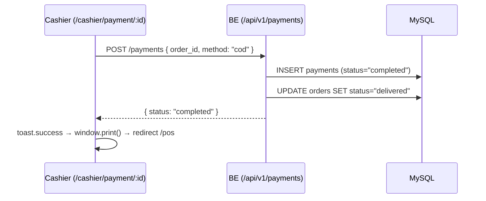
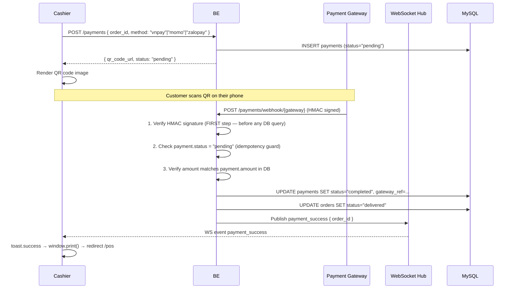

# Payment Flow

> **TL;DR:** Payment is only allowed when `order.status = "ready"`. Four methods: cash (COD —
> completes immediately), VNPay QR, MoMo QR, ZaloPay QR (all webhook-based). Every webhook
> verifies HMAC signature first. One payment row per order — retries update the existing row.

---

## Prerequisites

- Actor must have `cashier` role or higher
- `order.status` must be `"ready"` (or `"delivered"`)
- Attempting payment on any other status → `422 ORDER_NOT_READY`

---

## COD (Cash) Flow



- Server responds synchronously with `status: "completed"` — no async wait
- No WS wait; print receipt immediately after response

---

## QR Payment Flow (VNPay / MoMo / ZaloPay)



---

## Optional: Proof Upload

Used when staff manually verifies a customer's payment screenshot.

```
PATCH /api/v1/payments/:paymentId/proof
Content-Type: multipart/form-data
Field: image

→ marks payment as manually verified
```

---

## Webhook Rules

| Rule | Detail |
|---|---|
| **HMAC verify first** | Verify signature before any DB query or business logic |
| **Idempotency** | Check `payment.status = "completed"` before processing — webhooks may arrive multiple times |
| **Amount verify** | Compare webhook amount vs `payment.amount` in DB — reject mismatch |
| **One payment row** | `UNIQUE(order_id)` — retries must `UPDATE` the existing row (`attempt_count++`), never `INSERT` a new row |
| **Store raw payload** | Save raw webhook body to `gateway_data` JSON column for audit — never expose to API |
| **No hard delete** | `deleted_at` is the only delete mechanism — hard deletes blocked at application layer |

---

## Webhook Endpoints

| Gateway | Endpoint | HMAC Algorithm |
|---|---|---|
| VNPay | `POST /api/v1/payments/webhook/vnpay` | HMAC-SHA512 of query string sorted alphabetically |
| MoMo | `POST /api/v1/payments/webhook/momo` | HMAC-SHA256 per MoMo docs |
| ZaloPay | `POST /api/v1/payments/webhook/zalopay` | HMAC-SHA256 with `key = key1` |

---

## Backend Endpoints Summary

| Action | Method | Endpoint | Auth |
|---|---|---|---|
| Create payment | POST | `/api/v1/payments` | Cashier+ |
| Upload proof | PATCH | `/api/v1/payments/:id/proof` | Cashier+ |
| VNPay webhook | POST | `/api/v1/payments/webhook/vnpay` | Public (HMAC verified) |
| MoMo webhook | POST | `/api/v1/payments/webhook/momo` | Public (HMAC verified) |
| ZaloPay webhook | POST | `/api/v1/payments/webhook/zalopay` | Public (HMAC verified) |
| WS: payment_success event | WS | `/ws/orders-live?token=` | Cashier+ |

---

## State After Payment

| Payment Method | Order Status After | Payment Status |
|---|---|---|
| COD | `delivered` | `completed` |
| VNPay / MoMo / ZaloPay (webhook OK) | `delivered` | `completed` |
| QR pending (no webhook yet) | `ready` | `pending` |

---

## Deep Dive Sources

| File | Purpose |
|---|---|
| `../02_spec/BUSINESS_RULES.md §4` | Payment rules (in-handbook source) |
| `../07_business_logic/LOGIC_BE.md` | Payment invariants: ready-only, idempotency, HMAC-first |
| `../02_spec/API_SPEC.md` | Payment + webhook endpoints |
| `../02_spec/ERROR_SPEC.md` | `ORDER_NOT_READY`, `PAYMENT_ALREADY_EXISTS` codes |
| `../01_flow/ORDER_STATE_MACHINE.md` | `ready → delivered` transition via payment |
