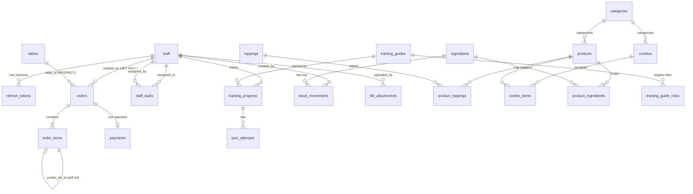

# Database Schema

> **TL;DR**
> MySQL 8.0. 17 migrations (001–017). All PKs are UUID CHAR(36). All currency is DECIMAL(10,0) VND integer.
> Soft delete: `deleted_at DATETIME NULL` — always query `WHERE deleted_at IS NULL`.
> `order_items.filling` column existed (migration 016, OC epic) but was **migrated into `toppings_snapshot`** by migration 017.
> This file is the single in-handbook source for field names (derived from `be/migrations/` DDL).

---

## Global Conventions

| Rule | Detail |
|---|---|
| Primary keys | `CHAR(36) DEFAULT (UUID())` — never AUTO_INCREMENT |
| Timestamps | Every table: `created_at`, `updated_at`. Mutable: `deleted_at` (soft delete) |
| Soft delete | `deleted_at DATETIME NULL` — always filter `WHERE deleted_at IS NULL` |
| Currency | `DECIMAL(10,0)` — VND has no decimal. Never FLOAT |
| File paths | Store `object_path` (relative). Full URL = `STORAGE_BASE_URL` + `object_path` |
| Indexes | Every FK column, `status`, `created_at`, `is_active`, `deleted_at` |
| Naming | `snake_case`, tables plural |

---

## Migration Run Order

```
001_auth.sql
002_products.sql
003_tables.sql            ← must run BEFORE 005_orders
004_combos.sql
005_orders.sql
006_payments.sql
007_files.sql
008_order_groups.sql      ← adds orders.group_id
009_ingredients.sql
010_ingredients_dates.sql ← adds ingredients.import_date + shelf_days
011_staff_tasks.sql
012_staff_tasks_v2.sql    ← adds priority/notes/due_time + status enum
013_staff_profile_fields.sql ← adds staff.job_title/shifts/responsibilities
014_training.sql
015_add_paid_status.sql   ← adds orders.status 'paid'
016_add_order_item_filling.sql  ← adds order_items.filling (OC epic)
017_drop_order_item_filling.sql ← migrates filling → toppings_snapshot, drops column
```

Tool: Goose (`-- +goose Up / Down` in each file).

---

## Tables by Domain

### Auth — `staff`, `refresh_tokens`

**`staff`**

| Column | Type | Notes |
|---|---|---|
| `id` | CHAR(36) PK | UUID |
| `username` | VARCHAR(50) UNIQUE | |
| `password_hash` | VARCHAR(255) | bcrypt cost=12 |
| `email` | VARCHAR(100) NULL | |
| `role` | ENUM('customer','chef','cashier','staff','manager','admin') | Default: cashier |
| `full_name` | VARCHAR(100) | |
| `job_title` | VARCHAR(100) NULL | migration 013 |
| `shifts` | JSON NULL | migration 013 — work schedule |
| `responsibilities` | TEXT NULL | migration 013 |
| `phone` | VARCHAR(20) NULL | |
| `is_active` | TINYINT(1) | Checked per-request via Redis cache |
| `created_at`, `updated_at`, `deleted_at` | DATETIME | |

**`refresh_tokens`**

| Column | Type | Notes |
|---|---|---|
| `id` | CHAR(36) PK | |
| `staff_id` | CHAR(36) | FK → staff ON DELETE CASCADE |
| `token_hash` | CHAR(64) UNIQUE | SHA-256 of raw token |
| `expires_at` | DATETIME | NOW() + 30 days |
| `last_used_at` | DATETIME NULL | Updated on each `/auth/refresh` |
| `ip_address` | VARCHAR(45) NULL | IPv6-safe |

Max 5 active sessions per staff (LRU eviction by `last_used_at`).

---

### Products — `categories`, `products`, `toppings`, `product_toppings`, `combos`, `combo_items`

**`categories`**: `id`, `name`, `description`, `sort_order`, `is_active`, soft-delete timestamps.

**`products`**

| Column | Type | Notes |
|---|---|---|
| `id` | CHAR(36) PK | |
| `category_id` | CHAR(36) | FK → categories RESTRICT |
| `name` | VARCHAR(150) | |
| `price` | DECIMAL(10,0) | ⚠️ NOT `base_price` |
| `image_path` | VARCHAR(500) NULL | Object path, NOT full URL. NOT `image_url` |
| `is_available` | TINYINT(1) | Toggle sold-out |
| `sort_order` | INT | |

**`toppings`**: `id`, `name`, `price` (⚠️ NOT `price_delta`), `is_available`.

**`product_toppings`** (M:N junction): `(product_id, topping_id)` composite PK.

**`combos`**: `id`, `name`, `price`, `category_id`, `image_path`, `is_available`, `sort_order`.

**`combo_items`** (static template): `id`, `combo_id`, `product_id`, `quantity`. Expanded to `order_items` at order time.

---

### Tables — `tables`

| Column | Type | Notes |
|---|---|---|
| `id` | CHAR(36) PK | |
| `name` | VARCHAR(50) UNIQUE | e.g. "Ban 01" |
| `qr_token` | CHAR(64) UNIQUE | Random hex; regenerating invalidates printed QRs |
| `capacity` | INT | Default 4 |
| `status` | ENUM('available','occupied','reserved','inactive') | |
| `is_active` | TINYINT(1) | |

---

### Orders — `order_sequences`, `orders`, `order_items`

**`order_sequences`** (fallback counter): `date_key DATE`, `last_seq INT`. Primary path: Redis INCR.

**`orders`**

| Column | Type | Notes |
|---|---|---|
| `id` | CHAR(36) PK | |
| `order_number` | VARCHAR(30) UNIQUE | Format: `ORD-YYYYMMDD-NNN` |
| `table_id` | CHAR(36) NULL | FK → tables RESTRICT. NULL = online/delivery |
| `status` | ENUM('pending','confirmed','preparing','ready','delivered','cancelled','paid') | `paid` added migration 015 |
| `source` | ENUM('online','qr','pos') | ⚠️ NOT `payment_method` |
| `total_amount` | DECIMAL(10,0) | ⚠️ DENORMALIZED — recalculate after every order_items mutation |
| `created_by` | CHAR(36) NULL | FK → staff SET NULL. NULL = customer self-order. ⚠️ NOT `staff_id` |
| `group_id` | CHAR(36) NULL | Shared UUID for multi-table group (migration 008). No FK — app-level. |

State machine:
```
pending → confirmed → preparing → ready → delivered → paid
                     ↘ cancelled  (only if SUM(qty_served)/SUM(quantity) < 0.30)
```

**`order_items`**

| Column | Type | Notes |
|---|---|---|
| `id` | CHAR(36) PK | |
| `order_id` | CHAR(36) | FK → orders CASCADE |
| `product_id` | CHAR(36) NULL | NULL for combo header row |
| `combo_id` | CHAR(36) NULL | NULL for standalone product |
| `combo_ref_id` | CHAR(36) NULL | Self-ref FK. NULL = standalone or header |
| `name` | VARCHAR(200) | Snapshot at order time |
| `unit_price` | DECIMAL(10,0) | Snapshot at order time. ⚠️ Combo header = 0 |
| `quantity` | INT | |
| `qty_served` | INT | Chef increments. Derive status: 0=pending, partial=preparing, =quantity=done |
| `toppings_snapshot` | JSON NULL | Selected toppings at order time (including nhân/filling as of migration 017) |
| `note` | TEXT NULL | |

3 valid item types (CHECK constraint):

| Type | product_id | combo_id | combo_ref_id |
|---|---|---|---|
| Standalone product | NOT NULL | NULL | NULL |
| Combo header | NULL | NOT NULL | NULL |
| Combo sub-item | NOT NULL | NULL | NOT NULL |

⚠️ `order_items.status` does NOT exist as a column — derive from `qty_served`.
⚠️ `filling` column was added in migration 016 then removed in migration 017; nhân (thịt/mộc nhĩ) is now stored inside `toppings_snapshot` as a topping entry.

---

### Payments — `payments`

| Column | Type | Notes |
|---|---|---|
| `id` | CHAR(36) PK | |
| `order_id` | CHAR(36) UNIQUE | FK → orders RESTRICT. 1 payment per order |
| `method` | ENUM('vnpay','momo','zalopay','cash') | |
| `status` | ENUM('pending','completed','failed','refunded') | ⚠️ `completed` NOT `success` |
| `amount` | DECIMAL(10,0) | |
| `gateway_ref` | VARCHAR(150) NULL | Gateway transaction ID |
| `gateway_data` | JSON NULL | Raw webhook payload. ⚠️ NOT `webhook_payload` |
| `expires_at` | DATETIME NULL | NULL for cash; 15 min for online |
| `paid_at` | DATETIME NULL | |
| `deleted_at` | DATETIME NULL | Soft delete only — hard delete blocked |

---

### Files — `file_attachments`

| Column | Type | Notes |
|---|---|---|
| `id` | CHAR(36) PK | |
| `object_path` | VARCHAR(500) | Relative path in storage |
| `mime_type` | VARCHAR(100) | JPEG/PNG/WebP only |
| `is_orphan` | TINYINT(1) | 1 = not linked → eligible for cleanup after 24 h |
| `entity_type` | VARCHAR(50) NULL | `'order'`\|`'payment'`\|`'staff'`\|NULL |
| `entity_id` | CHAR(36) NULL | Polymorphic ref (no hard FK) |

---

### Ingredients — `ingredients`, `product_ingredients`, `stock_movements`

- **`ingredients`**: `id`, `name`, `unit`, `import_date`, `shelf_days`, `current_stock`, `min_stock`, `cost_per_unit`. Stock quantities use DECIMAL(10,3).
- **`product_ingredients`** (recipe/BOM junction): `(product_id, ingredient_id)`, `qty_used DECIMAL(10,3)`.
- **`stock_movements`** (append-only log): `id`, `ingredient_id`, `type (in|out|adjustment)`, `quantity`, `note`, `created_by`. No `updated_at`/`deleted_at`.

---

### Staff Tasks — `staff_tasks`

Key columns: `title`, `assigned_to`, `assigned_by`, `status (pending|in_progress|completed|overdue)`, `priority (high|medium|low)`, `due_at`, `due_time_start`, `due_time_end`.

---

### Training — `training_guides`, `training_guide_roles`, `training_progress`, `quiz_attempts`

- **`training_guides`**: `title`, `role (chef|cashier|staff|manager)`, `pass_threshold (%)`, `max_attempts`, `published`.
- **`training_guide_roles`**: M:N junction `(guide_id, role)` for multi-role targeting.
- **`training_progress`**: UNIQUE `(guide_id, staff_id)` — one row per staff per guide.
- **`quiz_attempts`**: Append-only. FK → `training_progress` CASCADE.

---

## ER Diagram



---

## Critical Field-Name Gotchas

| Wrong | Correct |
|---|---|
| `base_price` | `price` (products) |
| `price_delta` | `price` (toppings) |
| `image_url` | `image_path` (object_path, relative) |
| `staff_id` on orders | `created_by` |
| `webhook_payload` | `gateway_data` |
| Payment status `'success'` | `'completed'` |
| `order_items.status` column | Does not exist — derive from `qty_served` |
| Hard delete payments | Blocked — use `deleted_at` only |
| `order_items.filling` | Removed in migration 017 — now in `toppings_snapshot` |

---

## Deep Dive Sources

| Topic | File |
|---|---|
| Full column definitions + FK graph | `be/migrations/*.sql` (DDL source of truth) |
| Migration SQL files | `be/migrations/001–017` |
| Redis key schema | `../03_be/REDIS_CACHE.md §2–§3` |
