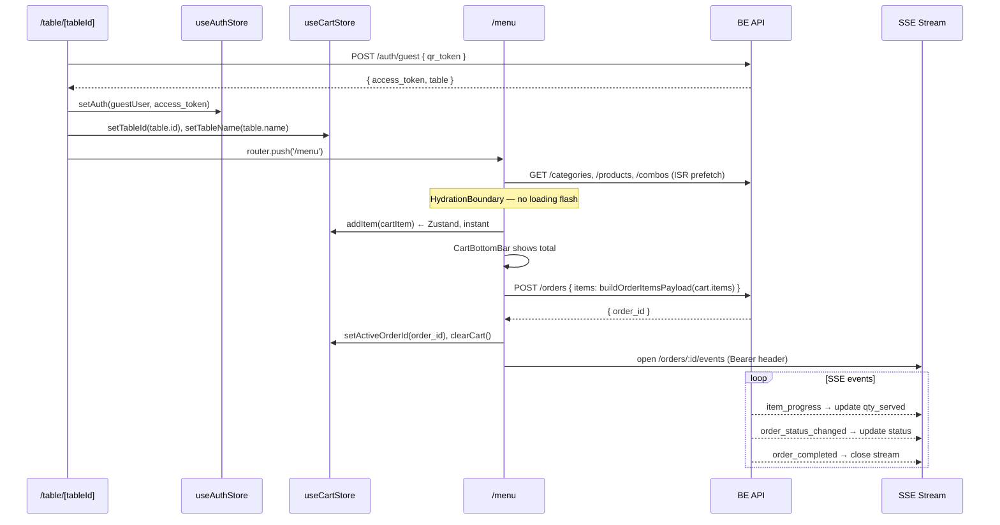

# Data Communication

> **TL;DR** — FE talks to BE through one Axios instance (`api-client.ts`) with automatic
> Bearer auth and silent refresh. Pages share data via Zustand stores and localStorage keys
> (all centralized in `storage-keys.ts`). Realtime uses SSE (customers) and WebSocket (staff/KDS).
> ALL cart→order payloads go through `lib/order-payload.ts` — never built inline.

---

## FE → BE: API Client

Single source for all HTTP calls: `fe/src/lib/api-client.ts`.

```ts
export const api = axios.create({
  baseURL:         process.env.NEXT_PUBLIC_API_URL ?? 'http://localhost:8080/api/v1',
  withCredentials: true,   // browser auto-sends httpOnly refresh cookie
})
```

**Request interceptor** — attaches Bearer token from Zustand (never from localStorage):
```ts
api.interceptors.request.use((config) => {
  const token = useAuthStore.getState().accessToken
  if (token) config.headers.Authorization = `Bearer ${token}`
  return config
})
```

**Response interceptor** — 401 handling:

| Condition | Action |
|---|---|
| 401 + `sub === 'guest'` | `clearAuth()` → redirect `/login` (guests cannot refresh) |
| 401 + staff token | POST `/auth/refresh` (httpOnly cookie sent automatically) → update store → retry |
| Refresh also fails | `clearAuth()` → redirect `/login` |
| 403 | `toast.error('Không có quyền...')` |
| `INVALID_INPUT` | Map `details.fields[]` to RHF `setError()` per field |
| `TABLE_HAS_ACTIVE_ORDER` | `router.push('/order/:active_order_id')` |

---

## Auth: Token Lifecycle

| Token | Storage | Notes |
|---|---|---|
| Staff access token (24h TTL) | Zustand memory-only | Never localStorage — XSS risk |
| Guest JWT (2h TTL, `sub='guest'`) | Zustand memory-only | No refresh — redirect to `/table/:id` on expiry |
| Refresh token (30d TTL) | httpOnly cookie (set by BE) | FE never reads it; browser sends it automatically |

On app mount or F5: `GET /auth/me` restores session silently from refresh cookie.

---

## Page-to-Page Data: localStorage Keys

All localStorage key strings MUST be imported from `fe/src/lib/storage-keys.ts`:

```ts
export const STORAGE_KEYS = {
  COOKIE_CONSENT:    'cookie_consent_accepted',
  ORDER_CACHE:       'order_cache_',              // prefix — append orderId
  FAVOURITES:        'favourites',
  CUSTOMER_SETTINGS: 'customer-settings',
  CART_CONFIG:       'cart-config-v3',
} as const
```

| Key | What's stored | Who reads it |
|---|---|---|
| `ORDER_CACHE` + orderId | Serialized `Order` object (instant display before SSE) | `useOrderSSE` — loads on mount, updates on each order change |
| `FAVOURITES` | `FavouritesStore` (items + sets) via Zustand persist | `/menu/favourites`, favourites rail on menu page |
| `CUSTOMER_SETTINGS` | `{ customerName, tableLabel }` | Menu header (tableLabel), checkout form (customerName) |
| `CART_CONFIG` | `{ orderNote, activeOrderId }` only | Cart store — items are session-only |

**Rule:** Never write a localStorage key string inline in a component. Always import from `STORAGE_KEYS`.

---

## Zustand: Cross-Page State

| Store | Shared between |
|---|---|
| `useCartStore` | QR entry `/table/:id` → `/menu` → `/checkout` → `/order/:id` |
| `useFavouritesStore` | `/menu` (rail + toggle) → `/menu/favourites` |
| `useSettingsStore` | `/table/:id` (write tableLabel) → `/menu` header (read tableLabel) |
| `useAuthStore` | All pages — provides `accessToken` to `api-client.ts` |

---

## Realtime: SSE

Used by customer-facing pages. Auth via `Authorization: Bearer` header (using `@microsoft/fetch-event-source`).

| Hook | Endpoint | Events handled |
|---|---|---|
| `useOrderSSE` | `GET /orders/:id/events` | `order_init`, `order_status_changed`, `item_progress`, `order_cancelled`, `order_completed` |
| `useOrderMonitorSSE` | `GET /sse/order-monitor/:id` | `order.status`, `queue.update`, `tables.status`, `items_added`, `item_updated`, `item_cancelled` |
| `useAdminSSE` | `GET /sse/admin` | `new_order` |

Reconnect: 5 attempts, exponential backoff 1s→30s. `<ConnectionErrorBanner>` shown after attempt 3.

## Realtime: WebSocket

Used by staff pages. Auth via `?token=<accessToken>` query param (browser WS API cannot set custom headers).

| Hook/Context | Endpoint | Events |
|---|---|---|
| `OrdersWSContext` + `useOverviewWS` | `ws://.../ws/kds?token=` | `new_order`, `item_progress`, `order_status_changed`, `order_updated`, `order_cancelled`, `order_completed` |
| KDS page | `ws://.../ws/kds?token=` | Same events — drives full-screen card grid |

`useOverviewWS` patches `['orders', 'live']` query cache directly via `queryClient.setQueryData` — no network round-trip on WS events.

---

## Order Payload Builder

**`fe/src/lib/order-payload.ts`** is the SINGLE source for converting `CartItem[]` to the POST /orders body. Every checkout path (table confirm, online checkout, add-to-order) MUST call this function.

> Field shapes of `CartItem` and `OrderItemPayload` are **not** redefined here — see their single home [OBJECT_MODEL_ORDER.md §2.1–2.3](../02_spec/object/OBJECT_MODEL_ORDER.md) (Rule #9). This section documents the *transport* (how the conversion happens), not the model.

```ts
export function buildOrderItemsPayload(items: CartItem[]): OrderItemPayload[] {
  // Handles three item types:
  // 1. Combo — maps to { combo_id, combo_items: [overrides], topping_ids: [] }
  //    Canh (soup) sub-items are stripped — they live as standalone CartItems
  // 2. Standalone product — maps to { product_id, topping_ids: [t.id, ...] }
  //    Includes canh items (canh_<id>_rau has Rau topping in topping_ids)
  // 3. Filling (nhân: thịt/mộc nhĩ) — carried as topping_ids on products and combo sub-items
}
```

Three POST paths that MUST use this builder:
1. `TableConfirmModal` — QR table confirm (menu page)
2. `/checkout/page.tsx` — online checkout form
3. Add-to-order path — "Đặt thêm món" when `activeOrderId` is set

**Never build `items[]` inline** in a page. Inconsistencies in how combo `product_id`, `filling`, and canh splitting are handled will cause the saved order to differ from the menu preview.

---

## Client QR Ordering — Data Flow Diagram



---

## Deep Dive Sources

- `fe/src/lib/api-client.ts` — full interceptor implementation
- `fe/src/lib/storage-keys.ts` — all localStorage key constants
- `fe/src/lib/order-payload.ts` — `buildOrderItemsPayload` implementation
- `fe/src/hooks/useOrderSSE.ts` — SSE + localStorage cache pattern
- `fe/src/hooks/useOverviewWS.ts` — WS → TanStack Query cache update
- `../01_flow/CLIENT_FLOW.md` — full QR ordering flow spec
- `../02_spec/API_SPEC.md` — endpoint table incl. SSE/WS rows; event config in `../03_be/REALTIME_SSE.md`
