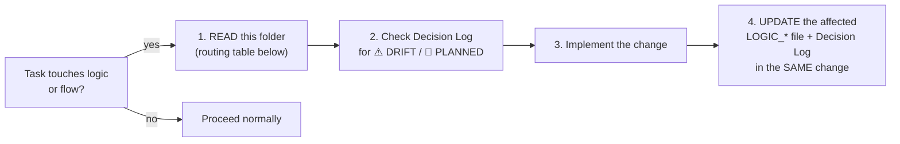

# Business Logic Index — The Canonical Logic Home

> **TL;DR:** This folder is the **single canonical home for business logic** across BE, FE, and
> DevOps. **Mandate: every time Claude Code wants to change any logic or flow, it MUST consult
> this folder first AND update it as part of the same change.** Shared rule definitions live in
> [../02_spec/BUSINESS_RULES.md](../02_spec/BUSINESS_RULES.md) (one fact, one home) — the LOGIC_*
> files here own the **per-layer interpretation and invariants** plus the owner's Decision Log.

---

## The Mandate (non-negotiable)

1. **Consult first** — before changing any rule, state transition, permission, payment behaviour,
   cache trigger, realtime event, or flow step: read the matching section in
   [LOGIC_BE.md](LOGIC_BE.md) / [LOGIC_FE.md](LOGIC_FE.md) / [LOGIC_DEVOPS.md](LOGIC_DEVOPS.md),
   plus the shared rule in [BUSINESS_RULES.md](../02_spec/BUSINESS_RULES.md) and the relevant
   `01_flow/` doc.
2. **Update in the same change** — if the change alters logic, the LOGIC_* file and this
   Decision Log must be updated before the task is DONE. A logic change without a doc update
   here is an incomplete task.
3. **Code wins on disagreement** — when a LOGIC_* file and the code disagree, the code is the
   fact; fix the file and record the discrepancy as a ⚠️ DRIFT entry in the Decision Log.

---

## Status Markers

| Marker | Meaning |
|---|---|
| ✅ implemented | Rule is in code and matches this doc |
| 🔮 PLANNED | Owner decision exists; **not in code yet** — do not assume endpoints/pages exist |
| ⚠️ DRIFT | Owner's target rule differs from current code behaviour — both are documented |

---

## How to Use This Folder

| File | Owns |
|---|---|
| [LOGIC_INDEX.md](LOGIC_INDEX.md) (this file) | Mandate, routing table, Decision Log |
| [LOGIC_BE.md](LOGIC_BE.md) | Server-side invariants: state machine, cancel, payments, RBAC, JWT, cache, realtime publishing |
| [LOGIC_FE.md](LOGIC_FE.md) | Client-side invariants: state homes, order write path, error mapping, cancel UX, redirects, reconnect, role routing |
| [LOGIC_DEVOPS.md](LOGIC_DEVOPS.md) | Infra-coupled logic: ports, proxy/SSE requirements, Redis roles, migration sequence, env, webhooks, backup/rollback |

Shared rule text (RBAC tables, cancel formula, payment rules, JWT config, realtime config) lives
**only** in [../02_spec/BUSINESS_RULES.md](../02_spec/BUSINESS_RULES.md). LOGIC_* files link to it
and add the layer-specific interpretation — never duplicate the full rule text.

---

## Routing Table — "I'm changing X, what must I read?"

| Changing… | LOGIC section | Shared rule | Flow doc |
|---|---|---|---|
| Order status transitions | [LOGIC_BE §2](LOGIC_BE.md#2--order-state-machine-enforcement) + [LOGIC_FE §6](LOGIC_FE.md#6--one-active-order--redirect-rules) | [BUSINESS_RULES §2](../02_spec/BUSINESS_RULES.md#2-order-rules) | [ORDER_STATE_MACHINE](../01_flow/ORDER_STATE_MACHINE.md) |
| Cancel rule / cancel UX | [LOGIC_BE §3](LOGIC_BE.md#3--cancel-rule--drift) + [LOGIC_FE §5](LOGIC_FE.md#5--cancel-ux--drift) | [BUSINESS_RULES §3](../02_spec/BUSINESS_RULES.md#3-cancel-rules) | [ORDER_STATE_MACHINE — cancel](../01_flow/ORDER_STATE_MACHINE.md#cancel-rules) |
| Order create / items / combos | [LOGIC_BE §4–5](LOGIC_BE.md#4--one-active-order-per-table) + [LOGIC_FE §2](LOGIC_FE.md#2--single-order-write-path) | [BUSINESS_RULES §2.3–2.5](../02_spec/BUSINESS_RULES.md#2-order-rules) | [CLIENT_FLOW](../01_flow/CLIENT_FLOW.md) |
| Payment / webhooks | [LOGIC_BE §6](LOGIC_BE.md#6--payment-rules) + [LOGIC_DEVOPS §6](LOGIC_DEVOPS.md#6--webhook-exposure) | [BUSINESS_RULES §4](../02_spec/BUSINESS_RULES.md#4-payment-rules) | [PAYMENT_FLOW](../01_flow/PAYMENT_FLOW.md) |
| RBAC / permissions | [LOGIC_BE §7](LOGIC_BE.md#7--rbac-middleware-rules) + [LOGIC_FE §8](LOGIC_FE.md#8--role--screen-routing) | [BUSINESS_RULES §1](../02_spec/BUSINESS_RULES.md#1-rbac-role-hierarchy) | [STAFF_FLOW](../01_flow/STAFF_FLOW.md) |
| Auth / JWT / guest token | [LOGIC_BE §8](LOGIC_BE.md#8--jwt--guest-token-rules) + [LOGIC_FE §1](LOGIC_FE.md#1--state-homes-strict) | [BUSINESS_RULES §5](../02_spec/BUSINESS_RULES.md#5-jwt--auth-rules) | [CLIENT_FLOW](../01_flow/CLIENT_FLOW.md) / [STAFF_FLOW](../01_flow/STAFF_FLOW.md) |
| Caching / invalidation | [LOGIC_BE §9](LOGIC_BE.md#9--cache-invalidation-triggers) + [LOGIC_DEVOPS §4](LOGIC_DEVOPS.md#4--redis-roles) | — | [REDIS_CACHE](../03_be/REDIS_CACHE.md) |
| Realtime events (SSE/WS) | [LOGIC_BE §10](LOGIC_BE.md#10--realtime-event-publishing-duties) + [LOGIC_FE §7](LOGIC_FE.md#7--ssews-reconnect-behaviours) + [LOGIC_DEVOPS §3](LOGIC_DEVOPS.md#3--caddy-proxy--ssews-requirements) | [BUSINESS_RULES §6](../02_spec/BUSINESS_RULES.md#6-realtime-config) | [REALTIME_SSE](../03_be/REALTIME_SSE.md) |
| Error codes / messages | [LOGIC_FE §4](LOGIC_FE.md#4--error-code--message-mapping-duty) | [ERROR_SPEC](../02_spec/ERROR_SPEC.md) | — |
| Migrations / env / ports / deploy | [LOGIC_DEVOPS](LOGIC_DEVOPS.md) | — | — |
| New pages (Welcome, Storage, online ordering…) | [LOGIC_FE §9](LOGIC_FE.md#9--planned-pages--flows-) | Decision Log below | [../08_pages/PAGES_INDEX.md](../08_pages/PAGES_INDEX.md) |
| Ingredient / inventory rules | [LOGIC_BE §12](LOGIC_BE.md#12--inventory--storage-domain) + [LOGIC_FE §10](LOGIC_FE.md#10--inventory--storage-ui) | [../02_spec/object/OBJECT_MODEL_INGREDIENT.md](../02_spec/object/OBJECT_MODEL_INGREDIENT.md) | [../08_pages/admin/admin_storage/admin_storage.md](../08_pages/admin/admin_storage/admin_storage.md) |

---

## Decision Log

> Owner decisions, newest first. Every logic change must add or update a row here.
> ⚠️ DRIFT entries stay until the code matches the target; then they flip to ✅.

| Date | Decision | Status | Layer impact |
|---|---|---|---|
| 2026-06-18 | **Admin Staff (`/admin/staff`, A7): staff account CRUD — handbook 100% accurate, no code bugs, page-doc drift fixed.** Traced during `/page-doc-set admin_staff` (6 endpoints, all `authMW` + `AtLeast("manager")` on the `/staff` group `main.go:281`; `DELETE` nested `AtLeast("admin")` `main.go:289`): `GET /staff` (`ListStaff`→raw-SQL `ListStaff` COUNT+paged SELECT `staff_repo.go:70`, **no Redis**; page sends only `?limit=100` and filters/paginates client-side, so BE `role`/`search`/`is_active` params are unused here), `GET /staff/:id` (detail drawer, raw SQL `GetStaffByID`), `POST /staff` (hierarchy `targetLevel<callerLevel` + username-unique + bcrypt INSERT), `PATCH /staff/:id` (raw-map partial update, role-change hierarchy guard), `PATCH /staff/:id/status` (self-deactivation block + hierarchy; **`Del auth:staff:<id>`** invalidates the auth is_active cache), `DELETE /staff/:id` (admin-only, self-delete block, **last-admin guard `CountAdmins≤1`→409**, soft-delete + cache Del). **No handbook drift** — API_SPEC.md:130-139 (6 staff rows: paths `/staff*`, auth manager+/DELETE admin, request/response shapes), DB_SCHEMA.md:53-67 (`staff` job_title/shifts/responsibilities; **no `performance_score` column** — confirms the hardcoded-0 stub), REDIS_CACHE.md:42,48,71,77 (`auth:staff:{id}` 5-min fail-open; staff list on do-not-cache list) all matched code. **No code bugs → no `_BUGS.md`** — FE and BE agree on every route/shape/guard; the only mismatches are dead defensive code + a stub. **Page-doc drift FIXED** (`admin_staff.md` refreshed): Zone D source `GET /admin/staff`→`GET /staff?limit=100`; Key Interaction `PUT/PATCH`→`PATCH /staff/:id`; broken BUSINESS_RULES/LOGIC_FE links `../02_spec`/`../07_business_logic`→`../../../…` (same link-depth class fixed for C13 landing); added `_be.md`/loading/x-page/scenario links to TL;DR. **Non-bug flags in `_be.md`:** (1) dead self-service guard (`id==callerID` non-manager branch unreachable under manager+ group); (2) list filter params unused by this page; (3) 100-row client cap; (4) no admin creatable/promotable here (hierarchy + form omits `admin`); (5) self-status toggle fully blocked; (6) soft-delete doesn't purge `refresh_tokens` (only cache Del'd — lockout still fast via middleware re-check); (7) DB error on create → 500 not 4xx; (8) `performance_score` hardcoded 0 stub (table shows 0% for all; drawer degrades to "Chưa có dữ liệu"). Full set built: be anchor + crosspage + loading + scenario + refreshed page doc; crosscomponent = **N/A** (page-level `useState` + props + one shared TanStack key, classic prop-drilling — no Zustand store). **Cross-page:** staff writes ripple to the auth middleware (every request, near-live lockout via cache Del), login, and the todo-list/task-board assignee dropdowns (`GET /staff`). 0 ❓ UNVERIFIED. BE ref: [admin_staff_be.md Flags 1–8](../08_pages/admin/admin_staff/admin_staff_be.md). | ✅ | [LOGIC_FE](LOGIC_FE.md) (staff page — doc paths/links fixed; admin CRUD pattern) · [LOGIC_BE](LOGIC_BE.md) (staff CRUD — role hierarchy, last-admin guard, is_active cache invalidation) |
| 2026-06-18 | **Admin Toppings (`/admin/toppings`, A6): topping CRUD — handbook 100% accurate, no code bugs, page-doc drift fixed.** Traced during `/page-doc-set admin_toppings` (5 endpoints, topping CRUD lives in the products domain): `GET /toppings` (**public**, `main.go:201`; cache-aside `toppings:list` 5-min `product_service.go:432-445`; `ListToppings` returns `deleted_at IS NULL` regardless of `is_available`, so the admin table shows "Hết" rows too), `GET /products/all` (**manager+**, uncached + N+1 toppings, used only to build the "Áp dụng cho sản phẩm" column — shared with A3), `POST /toppings` (**manager+**, INSERT hardcodes `is_available=1`), `PATCH /toppings/:id` (**manager+**, `GetToppingByID`→404 if missing, then name/price UPDATE + a **separate raw-SQL `UpdateToppingAvailability`** write `product_repo.go:157` only if `is_available` sent), `DELETE /toppings/:id` (**admin-only**, soft delete, **no in-use guard**). All three writes call `invalidateToppingCaches` → Del `toppings:list`+`products:list` (`product_service.go:719-721`). **No handbook drift** — API_SPEC.md:53-56 (4 topping rows, auth, request/response shapes), DB_SCHEMA.md:103 (`toppings`: id/name/price NOT price_delta/is_available), REDIS_CACHE.md:38-39 (`toppings:list` 5-min, topping write Dels `products:list`) all matched code. **No code bugs** → no `_BUGS.md`. **Page-doc drift FIXED** (`admin_toppings.md` refreshed): Key Interactions claimed "in-use toppings rejected server-side" — **false**, the BE soft-deletes unconditionally (FE shows only a JS `confirm()` unlink warning); the wireframe + Zones omitted the "Trạng thái" column + the modal's Có sẵn/Hết toggle → added. **Non-bug flags in `_be.md`:** (1) `UpdateToppingAvailability` is raw SQL bypassing sqlc (layer exception); (2) topping writes Del `toppings:list`+`products:list` but **not** `product:<id>` → customer product-detail (C4) stale up to 5 min (already-logged Cross-Page Concern); (3) DELETE has no in-use guard, junction rows persist after soft-delete (harmless — reads filter `deleted_at IS NULL`); (4) FE expects a 409 on duplicate name that the BE never sends (no unique constraint on `toppings.name`) → dead FE branch. Full 6-file set built (be anchor + refreshed page + crosspage + loading + scenario); crosscomponent = **N/A** (header/table/modal coordinate via local `useState` + props + one shared TanStack key — no Zustand store). BE ref: [admin_toppings_be.md Flags 1–5](../08_pages/admin/admin_toppings/admin_toppings_be.md). | ✅ | [LOGIC_FE](LOGIC_FE.md) (toppings page — doc wording fixed; admin CRUD pattern) · [LOGIC_BE](LOGIC_BE.md) (topping CRUD — raw-SQL availability write, asymmetric cache invalidation) |
| 2026-06-18 | **Cashier Payment (`/cashier/payment/:id`, S5): bill + payment screen — 3 code bugs make payment impossible from this page for every method; 1 API_SPEC gate fix.** Traced during `/page-doc-set staff_cashier_payment` (2 REST it calls + 1 absent route + 1 WS): `GET /orders/:id` (**authMW, no role gate**, customer-only ownership guard so a cashier reads any order `order_service.go:106-120`; no Redis read), `POST /payments` (**authMW + `AtLeast("cashier")`**, `main.go:255`; `paymentH.Create`→`CreatePayment` `payment_service.go:63`: order-ready gate `ready`OR`delivered` else 409 `ORDER_NOT_READY`, one-payment-per-order idempotency else 409 `PAYMENT_ALREADY_EXISTS`, amount snapshotted server-side from order total; cash → `completePayment` instantly, gateways → build pay/QR URL; publishes `payment_success` to `orders:kds` on completion `:270-271`), and WS `GET /ws/orders-live` (**no authMW/role gate**, `?token=` claims discarded, subscribes `orders:kds`, `websocket/handler.go:22-23,31-47`). **3 code bugs** ([PAYMENT_BUGS.md](../08_pages/staff/staff_cashier_payment/PAYMENT_BUGS.md)): (1) 🔴 cash button sends `method:'cod'` (`page.tsx:14,52`) but the BE binding is `oneof=...cash` (`payment_handler.go:25`) → cash always 400s; (2) 🔴 `POST /payments` response is thin `{id, pay_url, qr_code_url}` (`payment_handler.go:44-48`, no `status`/`amount`/`method`) but the FE consumes a full `Payment` → `payment.status` undefined kills the WS listener guard (`page.tsx:64`) and the QR-pending render (`page.tsx:249`), so after create the screen goes blank and `payment_success` is never received → no auto-print/redirect; (3) 🟠 `PATCH /payments/:id/proof` (`page.tsx:129`) matches **no route** (no proof handler/service/column in `be/`) → 404. **Doc drift FIXED:** `API_SPEC.md:115` "Payment requires `order.status = ready`" → corrected to `ready` **or** `delivered` (`order_service.go:50`); added a note that the documented `{...payment, pay_url?}` create response is the **intended** contract and the code currently returns the thin shape (Bug 2). API_SPEC method enum (`vnpay|momo|zalopay|cash`), ERROR_SPEC (`ORDER_NOT_READY`/`PAYMENT_ALREADY_EXISTS` 409), and REDIS_CACHE (`orders:kds` "published by order_service + payment_service") all matched code. **Non-bug flags in `_be.md`:** `payment_success` rides the shared `orders:kds` channel (KDS/POS/admin floor all receive + ignore it); WS no role gate (shared concern); paying a `ready` (not `delivered`) order leaves order status at `ready` because `MarkOrderPaid` only advances `delivered→paid` and the error is swallowed (`order_service.go:83-86`, `payment_service.go:265-267`) → status drift; gateway pay/QR URL silently empty if creds/`WEBHOOK_BASE_URL` unset; `GET /payments/:id` exists (cashier+) but is unused — the natural fix path for Bug 2. Full 6-file set built (be anchor + refreshed page + crosspage + loading + scenario + bugs); crosscomponent = **N/A** (one `PaymentContent` component owns `method`/`payment` in local `useState` — no shared store). BE ref: [staff_cashier_payment_be.md Flags 1–8](../08_pages/staff/staff_cashier_payment/staff_cashier_payment_be.md). | ⚠️ DRIFT | [LOGIC_FE](LOGIC_FE.md) (payment page — cod≠cash, thin-response consumed as full, proof 404) · [LOGIC_BE](LOGIC_BE.md) (CreatePayment thin response; MarkOrderPaid gate drift) |
| 2026-06-18 | **Admin Combos (`/admin/combos`, A4): combo CRUD — handbook accurate, 4 BE code bugs + stale FE wireframe.** Traced during `/page-doc-set admin_combos` (5 endpoints, 2 reads / 3 writes): `GET /combos` (**public**, `main.go:216`; cached `combos:list` 5-min, populated from `ListCombosAvailable` available-only `products.sql:112`), `GET /products/all` (**manager+**, uncached + N+1 toppings, used for the product-name map), `POST /combos` (**manager+**), `PATCH /combos/:id` (**manager+**, items `required,min=2`), `DELETE /combos/:id` (**admin-only**; FE 🗑 correctly gated to `role==='admin'` `combos/page.tsx:326` — so combos does **not** have the A5/A12 manager-delete-403 bug). **No handbook drift** — API_SPEC §combos (auth + min-2 on PATCH), DB_SCHEMA (combos/combo_items), REDIS_CACHE (`combos:list`) all matched code; the available-only filter is the already-logged "Catalog GETs are available-only everywhere" cross-page concern. **4 code bugs** ([COMBOS_BUGS.md](../08_pages/admin/admin_combos/COMBOS_BUGS.md)): (1) 🟠 admin management list calls `ListCombosAvailable` (`product_service.go:505`) so any `is_available=0` combo is unmanageable — the unfiltered `ListCombos` query (`products.sql:107`) is **dead**, no `/combos/all` exists (latent — no UI path sets a combo unavailable); (2) 🟠 `PATCH /combos/:id` **nulls `image_path` + `category_id` every edit** — handler `updateComboRequest` omits both fields (`product_handler.go:400-406`), service passes empty→NULL (`product_service.go:603-610`); `in.CategoryID` is a dead service parameter (latent — FE form sends neither); (3) 🟡 combo item inserts are non-transactional + swallow FK errors (`slog.Warn`, `product_service.go:562-564,617-619`) → partial/empty combo still 2xx; (4) 🟡 `POST /combos` validation looser than PATCH (`price min=0`, no item-count min `product_handler.go:359-365`) → API accepts a free/itemless combo. Non-bug flags in `_be.md`: combos are always `is_available=1` (CreateCombo hardcodes 1, no toggle); `DELETE` has no in-use guard; `category_id` returned but unrendered. **FE page-doc drift FIXED** (`admin_combos.md` refreshed): removed the phantom "Còn ●" availability column + "availability toggle controls /menu" claim (neither exists in code), corrected actions to text "Sửa"/"Xóa" (delete admin-only), added the "🎲 Random combo" header button (3 parallel POSTs) + the real modal (checkbox picker + retail/savings math). Full 6-file set built (be anchor + refreshed page + crosspage + loading + scenario + bugs); crosscomponent = **N/A** (header/table/modal coordinate via local `useState` — no shared store). BE ref: [admin_combos_be.md Flags 1–7](../08_pages/admin/admin_combos/admin_combos_be.md). | ⚠️ DRIFT | [LOGIC_FE](LOGIC_FE.md) (combos — stale wireframe fixed; admin list available-only) · [LOGIC_BE](LOGIC_BE.md) (combo PATCH nulls image/category; non-transactional items; create-validation gap) |
| 2026-06-18 | **Admin Categories (`/admin/categories`, A5): category CRUD — handbook drift fixed, 1 FE code bug.** Traced during `/page-doc-set admin_categories` (4 endpoints, all in the products domain). `GET /categories` (**public**, no `authMW`, `main.go:186`) → `ListCategories` cache-aside `categories:list` 5-min (`product_service.go:344-357`) → sqlc `ListCategories` `WHERE is_active=1 AND deleted_at IS NULL ORDER BY sort_order ASC, name ASC` (`products.sql.go:306-310`). `POST /categories` + `PATCH /categories/:id` (**`AtLeast("manager")`**, `main.go:188-191`) → dup-name guard via raw-SQL `GetCategoryByName` → `409 DUPLICATE_NAME`; PATCH 404s if missing; both a **full replace** of name/description/sort_order. `DELETE /categories/:id` (**`AtLeast("admin")`**, `main.go:193-196`) → `CountProductsByCategory>0` (raw SQL, **products only — not combos**) → `409 CATEGORY_HAS_PRODUCTS` else soft-delete; returns **204 no body**. All three writes call `invalidateProductCaches(ctx,"")` → Del `products:list`+`categories:list` (`product_service.go:709-717`). **1 FE code bug** ([CATEGORIES_BUGS.md](../08_pages/admin/admin_categories/CATEGORIES_BUGS.md)): 🟠 the red "Xóa" button renders for every manager+ user with no role check (`categories/page.tsx:131-136`) but `DELETE` is admin-only → a manager's delete 403s and the `onError` (no 403 branch) shows a generic "Không thể xóa danh mục" toast — **same class as A12 Training Bug 2** (admin-only write rendered to managers). ⚠️ **Doc drift FIXED:** `API_SPEC.md:49-52` — GET response was `[{id,name,sort_order}]` → actual `[{id,name,description,sort_order,is_active}]`; PATCH request was `name,description` → actual `name,sort_order` (description optional, full replace); DELETE response was `message` → actual `204` no body. `REDIS_CACHE.md:41,44` — `categories:list` invalidation trigger was "product write" only → added "**or category write**" + prose noting category writes also call `invalidateProductCaches`. Page-doc drift FIXED (refreshed `admin_categories.md`): stale wireframe had a "Số món" column + icon buttons `[✎][🗑]` (real table = Tên/Thứ tự/action only, text buttons "Sửa"/"Xóa"). **Non-bug flags in `_be.md`:** GET returns description+is_active unused FE-side; `is_active` write-once `1` (no toggle endpoint); handler doc-comment says "PUT" but route is PATCH; delete guard ignores combos. Full 6-file set built (be anchor + refreshed page + crosspage + loading + scenario + bugs); crosscomponent = **N/A** (single page component, local `useState` + RHF, no shared store). BE ref: [admin_categories_be.md Flags 1–7](../08_pages/admin/admin_categories/admin_categories_be.md). | ⚠️ DRIFT | [LOGIC_FE](LOGIC_FE.md) (categories page — manager delete 403) · [LOGIC_BE](LOGIC_BE.md) (category CRUD — cache invalidation, combo-blind delete guard) |
| 2026-06-17 | **Staff KDS (`/kds`, S3): kitchen display — handbook accurate, 2 FE code bugs.** Traced during `/page-doc-set staff_kds` (3 REST + 1 WS): `GET /orders` (**authMW + `AtLeast("chef")`**, `main.go:233`; raw `ListActiveOrders` returns pending/confirmed/preparing/ready/delivered, N+1 items+table, no Redis read), `GET /orders/:id` (**authMW**, customer-only ownership guard `order_service.go:116-120`; fetched on each `new_order` WS event), `PATCH /orders/:id/status` (**chef+**, `validTransitions` map `order_service.go:524-530`; `→ready` valid only from `preparing` → else 409; publishes `order_status_changed` to `order:<id>`+`orders:kds`), WS `GET /ws/orders-live` (**no authMW/role gate**, `?token=` in-handler claims discarded, subscribes `orders:kds`, `websocket/handler.go:22-23,31-40`). **No handbook drift** — API_SPEC (`PATCH /orders/items/:id`→`qty_served` chef+; `/ws/*` JWT), BUSINESS_RULES §2.2 transitions + §2.4 item_status, REDIS_CACHE (`orders:kds` pub/sub, no read cache) all matched code. **2 FE code bugs** ([KDS_BUGS.md](../08_pages/staff/staff_kds/KDS_BUGS.md)): (1) 🔴 tap-to-serve PATCHes `/orders/:orderId/items/:itemId/status` (`kds/page.tsx:160-161`) — a 5-segment path matching **no route** → 404; real route is `PATCH /orders/items/:id` with `{qty_served}` (`main.go:250`); FE body is also `{}` (would SET qty_served=0) → item progress **unservable from the KDS**, auto-ready never fires from kitchen action; (2) 🟠 card header renders `Bàn ${order.table_id}` (UUID, `kds/page.tsx:214`) instead of the resolved `table_name` the API returns. **Doc note (not code):** REALTIME_SSE.md WS table labelled `/ws/kds` as the KDS subscriber — corrected: the KDS page uses the shared `/ws/orders-live`; `/ws/kds` is identical-but-unused dead code. **Minor flags in `_be.md`:** `→ready` 409 from confirmed/pending (no "start cooking" control on KDS); 3 `orders:kds` events ignored (items_added/item_cancelled/item_updated); `order_status_changed` handler only filters non-active cards → a **staying** card's badge doesn't live-update; no `setInterval` → urgency borders/elapsed-min don't tick without a WS event; loading-vs-empty indistinguishable (query `isLoading` unread); WS disconnect has no banner; `order_items.filling` dropped by migration 017 (root CLAUDE.md still lists it live). Full 6-file set built (be + page + crosspage + loading + scenario + bugs); crosscomponent = **N/A** (single page component owns board state in `useState` + the cross-page WS context — no shared store). BE ref: [staff_kds_be.md Flags 1–7](../08_pages/staff/staff_kds/staff_kds_be.md). | ⚠️ DRIFT | [LOGIC_FE](LOGIC_FE.md) (KDS — tap-to-serve 404, table UUID, dead-listener flags) · [LOGIC_BE](LOGIC_BE.md) (item-serve route shape; WS no role gate) |
| 2026-06-17 | **Public Landing (`/`, C13): a static marketing page whose only BE traffic comes from two demo widgets — handbook 100% accurate, 3 code bugs (1 security).** Traced during `/page-doc-set public_landing`. The page body (`app/page.tsx`) is a static server component; all BE calls come from **StaffQuickLogin** (`POST /auth/login`, public, **rate-limited 5/min/IP** `auth_service.go:70-73`) and the **TableGrid → SimulateBtn** "Giả lập khách" chain (`POST /auth/guest` → `GET /products?is_available=true` + `GET /combos` → `POST /orders`, `source:'qr'`). All 5 endpoints already documented correctly in API_SPEC/DB_SCHEMA/REDIS_CACHE/BUSINESS_RULES from prior runs (C1 menu, C3 table_qr, S1 login) — **no domain-file edit**. **3 code bugs** ([LANDING_BUGS.md](../08_pages/public/public_landing/LANDING_BUGS.md)): (1) 🔴 **`/api/dev/run` runs host shell commands with no auth + no prod guard** — a Next.js route (`fe/src/app/api/dev/run/route.ts:13-33`) `exec`s whitelisted `seed`/`build-be`/`build-fe` commands, reachable from public `/` via DevPanel; needs a `NODE_ENV`/auth gate before go-live; (2) 🟠 **Hero "Thử Menu Khách" + Footer "Demo Khách" link to `/table/1`** (`page.tsx:135,305,326`) — `1` is not a 64-char token so `/auth/guest` `len=64` bind 400s → CTAs dead-end on the C3 error screen (table *cards* use real tokens and work); (3) 🟡 SimulateBtn `TABLE_HAS_ACTIVE_ORDER` branch (`TableGrid.tsx:107-113`) is **dead** — same shared root as C3/C8 (`ErrTableHasActiveOrder` returned by no path; `CreateOrder` makes a parallel order + `table_busy`). Non-bug flags in `_be.md`: SimulateBtn bypasses `lib/order-payload.ts` (inline `items[]`, 2nd caller after POS); `GET /products` ignores `is_available` query param (no-op, same as C1); `/auth/guest` unthrottled while `/auth/login` is. Full set built: be (anchor) + crosspage + loading + scenario + bugs + refreshed page doc (fixed `../02_spec`→`../../../02_spec` link depth + added SimulateBtn flow to Zones); crosscomponent = **N/A** (DevPanel/StaffQuickLogin/SimulateBtn each mutate a global store independently then navigate away — no shared-store coordination). BE ref: [public_landing_be.md Flags 1–6](../08_pages/public/public_landing/public_landing_be.md). | ⚠️ DRIFT | [LOGIC_FE](LOGIC_FE.md) (landing — dev-route guard, broken /table/1 CTA, dead table-busy branch) |
| 2026-06-16 | **Staff POS (`/pos`, S4): walk-in order builder — handbook 100% accurate, 2 code bugs + a confirmed 2nd-page dead-feature.** Traced during `/page-doc-set staff_pos` (4 REST + 1 WS): `GET /categories` + `GET /products` (both **public**, `products:list`/`categories:list` 5-min cache, `main.go:168,186`), `POST /orders` (**authMW, no role gate**, `main.go:232`; for a cashier JWT `created_by`=staff UUID, `table_id` NULL → table-busy check skipped, `status` starts `pending`, no POS-specific BE branch beyond the stored `source='pos'` enum), `GET /orders/:id` (**authMW**, customer-only ownership guard so a cashier reads any order, `order_service.go:116-120`), and WS `GET /ws/orders-live` (**no authMW/role gate**, `?token=` parsed in handler, subscribes `orders:kds`, `websocket/handler.go:23,31-47`). **No handbook drift** — API_SPEC (source `oneof online\|qr\|pos`, `/ws/orders-live` JWT), REDIS_CACHE (5-min catalog keys, `orders:kds` pub/sub), DB_SCHEMA, BUSINESS_RULES all matched code; §2.3 table_busy already annotated NOT-IN-CODE and doesn't apply to POS (no table_id). **WS field shape MATCHES** — BE publishes `{type, order_id, status}` to `orders:kds` (`order_service.go:552,745,788-795`), FE `WsMsg` reads exactly those (`OrdersWSContext.tsx:5-11`); POS auto-redirect on `order_status_changed`+`order_id` is wired correctly (NOT the `/tracking` `order.status` SSE mismatch). **2 code bugs** ([POS_BUGS.md](../08_pages/staff/staff_pos/POS_BUGS.md)): (1) 🟠 `POST /orders` returns only `{id, table_busy}` (`order_handler.go:121`, no `orderJSON`), but POS uses it as a full `Order` with **no follow-up `GET /orders/:id`** (menu/checkout do that GET) → waiting card + toast render **"Đơn #undefined"** on every POS order (`pos/page.tsx:101,111`); redirect still works via `id`; (2) 🟡 "Tạo đơn mới" clears local `activeOrder` with no `DELETE /orders/:id` (`pos/page.tsx:124`) → a mistaken POS order is only cancellable from `/admin/overview` (may be intended — product decision). Non-bug flags in `_be.md`: POS **bypasses `lib/order-payload.ts`** (inline `{product_id,quantity}` only → products-only, no toppings/combos); placeholder `customer_phone='0000000000'` persisted verbatim; WS no role gate (shared cross-page concern); WS `order:<id>` not replayed on reconnect. Full 6-file set built (be anchor + crosspage + loading + scenario + bugs; existing page doc already current); crosscomponent = **N/A** (POS keeps cart/selectedCategory/activeOrder in local `useState` in one `POSContent` component — no shared store, deliberately not the customer cart store). **Cross-page:** `GET /products` ignores `category_id` (`product_handler.go:42-54`) → POS category tabs are a **no-op**, the **2nd** page (after C1 menu) confirmed on this dead shared-catalog filter. BE ref: [staff_pos_be.md Flags 1–7](../08_pages/staff/staff_pos/staff_pos_be.md). | ⚠️ DRIFT | [LOGIC_FE](LOGIC_FE.md) (POS page — #undefined order number, order-payload.ts bypass, orphan on new-order) · [LOGIC_BE](LOGIC_BE.md) (CreateOrder thin POST response) |
| 2026-06-16 | **Staff Training (`/admin/training`, A12): a working guide-authoring CMS bolted onto an empty progress-tracking shell — 2 code bugs, no handbook drift.** Traced/verified during `/page-doc-set admin_training` (7 endpoints, all `authMW` + `AtLeast("manager")` **except `DELETE` which is `AtLeast("admin")`**, `main.go:294-323`; **no Redis** anywhere — every read hits MySQL, client cache = TanStack Query only). API_SPEC.md:177-183 already lists all 7 with correct auth (incl. `DELETE`=admin) — **no domain-file edit**. **2 code bugs** ([TRAINING_BUGS.md](../08_pages/admin/admin_training/TRAINING_BUGS.md)): (1) 🔴 **the whole progress half is dead** — `UpsertStaffProgress`/`InsertQuizAttempt` exist in `training.sql`+`training_repo.go:25,30` but have **zero callers** in `be/` (verified `grep -rn` → repo/db layers only, no service/handler), so nothing ever writes `training_progress`/`quiz_attempts`; endpoint 5 `GET …/guides/:id/progress` (INNER JOIN staff) returns `{data:[]}`, endpoint 6 `GET …/staff/:id/progress/:gId` returns 404 `TRAINING_PROGRESS_NOT_FOUND`, endpoint 7 manager-notes `PATCH` 404s silently (no `onError`) → Zone D table + Modal 2 + notes are permanently inert. Same write-once shape as the A8/A9 `staff_tasks` gap (read/aggregation side built, row-producing write never wired). (2) 🟠 the 🗑 "Xoá" button renders unconditionally for managers (`JobGuideCard.tsx:69-71`, no role check, no `onError`) but `DELETE` is admin-only → a manager's delete 403s silently. Authoring half (create/edit guide, role filter, KPI/pass-rule fields) works end-to-end. Non-bug flags in `_be.md`: `ListGuides` returns drafts (no `published` gate), N+1 reads (`GetGuideRoles`/`ListQuizAttempts` per row, no Redis to absorb), dead `trainingStore.ts` (page uses Query cache + page-level state), `PATCH` guide is a full replace (PUT-semantics, harmless). Full 6-file set + BUGS already on disk (`_be.md` anchor + page/x-comp/x-page/loading/scenario); this run re-verified routes + Bug 1 against code and synced the roll-ups (PAGES_INDEX links, tracker A12). BE ref: [admin_training_be.md Flags 1–6](../08_pages/admin/admin_training/admin_training_be.md). | ⚠️ DRIFT | [LOGIC_BE](LOGIC_BE.md) (TrainingService — no progress/quiz write path) · [LOGIC_FE](LOGIC_FE.md) (training page — delete button role gate) |
| 2026-06-16 | **Staff Login (`/login`, S1): single public endpoint, handbook accurate; 1 doc fix + 2 low-sev FE error-UX bugs.** Traced during `/page-doc-set staff_login`. The page calls exactly **1 endpoint**, `POST /auth/login` (**public**, no `authMW`, `main.go:154-155`) → `authH.Login` → `AuthService.Login` (`auth_service.go:69-142`): Redis rate-limit `ratelimit:login:<ip>` 5/min fail-open → `GetStaffByUsername` (soft-delete-filtered, `auth.sql.go:138-165`) → bcrypt → `is_active` check (after bcrypt, no timing oracle) → mint access JWT (HS256, 24h) + refresh cookie (httpOnly, 30d, path `/api/v1/auth`) → max-5-sessions evict → cache `auth:staff:<id>="active"` 5min. **No read-cache** (login always hits MySQL); the two Redis writes are documented correctly in REDIS_CACHE.md. ERROR_SPEC + BUSINESS_RULES (token config 24h/30d) already matched code. **Doc drift FIXED:** `API_SPEC.md:29` login response listed `user{id,username,full_name,role}` — code also returns `email` (`auth_handler.go:57`); added `email` + the `min 3`/`min 8` field constraints. **2 code bugs (FE-side, low sev)** ([LOGIN_BUGS.md](../08_pages/staff/staff_login/LOGIN_BUGS.md)): (1) 🟡 FE Zod `password.min(6)` (`login/page.tsx:16`) is looser than BE binding `min=8` (`auth_handler.go:24`) → a 6–7-char password passes the form, 400s, and shows a generic error; (2) 🟡 FE error map checks dead `AUTH_001` and has no branch for `RATE_LIMIT_EXCEEDED`/`INVALID_INPUT` → throttled/under-length users get the catch-all message. Both fix-FE-only. Behavioural flag (not a bug): login's rate-limit is **service-level** (`checkLoginRateLimit`), not middleware — so it IS enforced, unlike the guest path. Full 6-file set built (be/crosspage/loading/scenario + bugs; existing page doc already current); crosscomponent = **N/A** (single RHF form, no ≥3 widgets sharing a store). BE ref: [staff_login_be.md Flags 1–5](../08_pages/staff/staff_login/staff_login_be.md). | ⚠️ DRIFT | [LOGIC_FE](LOGIC_FE.md) (login page — password min, error map) · [LOGIC_BE](LOGIC_BE.md) (AuthService.Login) |
| 2026-06-16 | **Register (`/register`, S2): public self-registration mints an ACTIVE `cashier` staff account — 1 security/intent code bug + API_SPEC corrected.** Traced during `/page-doc-set staff_register` (1 endpoint — `POST /auth/register`, **public**, no `authMW`/role gate `main.go:156`, no Redis, no realtime). `AuthService.Register` hardcodes `role="cashier"`, `full_name=username`, and the repo INSERT bakes `is_active=1` (`auth_service.go:219`, `auth_repo.go:87-88`) — so anyone hitting the public endpoint with `{username,password}` is immediately logged in with POS/staff access, contrary to the norm that staff are created by managers at `/admin/staff` ([BUSINESS_RULES §1 RBAC](../02_spec/BUSINESS_RULES.md)). 🔴 **Code bug (security + FE/BE intent mismatch):** the FE redirect map carries a `customer:'/menu'` branch (`register/page.tsx:23-29`) that is **dead** — BE never returns `role:"customer"` here, so every register lands on `/pos`; the FE page/wireframe imply a customer/full-name signup that does not exist → [REGISTER_BUGS.md](../08_pages/staff/staff_register/REGISTER_BUGS.md) Bug 1 (owner must decide: delete the route · make it customer-only · or gate behind manager auth). ⚠️ **Doc drift FIXED:** `API_SPEC.md:30` claimed the request takes `full_name` and returns only `id`; code request is `{username,password}` only (`confirm` is client-only Zod, `page.tsx:13-20`) and the response is `201` + `{access_token, user{id,username,full_name,role,email}}` + a `refresh_token` httpOnly cookie (`auth_handler.go:135-138,162-173`, `middleware/auth.go:101-104`) — corrected. Page-doc drift FIXED (refreshed `staff_register.md`): the wireframe's "Họ tên" field and a "Đăng nhập" link do not exist in `page.tsx`; the "serves the customer path" TL;DR was wrong. Full set built: be (anchor) + crosspage + loading + scenario + bugs + refreshed page doc; crosscomponent = N/A (single form card, RHF-local, no shared store). Minor flags in `_be.md` (not bugs): response omits `phone` (asymmetric vs Login); no rate-limit middleware on any `/auth` route (same gap as the table_qr/guest finding). BE ref: [staff_register_be.md Flags 1–6](../08_pages/staff/staff_register/staff_register_be.md). | ⚠️ DRIFT | [LOGIC_BE](LOGIC_BE.md) (AuthService.Register — hardcoded cashier role) · [LOGIC_FE](LOGIC_FE.md) (register page — dead customer redirect) |
| 2026-06-16 | **Marketing (`/admin/marketing`, A11) is a fully static handler-only stub — confirmed, no handbook drift.** Traced during `/page-doc-set admin_marketing`. The page calls exactly **1 endpoint**, `GET /admin/marketing/spend?from=&to=` (`authMW` + `AtLeast("manager")`, `main.go:294-306`), handled by `marketingH.GetSpend` (`marketing_handler.go:19-80`) which returns a **hardcoded `gin.H` literal** — total_budget 50M / spent 18.5M / spent_pct 37 / roi 3.2 + 5 spend categories + love_score — with **no service, no repository, no SQL, no Redis** (`NewMarketingHandler()` is a zero-field struct). **The `from`/`to` params are accepted (`DefaultQuery`) but only echoed into `date_range` — never used to filter**, so the header date picker refetches identical numbers (Flag 1); the "Xuất báo cáo" / "+ Nhập chi tiêu" buttons are placeholder `toast.info('… đang phát triển')` with no endpoint (Flag 3). **No handbook drift** — API_SPEC.md:184 ("Campaign spend data (static)") and BE_CODE_SUMMARY.md:59,173 already mark it static; **no domain-file edit**. No `_BUGS.md` (intentional pre-launch stub, no FE↔BE disagreement). Set built this run: `_be.md` (anchor) + `_loading.md` + `SCENARIO_MARKETING.md`; **N/A** — `_crosscomponent` (widgets get data via props from one page-level `useMarketingSpend` query, no shared store), `_crosspage` (read-only, no write/handoff). Surgical fix to the page doc's misleading "refetch spend data for that window" interaction bullet. BE ref: [admin_marketing_be.md Flags 1–4](../08_pages/admin/admin_marketing/admin_marketing_be.md). | ✅ NO DRIFT | [LOGIC_BE](LOGIC_BE.md) (marketing — static handler, no service/repo) |
| 2026-06-16 | **Customer Profile (`/profile`, C12): both endpoints it calls are UNIMPLEMENTED in the backend.** Traced during `/page-doc-set customer_profile`, resolving the tracker's standing "GET/PATCH vs local-only" question. The page (`profile/page.tsx` + `useCustomerProfile.ts`) calls `GET /customer/profile` and `PUT /customer/profile` (note: **PUT**, not PATCH), resolved against baseURL `…/api/v1` (`api-client.ts:7`). `be/cmd/server/main.go:148` mounts only the groups auth/products/categories/toppings/combos/orders/payments/tables/staff/admin (`main.go:154-311`) — **there is no `/customer` group and no profile route/handler/service/query anywhere in `be/`** (grep `profile`/`customer/profile` = staff `GET /auth/me` only). No custom `NoRoute`, so both calls get Gin's default plain-text `404` (not the JSON error contract). Consequences: GET 404 → page renders "new profile" empty create-form (`page.tsx:19,69-74`, retry skips 404 `useCustomerProfile.ts:34-38`); PUT 404 → `onError` toast "Không thể lưu — kiểm tra kết nối" and **`onSuccess` never runs**, so nothing persists to BE *or* to `settings.customerName` — the page's only intended cross-page write is dead too. The page is **FE-only groundwork** for the 🔮 PLANNED online customer account. **Code** bugs, not handbook drift — API_SPEC/DB_SCHEMA correctly omit the nonexistent endpoint, **no domain-file edit**. Page-doc drift FIXED (nav title "Hồ sơ"→"Thông Tin Khách Hàng"; wrong QuickNav tiles incl. a phantom /menu/settings link; save label). Full set built: be + loading + scenario + bugs + refreshed page doc; crosscomponent = N/A (widgets coordinate via a shared HTML `form id` + props, no Zustand store), crosspage = N/A (no functional outliving write today). Full detail + fixes: [PROFILE_BUGS.md](../08_pages/customer/customer_profile/PROFILE_BUGS.md). BE ref: [customer_profile_be.md Flags 1–5](../08_pages/customer/customer_profile/customer_profile_be.md). | ⚠️ DRIFT | [LOGIC_FE](LOGIC_FE.md) (profile hooks — dead PUT) · [LOGIC_BE](LOGIC_BE.md) (no `/customer/profile` endpoint) |
| 2026-06-16 | **Order Detail (`/order/:id`, C10): a standalone page reusing `useOrderSSE` — same 4 endpoints as the `/order` overlay PLUS a 5th (`PATCH /orders/items/:id/quantity`); 2 FE code bugs, no handbook drift.** Traced during `/page-doc-set customer_order_detail`. The page is its own `order/[id]/page.tsx` driven by `useOrderSSE(params.id)` (not the C9 `OrderDetailSheet` overlay), so it shares `GET /orders/:id`, `GET /orders/:id/events` (SSE `order:<id>`), `DELETE /orders/:id`, `DELETE /orders/items/:id` with C9 — all `authMW`, table-ownership, **no Redis read-cache** — and adds the per-dish QuantityStepper → `PATCH /orders/items/:id/quantity` (`orderH.UpdateItemQuantity`→`UpdateOrderItemQuantity`, `authMW`-only/no role gate, rejects once `qty_served>0`, `order_service.go:648-698`). API_SPEC.md:78 already documents this 5th endpoint correctly — **no domain-file edit**. **2 code bugs** ([ORDER_DETAIL_BUGS.md](../08_pages/customer/customer_order_detail/ORDER_DETAIL_BUGS.md)): (1) 🟠 quantity edit never reflects live — BE emits `item_updated` (`order_service.go:696`) but `useOrderSSE` has no case for it (`useOrderSSE.ts:83-123`), AND the mutation's `invalidateQueries(['order',id])` (`page.tsx:59`) is a **no-op** (no such `useQuery` exists; order lives in `useState`); (2) 🟡 `item_cancelled` unhandled (same root as the C9 row below). Same hook also ignores `items_added` (`order_service.go:516`) — a third dead event; `order_init` is a handled case the BE **never publishes** (dead but harmless). Unlike C9, this page **does** read `isNotFound` → full-page not-found (`page.tsx:41,155-173`), so the C9 "spinner forever" flag does NOT apply here. Behavioural inconsistency (not a server bug, flagged): C10 gates "Huỷ đơn" on `status∈{confirmed,preparing}` (so a `pending` order shows no cancel button, `page.tsx:233`), while the C9 overlay uses `progress<30 && isActive`. Doc drift FIXED: page-doc Zone row said `PATCH /orders/items/:id` → corrected to `…/quantity`. Full 6-file set built (be/crosspage/loading/scenario + bugs + refreshed page doc); crosscomponent = N/A (widgets read a page-level `useMemo` over `useOrderSSE` and prop-drill into `DishRow` — no shared store). BE ref: [customer_order_detail_be.md Flags 1–6](../08_pages/customer/customer_order_detail/customer_order_detail_be.md). | ⚠️ DRIFT | [LOGIC_FE](LOGIC_FE.md) (useOrderSSE — item_updated/item_cancelled/items_added unconsumed; dead invalidation) · [LOGIC_BE](LOGIC_BE.md) (publishOrderEvent) |
| 2026-06-15 | **Welcome (`/welcome`) is a fully static marketing page — confirmed zero BE calls.** Traced during `/page-doc-set customer_welcome`, resolving the tracker's standing question. `app/welcome/page.tsx` is a self-contained default **Server Component** (no `'use client'`, no hooks, no `fetch`/`api-client`, no store): the "signature dishes" and opening hours are hardcoded in-file constants (`page.tsx:9-25,27-30`), **NOT** `GET /products`; every CTA is a `next/link` → `/menu` (or an `#about` anchor / `/privacy-policy` / `/terms`). The page makes no request, holds no state, and hands off no data — so it is **N/A** for `_be.md` / `_crosscomponent` / `_crosspage` / `_loading`; only [SCENARIO_WELCOME.md](../08_pages/customer/customer_welcome/SCENARIO_WELCOME.md) was built this run (the existing [customer_welcome.md](../08_pages/customer/customer_welcome/customer_welcome.md) already matched code). No `_BUGS.md` (no FE/BE disagreement). 🔮 PLANNED (owner 2026-06-12, rows below): a QR table-info banner + `/introduction`/customer-login links would make it dynamic — only then would a `_be.md`/`_loading.md` apply. | ✅ NO DRIFT | [LOGIC_FE §9](LOGIC_FE.md#9--planned-pages--flows-) (welcome page — static today, planned dynamic) |
| 2026-06-15 | **Checkout (`/checkout`, the `source:'online'` order-submit path): 3 code bugs, no handbook drift.** Traced during `/page-doc-set customer_checkout` (2 endpoints — `POST /orders` + post-create `GET /orders/:id`, both `authMW`, **no Redis read-cache**; full trace [customer_checkout_be.md](../08_pages/customer/customer_checkout/customer_checkout_be.md)). API_SPEC + DB_SCHEMA already matched code on every cell — **no domain-file edit**. (1) 🟠 the **payment-method radio is dead**: the choice is written to `cart.setPaymentMethod` (`checkout/page.tsx:47`) then wiped by `clearCart` (`cart.ts:89`) and is **never in the `POST /orders` body** (`page.tsx:49-56`); there is no `orders.payment_method` column (DB_SCHEMA.md:138 "`source` … ⚠️ NOT `payment_method`") — payment method is set later at the cashier (S5), so VNPay/MoMo/ZaloPay behave identically to Cash. (2) 🟠 the **`TABLE_HAS_ACTIVE_ORDER` `onError` branch is dead** (`page.tsx:79-85`): `CreateOrder` never returns it — busy table → `201` + `data.table_busy:true` + a **parallel order** (`order_service.go:270-275`, `order_handler.go:121`); checkout reads neither the error nor `table_busy`, so a duplicate order is created with **no notice** (the menu `TableConfirmModal` at least toasts). Same dead `ErrTableHasActiveOrder` constant (`errors.go:30`) flagged on the guest-login path in the table_qr row below — it is emitted **nowhere**. (3) 🟡 latent: a `source:'online'` (table-null) order **403s on `GetOrder`** for a guest token (`order_service.go:116-120`) — the re-fetch + `/order/:id` both forbid it; harmless until online ordering is wired (🔮 PLANNED). Full detail + fixes: [CHECKOUT_BUGS.md](../08_pages/customer/customer_checkout/CHECKOUT_BUGS.md). | ⚠️ DRIFT | [LOGIC_FE](LOGIC_FE.md) (checkout page — dead payment + error branches) · [LOGIC_BE](LOGIC_BE.md) (CreateOrder table_busy / GetOrder ownership) |
| 2026-06-15 | **Table QR landing (`/table/:tableId`): one dead FE branch + two BUSINESS_RULES §5.2 facts not in code.** Traced during `/page-doc-set customer_table_qr` (1 endpoint — `POST /auth/guest`, **public**, no Redis, no DB write; `GuestLogin` = `GetTableByQRToken` (raw SQL, not sqlc) + `GenerateGuestToken` 2 h, `auth_service.go:281-303`). (1) 🟡 **Code bug** — the FE special-cases `TABLE_HAS_ACTIVE_ORDER` from guest login (`page.tsx:36-38`) but `GuestLogin` never returns it (only `ErrNotFound`/500). **CORRECTION (re-verified 2026-06-15):** `ErrTableHasActiveOrder` (`errors.go:30`) is **defined but never returned ANYWHERE in `be/`** (`grep -rn "ErrTableHasActiveOrder" be/` → definition only) — the earlier "emitted only on the order-create path / guard still fires later at `POST /orders`" wording was wrong. `CreateOrder` allows concurrent orders per table: an existing active order only sets an informational `tableBusy` flag and "never blocks creation" (`order_service.go:256-275`; handler returns `201`+`table_busy`, `order_handler.go:121`). So the "scan → rejoin existing order" path is dead, a re-scan lands on `/menu`, and a **second concurrent order on the same table succeeds with no guard**. This means **BUSINESS_RULES §2.3 ("one active order per table, 409 if violated") is unenforced in code** — annotated as ⚠️ NOT-IN-CODE in §2.3, owner decision needed (enforce guard vs. update rule to multi-order). Matches the parallel checkout-row finding above. Needs a product call → [TABLE_QR_BUGS.md](../08_pages/customer/customer_table_qr/TABLE_QR_BUGS.md) Bug 1. (2) ⚠️ **Doc drift FIXED:** `API_SPEC.md` listed the guest response table as `{id,name}`; code returns `table{id,name,capacity,status}` (`auth_handler.go:199-204`) — corrected. (3) ⚠️ **Doc drift (annotated, flagged to owner — security/spec, not silently rewritten):** `BUSINESS_RULES.md §5.2` claims a "5 req/min/IP rate limit on `POST /auth/guest`" — **no rate-limit middleware exists** (`be/internal/middleware/` = auth/metrics/rbac only; global chain `main.go:117,126`); and the documented guest-JWT payload includes `jti`, but `GenerateGuestToken` (`jwt.go:80-88`) sets no `jti` claim. Both annotated as ⚠️ NOT-IN-CODE in §5.2. Also robustness flag (BUGS Bug 2): axios client has no `timeout` (`api-client.ts:6`) + page effect has no abort, so a hung guest call hangs the spinner forever. Session is memory-only (auth store no persist; cart `partialize` keeps only orderNote/activeOrderId, `cart.ts:153`) → F5 = re-scan. BE ref: [customer_table_qr_be.md Flags 1–6](../08_pages/customer/customer_table_qr/customer_table_qr_be.md). | ⚠️ DRIFT | [LOGIC_BE](LOGIC_BE.md) (GuestLogin — no active-order check; no rate limit) · [LOGIC_FE](LOGIC_FE.md) (table-qr page) |
| 2026-06-15 | **Admin Task Board: task `status` is write-once `pending` — the whole stats half of the board is permanently dead.** Traced during `/page-doc-set admin_task_board` (4 endpoints — `GET /admin/tasks/stats`, `GET /admin/tasks`, `POST /admin/tasks`, `GET /staff` — all `authMW` + `AtLeast("manager")`, **no Redis**, every read hits MySQL). Builds on the same-day todo-list finding (next row): `querier.go` exposes exactly four `staff_tasks` queries — **none an UPDATE** — and no job flips rows to `overdue`, while `CreateStaffTask` hardcodes `status='pending'` (`tasks.sql.go:14-17`). Consequence specific to this page: the KPIs Hoàn thành/Đang thực hiện/Quá hạn, per-staff `completionRate`, `qualityScore`, and `hasOverdue` are **all permanently 0/false** on a live DB (🔴 Bug 1). Also: `qualityScore = completionRate/20` is fabricated — no quality column exists (🟠 Bug 2); invalid `assigned_to` → 500 not 4xx (🟡 Bug 3, same FK→`ErrInternalError` as todo-list); FilterBar status options pending/in_progress/completed are no-ops, only `overdue` is wired and it's always false (🟡 Bug 4, FE). **Code** bugs, not handbook drift — API_SPEC (§Admin — Tasks) + DB_SCHEMA (§Staff Tasks) matched code on every endpoint/auth/field cell. Cross-cutting: shared with A9 todo-list; **no staff-facing route lets the assignee view their own tasks** (only `useTodoTasks.ts` reads them, admin-side). Full detail + fixes: [TASK_BOARD_BUGS.md](../08_pages/admin/admin_task_board/TASK_BOARD_BUGS.md). BE ref: [admin_task_board_be.md Flags 1–6](../08_pages/admin/admin_task_board/admin_task_board_be.md). | ⚠️ DRIFT | [LOGIC_BE](LOGIC_BE.md) (TaskService — no status mutation) · [LOGIC_FE](LOGIC_FE.md) (task board filters) |
| 2026-06-15 | **Admin To-Do List is create-only: "edit" duplicates, two filters are dead.** Traced during `/page-doc-set admin_todo_list` (4 endpoints — `GET /staff`, `GET /admin/tasks/stats`, `GET /admin/tasks`, `POST /admin/tasks` — all `authMW` + `AtLeast("manager")`, **no Redis**, **no realtime**; on the REDIS_CACHE do-not-cache list). Handbook BE facts (API_SPEC, DB_SCHEMA, BE_CODE_SUMMARY, REDIS_CACHE) all already matched code — **no domain-file edit needed**. The drift is FE-side and in code: (1) 🔴 the modal's "edit" mode re-POSTs (`TodoPageClient.tsx:61-80` always calls `createTask`) and there is **no `PATCH`/`DELETE /admin/tasks/:id` route** (`main.go:307-309`) — editing a task **creates a duplicate** with no UI to delete it; (2) 🟠 the status `<select>` filter is never sent (`getStaffTasks` sends only `staffId`+`date`, `admin.api.ts:286`); (3) 🟠 the `Đến ngày` range input is dead — the page collapses to a single `date` (`TodoPageClient.tsx:32`) and every query is `WHERE DATE(due_at)=?`; (4) 🟡 a bad `staffId` on create returns 500 not 4xx (FK violation ≠ `sql.ErrNoRows`, `task_service.go:200-203`). The stale page wireframe (status tabs incl. "Đang làm" + `🗑` delete button) was **refreshed** to match code. Created tasks are read by `/admin/staff/task-board` via the same endpoints. Full detail + fixes: [TODO_BUGS.md](../08_pages/admin/admin_todo_list/TODO_BUGS.md). BE ref: [admin_todo_list_be.md Flags 1–4](../08_pages/admin/admin_todo_list/admin_todo_list_be.md). | ⚠️ DRIFT | [LOGIC_FE](LOGIC_FE.md) (todo hooks / filter bar / edit modal) · [LOGIC_BE](LOGIC_BE.md) (task CRUD — update/delete missing) |
| 2026-06-15 | **Admin Products: the availability toggle is a no-op, plus two latent product-write bugs.** Traced during `/page-doc-set admin_products`: (1) 🔴 `PATCH /products/:id/availability` is wired to `productH.UpdateProduct` (`main.go:176`) — the same handler as the full PATCH, whose `updateProductRequest` requires `name`/`price`/`category_id` (`product_handler.go:124-126`), so the FE's `{is_available}`-only body (`admin.api.ts:51-52`) 400s; and `UpdateProductInput`/`UpdateProduct` SQL never touch `is_available` anyway. The purpose-built `ToggleProductAvailability` query exists (`products.sql.go:667`, repo `product_repo.go:82-84`) but has **no service call site**. A manager cannot mark a dish sold-out. (2) 🟡 `POST /products` accepts `is_available` but the sqlc INSERT hardcodes `is_available=1` (`products.sql.go:82-83`); the field is dropped (latent — FE never sends it). (3) 🟠 `DELETE /products/:id` (`product_service.go:333-339`) soft-deletes with no active-order guard, while the FE handles a `409` that is never emitted (`page.tsx:36-37`). All three are **code** bugs, not handbook drift — API_SPEC (incl. the line-47 availability contract) and REDIS_CACHE already document the intended behaviour and matched code on every cache/auth cell. Full detail + fixes: [PRODUCTS_BUGS.md](../08_pages/admin/admin_products/PRODUCTS_BUGS.md). BE ref: [admin_products_be.md Flags 1–3](../08_pages/admin/admin_products/admin_products_be.md). | ⚠️ DRIFT | [LOGIC_BE](LOGIC_BE.md) (UpdateProduct/CreateProduct/DeleteProduct) · [LOGIC_FE](LOGIC_FE.md) (toggleAvailability) |
| 2026-06-15 | **Admin Summary is a read-only analytics page + one stock-in write — no code bugs; API_SPEC corrected.** Traced during `/page-doc-set admin_summary` (5 endpoints, all `authMW` + `AtLeast("manager")`, **no Redis** — analytics uses hand-written SQL, on the REDIS_CACHE do-not-cache list). **Doc drift FIXED this run:** `API_SPEC.md` listed `GET /admin/top-dishes` as `[{name, count, revenue}]` and `GET /admin/summary` as "revenue totals, order counts"; code returns `[{name, qty, pct, revenue}]` (`analytics_handler.go:49-58`) and `{customers, dishes_sold, revenue, active_tables}` (`analytics_handler.go:30-35`) — corrected. No `_BUGS.md` (no FE/BE code disagreement). Behavioural notes (not bugs, all handled or cosmetic): `staff-performance` omits `revenue` for `role=="chef"` rows — FE renders `—` (`summary/page.tsx:192`); `top-dishes` `pct` is share of the returned top-N only (`analytics_repo.go:150-154`); `summary.active_tables` ignores `range` (always live, `analytics_repo.go:94-97`); low-stock returns items up to `min_stock*1.2` and the FE splits red/yellow (`ingredient_repo.go:122-126`); restock write is non-transactional (pre-existing, shared with admin_ingredients). One minor FE drift: "Xem toàn bộ kho →" uses `<a href>` not `next/link` (full reload, `summary/page.tsx:304`). BE ref: [admin_summary_be.md](../08_pages/admin/admin_summary/admin_summary_be.md). | ✅ NO DRIFT (doc fixed) | [LOGIC_BE](LOGIC_BE.md) (analytics) · [LOGIC_FE](LOGIC_FE.md) (admin queries) |
| 2026-06-14 | **Favourites suite (`/menu/favourites` + `/save` + `/sets`) is BE-read-only — saved sets do NOT hit the backend.** Traced during `/page-doc-set customer_favourites`, resolving the tracker's standing question. All three pages call exactly two **public** GETs — `GET /products` + `GET /combos` (`favourites/page.tsx:25-35`, `save/page.tsx:26-34`, `sets/page.tsx:60-68`) — to resolve hearted ids into cards; they issue **zero writes**. Favourites + named sets live only in `useFavouritesStore` (localStorage key `favourites`, `store/favourites.ts:92`); "add all / apply set" pushes into the session-only cart, which reaches the BE later via the menu/checkout `POST /orders`. No "save favourites to account" endpoint exists. Handbook matched code on every cell (no API_SPEC/DB_SCHEMA/REDIS_CACHE correction needed); no `_BUGS.md` (no FE/BE code disagreement — no SSE, no unconsumed events). One behavioural note (not a bug): `toggleFav` always stores `qty:1, toppingIds:[]` (`store/favourites.ts:88`), so menu-card topping/qty choices are not carried into a favourite. BE ref: [customer_favourites_be.md](../08_pages/customer/customer_favourites/customer_favourites_be.md). | ✅ NO DRIFT | [LOGIC_FE](LOGIC_FE.md) (favourites store) |
| 2026-06-14 | **Product Detail (`/menu/product/:id`): doc-vs-code fix + a topping-cache-coherence gap.** Traced during `/page-doc-set customer_product_detail`. (1) Doc drift FIXED this run: `customer_product_detail.md` Zone table listed the hook endpoint as `GET /products` — the page actually calls `GET /products/:id` (`useProductDetail.ts:8` → `productH.GetProduct`, `main.go:169`). (2) Code flag (not handbook drift): `invalidateToppingCaches` (`product_service.go:719-721`) Dels only `toppings:list` + `products:list`, **not** any `product:<id>` key, so after an admin edits a topping's price/availability the detail page can serve a **stale topping for up to 5 min** (Redis TTL) on top of the FE 5-min `staleTime`. REDIS_CACHE.md is accurate (it only claims topping writes Del `products:list`), so no handbook edit needed; logged as a low-severity cache gap, documented in [customer_product_detail_be.md Flag 2](../08_pages/customer/customer_product_detail/customer_product_detail_be.md). The page does **no BE write** — add-to-cart is a client-only Zustand write, and cart `items[]` is session-memory only (`cart.ts:153`). No `<PAGE>_BUGS.md` created (gap is minor caching staleness, not a broken feature). | ⚠️ DRIFT | [LOGIC_BE](LOGIC_BE.md) (invalidateToppingCaches) |
| 2026-06-14 | **Combo Detail (`/menu/combo/:id`): two FE branches are unreachable because the catalog GETs return only available rows.** Traced during `/page-doc-set customer_combo_detail`: (1) `GET /combos` → `ListCombosAvailable` filters `WHERE is_available=1` (`products.sql.go:387`) and there is **no `GET /combos/:id`**, so an unavailable combo never reaches the page — `combo.is_available` is always true, making the "Hết hàng" badge (`page.tsx:122-126`) + disabled "Combo tạm hết" CTA (`page.tsx:183-185`) dead; the user gets "Không tìm thấy combo." instead. (2) `GET /products` → `ListProductsAvailable` also filters `is_available=1` (`products.sql.go:469`); a combo sub-item pointing at an unavailable product misses the FE `productMap` and falls back to rendering its **raw `product_id` UUID** as the name (`page.tsx:45`). Both are **code** bugs, not handbook drift (API_SPEC/DB_SCHEMA already document the available-only filter). Full detail + suggested fixes: [COMBO_BUGS.md](../08_pages/customer/customer_combo_detail/COMBO_BUGS.md). BE ref: [customer_combo_detail_be.md Flags 3–4](../08_pages/customer/customer_combo_detail/customer_combo_detail_be.md). | ⚠️ DRIFT | [LOGIC_FE](LOGIC_FE.md) (combo detail page) |
| 2026-06-14 | **Admin Overview: a `Huỷ` button on `delivered` orders always 409s, and the live-floor WS has no role gate.** Traced during `/page-doc-set admin_overview`: (1) `TableList` renders a **Huỷ** button on `delivered` orders (`TableList.tsx:378-385`) that PATCHes `{status:'cancelled'}`, but `validTransitions` only allows `delivered → paid` (`order_service.go:524-530`) — the click returns `409 INVALID_STATUS_TRANSITION` and the generic catch toast hides the cause. (2) WS `/ws/orders-live` route group carries **no `authMW`** (`main.go:337`); the handler only requires a parseable JWT (`websocket/handler.go:31-47`), so any role — incl. a `customer` guest token — can open the live-floor feed. SSE `/sse/admin` is correctly `AtLeast("manager")` (`main.go:331`). (3) `useOverviewWS` switches on `order_updated`/`order_completed` (`useOverviewWS.ts:51,67`) which the BE never publishes (dead branches). (4) Doc-vs-code drift FIXED this run: `admin_overview.md` Zone B labelled its feed `GET /orders`; the page actually calls `GET /orders/live` (`ListLive`→`SearchActiveOrders`, `admin.api.ts:172`). Drifts (1)–(3) are in the **code**, not the handbook. BE ref: [admin_overview_be.md Flags 1–7](../08_pages/admin/admin_overview/admin_overview_be.md). | ⚠️ DRIFT | [LOGIC_FE](LOGIC_FE.md) (TableList / useOverviewWS) · [LOGIC_BE](LOGIC_BE.md) (validTransitions / WS auth) |
| 2026-06-14 | **`/order` order-detail SSE drops `item_cancelled`; a 404 wedges the overlay spinner.** Traced during `/page-doc-set customer_order_list`: (1) `DELETE /orders/items/:id` publishes `type:"item_cancelled"` on `order:<id>` (`order_service.go:642`), but `useOrderSSE`'s event switch (`useOrderSSE.ts:83-123`) has **no `item_cancelled` case** — a cancelled item is not removed live in `OrderDetailSheet`; it only reconciles on the next REST snapshot/reload. (2) `useOrderSSE` returns `isNotFound` on a 404 (`useOrderSSE.ts:60,159`) but `OrderDetailSheet` destructures only 5 fields and never reads it (`OrderDetailSheet.tsx:45`), so opening a card for a deleted/foreign order shows "Đang tải đơn hàng..." forever. (3) `StreamOrder` does **no ownership check** — `authMW` only (`sse/handler.go:21-70`); the REST GET/DELETE paths do enforce table ownership. Drift is in the **code**, not the handbook (REALTIME_SSE/API_SPEC document the correct names). BE ref: [customer_order_list_be.md Flags 2–4](../08_pages/customer/customer_order_list/customer_order_list_be.md). Same `useOrderSSE`/`OrderDetailSheet` pair powers `/order/:id` (C10). | ⚠️ DRIFT | [LOGIC_FE](LOGIC_FE.md) (useOrderSSE) · [LOGIC_BE](LOGIC_BE.md) (publishOrderEvent / StreamOrder) |
| 2026-06-14 | **`/tracking` live status badge is broken — SSE event-type mismatch.** Traced during `/page-doc-set customer_tracking`: BE publishes order status transitions as `type:"order_status_changed"` on `order:<id>` (`order_service.go:552,745`), but the FE monitor hook only switches on `case 'order.status'` (`useOrderMonitorSSE.ts:67`). The case never fires, so `orderStatus` stays null and the badge falls back to the last `GET /orders/:id` snapshot — a pure `pending→preparing→ready` transition with no item change does not update live. Also dead on this page: `item_progress` events (published, not consumed), `tableStatuses` (stored, never rendered), `reconnect()` + `RECONNECT.showBannerAfter` (returned/defined, never wired). Handbook owners (REALTIME_SSE/API_SPEC/BE_CODE_SUMMARY) already document the correct `order_status_changed` name — the drift is in the **code**, not the handbook. Note: [customer_menu_crosspage_dataflow.md:271,284](../08_pages/customer/customer_menu/customer_menu_crosspage_dataflow.md) lists `order.status` as a live order-monitor event — that reflects the FE's broken expectation, not the wire. BE ref: [customer_tracking_be.md Flags 1–6](../08_pages/customer/customer_tracking/customer_tracking_be.md). | ⚠️ DRIFT | [LOGIC_FE](LOGIC_FE.md) (monitor hook) · [LOGIC_BE](LOGIC_BE.md) (publishOrderEvent) |
| 2026-06-13 | **Ingredient daily-usage = manual estimate (`avg_daily_usage` column).** Owner chose manual over auto-from-order-history or auto-from-orders×recipe because it is deterministic and works with zero order history for a small stall. Auto approaches were ruled out: order-history requires >= weeks of data; recipe×orders requires the recipe-consumption link to be wired (currently not auto-wired). Column is part of the 🔮 PLANNED "STOR" run-out forecast feature — not in code today. Code wins: do not assume the column or forecast endpoints exist until the migration lands. Object model ref: [../02_spec/object/OBJECT_MODEL_INGREDIENT.md](../02_spec/object/OBJECT_MODEL_INGREDIENT.md) · Page ref: [../08_pages/admin/admin_storage/admin_storage.md](../08_pages/admin/admin_storage/admin_storage.md). | 🔮 PLANNED | [LOGIC_BE §12.2](LOGIC_BE.md#122-planned-run-out-forecast-stor-) · [LOGIC_FE §10.2](LOGIC_FE.md#102-planned-forecast-columns-stor-) |
| 2026-06-13 | **"STOR" run-out-forecast feature is documented-but-not-yet-implemented.** Forecast logic (avg_daily_usage, daysRemaining, runoutDate) and the Admin Storage page columns (Tổng nhập / Dùng/ngày / Dự kiến hết) are forward spec only. Handbook rule applies: code wins — treat all STOR subsections as 🔮 PLANNED until migration + endpoints land. | 🔮 PLANNED | [LOGIC_BE §12.2](LOGIC_BE.md#122-planned-run-out-forecast-stor-) · [LOGIC_FE §10.2](LOGIC_FE.md#102-planned-forecast-columns-stor-) |
| 2026-06-12 | **Customers can cancel their meal/order at ANY time before payment completes.** Replaces the "< 30% served" customer cancel rule. Current BE code still enforces < 30% and blocks cancel at `ready` — BE change pending. | ⚠️ DRIFT | [LOGIC_BE §3](LOGIC_BE.md#3--cancel-rule--drift) · [LOGIC_FE §5](LOGIC_FE.md#5--cancel-ux--drift) |
| 2026-06-12 | **Customers can register/login and order food online from home** — not only via table QR scan. | 🔮 PLANNED | [LOGIC_BE §11](LOGIC_BE.md#11--planned-domains-) · [LOGIC_FE §9](LOGIC_FE.md#9--planned-pages--flows-) |
| 2026-06-12 | **POS cashier can log in / order on behalf of customers who have no phone.** | 🔮 PLANNED | [LOGIC_BE §11](LOGIC_BE.md#11--planned-domains-) · [LOGIC_FE §9](LOGIC_FE.md#9--planned-pages--flows-) |
| 2026-06-12 | **New pages:** Welcome (`/welcome`), Introduction (`/introduction`), Admin Storage (`/admin/storage` — ingredient/inventory management). | 🔮 PLANNED | [LOGIC_FE §9](LOGIC_FE.md#9--planned-pages--flows-) · [LOGIC_BE §11](LOGIC_BE.md#11--planned-domains-) |

---

## Related Reading (inside this handbook)

| Topic | File |
|---|---|
| Shared rule definitions (single home) | [../02_spec/BUSINESS_RULES.md](../02_spec/BUSINESS_RULES.md) |
| All flows + intersection map | [../01_flow/FLOW_INDEX.md](../01_flow/FLOW_INDEX.md) |
| Error codes | [../02_spec/ERROR_SPEC.md](../02_spec/ERROR_SPEC.md) |
| BE structure + route table | [../03_be/BE_CODE_SUMMARY.md](../03_be/BE_CODE_SUMMARY.md) |
| FE inventory (stores, hooks, components) | [../04_fe/FE_CODE_SUMMARY.md](../04_fe/FE_CODE_SUMMARY.md) |
| Page inventory + drawings | [../08_pages/PAGES_INDEX.md](../08_pages/PAGES_INDEX.md) |
