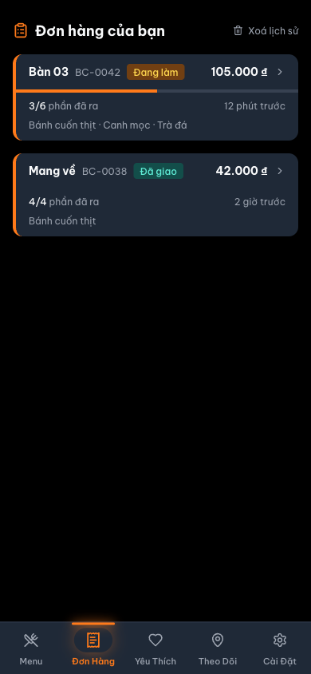
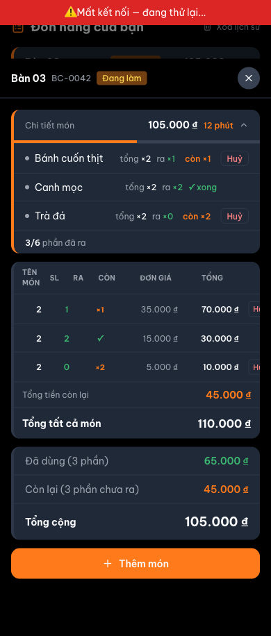
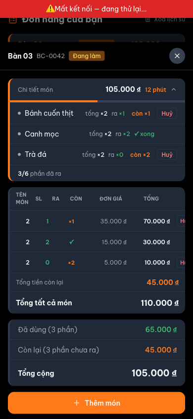

# Customer Order List — Mockup Trực Quan: Doc vs. Code vs. Đề Xuất Sửa + Feedback

> **Quy trình:** mỗi zone có **① Doc đang vẽ · ② Code render thật (ASCII) · ③ Đề xuất sửa**, kèm
> **📷 Ảnh chụp thật** và **💬 Feedback của bạn**. Bạn điền feedback vào ô đó → tôi chỉnh sửa theo.
>
> **Trạng thái ảnh chụp thật:** ✅ ĐÃ CHỤP (2026-06-21). Stack chạy đầy đủ qua `docker compose`
> (BE/FE/MySQL/Redis đều `running`). Chụp bằng Playwright MCP, viewport iPhone 390×844, trang
> `/order`. Vì luồng tạo đơn thật cần guest token + SSE session, ảnh được chụp bằng cách **seed
> một `order_cache_<id>` thực tế vào localStorage** rồi mở `/order` — đây CHÍNH là nguồn dữ liệu
> thật của trang (`order/page.tsx:10-24` đọc thẳng `ORDER_CACHE`, `OrderDetailSheet` vẽ từ cache
> trước khi gọi BE, `useOrderSSE.ts:33-38`). Ảnh lưu ở `./screenshots/<zone>_real.png`.
> Ngày: 2026-06-21. File này chỉ đọc — không sửa code/doc app.

---

## 🟢 Zone B — Order card (danh sách đơn)

Nguồn code: `order/page.tsx:90-147`

### ① Doc đang vẽ (`customer_order_list.md:15-22`)
```
┃ Bàn 03  #BC-0042  [preparing]   105.000đ  ▸
┃ ▓▓▓▓▓▓▓▓░░░░░░░░  (progress, active only)
┃ 3/6 phần đã ra              12 phút trước
┃ Bánh cuốn thịt · Canh mọc · Trà đá
```

### ② Code render THẬT — khớp doc
```
┌────────────────────────────────────────────────┐
│ Bàn 03  BC-0042  [Đang làm]      105.000 ₫  ▸ │  ◀── StatusBadge (preparing→"Đang làm")
│ ▓▓▓▓▓▓▓▓▓▓░░░░░░░░░░  (active-only, h-1)        │  ◀── progress = served/total (combo header lọc bỏ)
│ 3/6 phần đã ra                   12 phút trước  │  ◀── totalServed/totalQty · timeAgo()
│ Bánh cuốn thịt · Canh mọc · Trà đá              │  ◀── displayItems.slice(0,3) + "+N món"
└────────────────────────────────────────────────┘
   • border-l-4 border-primary (viền cam trái) khớp doc
   • "Mang về" hiện khi table_name = null (đơn #BC-0038) — doc ASCII có vẽ dòng này
```

### ③ Đề xuất sửa doc
```
Không cần sửa — ASCII doc khớp code. (Ghi chú nhỏ: badge hiển thị nhãn tiếng Việt
"Đang làm"/"Đã giao" qua StatusBadge, không phải chữ "preparing"/"delivered" như trong ngoặc.)
```

| 📷 Ảnh chụp thật | 💬 Feedback của bạn |
|---|---|
| <br>⚠ **Bằng chứng:** 2 card render đúng từ `ORDER_CACHE` — card active có thanh tiến độ + "3/6 phần đã ra", card "Mang về" (delivered) KHÔNG có thanh tiến độ (`isActive` gate `order/page.tsx:95,118`). |  |

---

## 🟡 Zone D — Detail overlay (OrderDetailSheet)

Nguồn code: `OrderDetailSheet.tsx:170-419`

### ① Doc đang vẽ (`customer_order_list.md:39` — Zones table, MỘT dòng)
```
| Detail overlay | features/order/components/OrderDetailSheet | GET /orders/:id |
   → doc chỉ mô tả overlay bằng 1 dòng "slide-up detail for the tapped order"
```

### ② Code render THẬT — overlay GIÀU hơn nhiều (3 card + 2 modal)
```
┌────────────────────────────────────────────────┐
│ Bàn 03  BC-0042  [Đang làm]                 ✕  │  ◀── header sheet (OrderDetailSheet.tsx:182-200)
├────────────────────────────────────────────────┤
│ ┌── Card 1: "Chi tiết món" (collapsible) ─────┐ │  ◀── :217-301
│ │ Chi tiết món      105.000 ₫   12 phút   ⌄   │ │
│ │ ▓▓▓▓▓▓▓▓▓▓░░░░░░  (progress bar)            │ │
│ │ • Bánh cuốn thịt   tổng×2 ra×1 còn×1  [Huỷ] │ │  ◀── DishRow (xem Zone D2)
│ │ • Canh mọc         tổng×2 ra×2  ✓ xong      │ │
│ │ • Trà đá           tổng×2 ra×0 còn×2  [Huỷ] │ │
│ │ 3/6 phần đã ra                              │ │
│ └─────────────────────────────────────────────┘ │
│ ┌── Card 2: bảng tổng kết món ────────────────┐ │  ◀── :304-359
│ │ Tên món | SL | Ra | Còn | Đơn giá | Tổng | _│ │
│ │ Bánh…   |  2 |  1 | ×1  | 35.000  | 70.000│H│ │
│ │ Canh…   |  2 |  2 |  ✓  | 15.000  | 30.000│ │ │
│ │ Trà đá  |  2 |  0 | ×2  |  5.000  | 10.000│H│ │
│ │ Tổng tiền còn lại            45.000 ₫       │ │
│ │ Tổng tất cả món              110.000 ₫      │ │
│ └─────────────────────────────────────────────┘ │
│ ┌── Card 3: tổng tiền ────────────────────────┐ │  ◀── :362-379
│ │ Đã dùng (3 phần)             65.000 ₫       │ │
│ │ Còn lại (3 phần chưa ra)     45.000 ₫       │ │
│ │ Tổng cộng                    105.000 ₫      │ │
│ └─────────────────────────────────────────────┘ │
│ [ Huỷ toàn bộ đơn hàng ]  (nếu canCancelOrder) │  ◀── :393-400
│ [ + Thêm món ]            (nếu order.table_id)  │  ◀── :403-415
└────────────────────────────────────────────────┘
   + 2 modal overlay riêng: thông báo (confirmed/ready/cancelled :421-468)
                            & xác nhận huỷ (:470-505)
   + banner "Đơn hàng đã hoàn thành" khi status=delivered (:381-390)
```

### ③ Đề xuất sửa doc
```
Mở rộng dòng "Detail overlay" trong Zones table thành mô tả 3-card + 2-modal,
hoặc thêm 1 mục ASCII riêng cho OrderDetailSheet trong customer_order_list.md.
KHÔNG phải lỗi code — chỉ là doc mô tả thiếu (overlay là phần nặng nhất của trang).
```

| 📷 Ảnh chụp thật | 💬 Feedback của bạn |
|---|---|
| <br>⚠ **Bằng chứng:** overlay render đủ 3 card + nút "Thêm món" — giàu hơn hẳn 1 dòng doc. (Banner đỏ "Mất kết nối — đang thử lại" ở trên là do ảnh chụp seed cache KHÔNG có guest token nên `GET /orders/:id` lỗi → reconnect banner sau 3 lần thử `useOrderSSE.ts:134` — đúng hành vi loading Area ④, không phải lỗi trang.) |  |

---

## 🟡 Zone D2 — DishRow (ẩn nhân + ghi chú)

Nguồn code: `OrderDetailSheet.tsx:510-544`

### ① Doc đang vẽ (`customer_order_list.md` — KHÔNG mô tả nội dung DishRow)
```
(doc không vẽ DishRow — chỉ nhắc "active orders show a served-progress bar")
```

### ② Code render THẬT — chỉ tên + SL, KHÔNG có nhân/ghi chú
```
┌─────────────────────────────────────────────────┐
│ • Bánh cuốn thịt   tổng ×2  ra ×1  còn ×1  [Huỷ] │  ◀── DishRow.tsx:521-543
└─────────────────────────────────────────────────┘
   item.toppings_snapshot = [{name:"Nhân thịt"}]  → KHÔNG hiển thị
   item.note              = "ít hành"             → KHÔNG hiển thị
   • DishRow chỉ render: name + tổng×quantity + ra×qty_served + còn×remaining + nút Huỷ
   • Sau TOP epic (migration 017) nhân = 1 topping trong toppings_snapshot → khách KHÔNG thấy
     mình đã chọn nhân gì, cũng không thấy ghi chú món
```

### ③ Đề xuất sửa doc + code
```
┌─────────────────────────────────────────────────┐
│ • Bánh cuốn thịt   tổng ×2  ra ×1  còn ×1  [Huỷ] │
│   ↳ Nhân thịt · "ít hành"                         │  ◀── ĐỀ XUẤT: render dòng phụ
└─────────────────────────────────────────────────┘
   FLAG 🟡 (code): DishRow nên render toppings_snapshot (nhân) + note để khách thấy
            đúng món đã đặt. Đăng ký MASTER_TASK trước khi sửa code.
   ❓ UNVERIFIED: chưa rõ product `name` có sẵn encode nhân hay chưa (vd "Bánh cuốn thịt"
            đã gồm chữ "thịt") — cần kiểm trước khi thêm để tránh lặp.
```

| 📷 Ảnh chụp thật | 💬 Feedback của bạn |
|---|---|
| <br>⚠ **Bằng chứng:** dòng "Bánh cuốn thịt" chỉ hiện `tổng ×2 · ra ×1 · còn ×1 · Huỷ` — KHÔNG có "Nhân thịt", KHÔNG có "ít hành" dù cả hai đã được seed vào `toppings_snapshot` + `note`. Đúng lỗi 🟡 (DishRow ẩn nhân/ghi chú). |  |

---

## Tổng hợp việc cần làm

| Zone | Sửa doc | Sửa code (đăng ký MASTER trước) |
|---|---|---|
| B — Order card | Tuỳ chọn: ghi chú badge hiển thị nhãn VN ("Đang làm") | — (khớp code) |
| D — Detail overlay | Mở rộng dòng "Detail overlay" thành mô tả 3-card + 2-modal trong `customer_order_list.md` | — (không phải lỗi code) |
| D2 — DishRow | Thêm mô tả DishRow ẩn nhân/ghi chú vào doc | 🟡 Render `toppings_snapshot` + `note` trong `DishRow` (`OrderDetailSheet.tsx:510-544`) |
