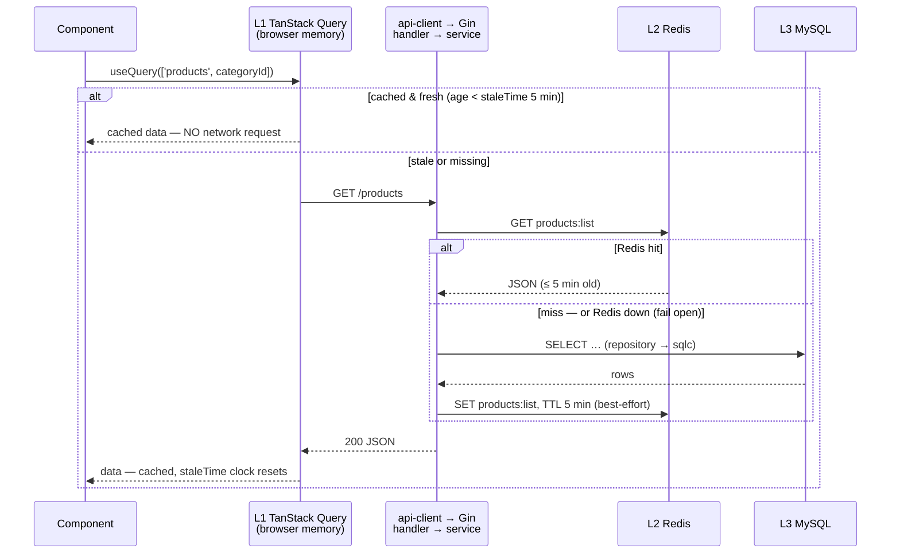
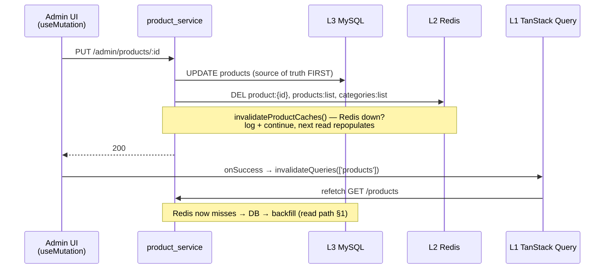
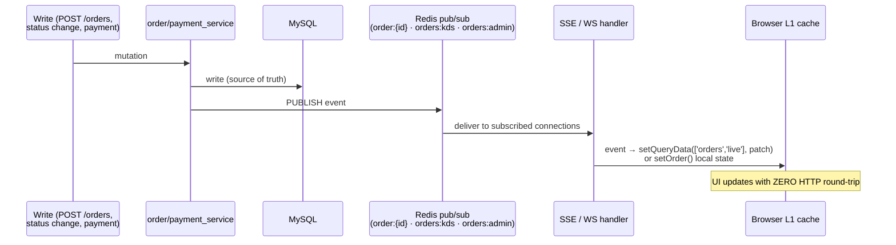

# Cache Flow End-to-End — FE → BE → DB

> **TL;DR**
> **Read:** component → TanStack cache (fresh? stop here) → HTTP → Gin → service → Redis (hit? return)
> → MySQL → backfill Redis → response → TanStack caches it.
> **Write:** mutate MySQL FIRST → `DEL` Redis keys → 200 → FE `invalidateQueries` → next read repopulates both layers.
> **Realtime (orders):** skips caching entirely — Redis pub/sub → SSE/WS → patch TanStack cache in place.
> Layer ownership and cross-layer rules → [CACHING_INDEX.md](CACHING_INDEX.md).
> Visual version of all three flows → [caching_flow.excalidraw](caching_flow.excalidraw).

---

## 1 — Read Path (catalog data: products, categories, combos, toppings)

The only data family cached at both layers. Example: menu page loads products.

Two independent freshness clocks:

| Step | Cache | Freshness window | Set where |
|---|---|---|---|
| 1st check | TanStack `staleTime` | 5 min (catalog) · 60 s (default) | query hook / `providers.tsx` |
| 2nd check | Redis TTL | 5 min (`productCacheTTL`) | `product_service.go:21` |

The FE staleTimes for catalog were deliberately set to **match** the Redis TTL — keep them in sync
if either changes.

---

## 2 — Write Path (admin mutates a product)

Order matters: **DB first, then delete keys, never update cached values in place.**

**The two-sided contract** (cross-layer Rule 1 in [CACHING_INDEX.md §3](CACHING_INDEX.md#3--cross-layer-rules-the-ones-no-single-layer-doc-states)):

| Side | Who | What | If skipped |
|---|---|---|---|
| BE | service layer | `DEL` affected Redis keys after DB write | every OTHER client reads stale Redis for ≤ 5 min |
| FE | mutation `onSuccess` | `invalidateQueries` matching key | the MUTATING client shows its own stale L1 data |

---

## 3 — Staleness Budget per Data Family

Worst case for a client that did **not** perform the write (no push channel):

| Data family | L1 staleTime | L2 Redis | Push channel | Worst-case staleness |
|---|---|---|---|---|
| Products / categories / combos / toppings | 5 min | 5 min TTL | none | **≤ 10 min** (5 + 5) — accepted for catalog |
| Orders (live lists, single order) | 60 s | **never cached** | SSE / WS patch | **~0** — pushed instantly |
| Staff tasks | 15 s | never cached | none (polling) | ≤ 15 s |
| Payments / analytics | 60 s | never cached | KDS/admin WS for payment status | ≤ 60 s |
| Staff `is_active` (auth check) | n/a (BE-internal) | 5 min TTL | none | ≤ 5 min — deliberate fail-open trade-off, see [REDIS_CACHE.md §4](../03_be/REDIS_CACHE.md) |

---

## 4 — Realtime Bypass: Orders Are Pushed, Not Cached

Order state changes never wait for a cache to expire — they skip HTTP entirely on the notify path:

- Redis pub/sub here is **transport, not cache** — messages are ephemeral, nothing is stored.
- `useOverviewWS` patches the shared `['orders','live']` query cache in place; `useOrderSSE`
  patches component-local `useState`. Detail: [STATE_MANAGEMENT.md — SSE Events → Query Cache](../04_fe/STATE_MANAGEMENT.md).
- Channel list: [REDIS_CACHE.md §3](../03_be/REDIS_CACHE.md).

---

## 5 — Adding Caching to New Data: Decision Checklist

Before adding ANY new cache key or staleTime override:

1. Is it on the "must NEVER be cached" list ([REDIS_CACHE.md §2](../03_be/REDIS_CACHE.md))? → stop.
2. Read-heavy AND rarely changing? If not → no Redis key; tune FE staleTime only.
3. Does the staleness budget (§3 math: FE staleTime + Redis TTL) hurt any user? → shrink or push instead.
4. Redis side: cache-aside only, one TTL constant, `DEL` on every write path, fail-open.
5. FE side: matching `invalidateQueries` in every mutation that touches it.
6. Document: add the key to [REDIS_CACHE.md §2](../03_be/REDIS_CACHE.md) and the family to §3 above.

---

## Deep Dive Sources

| Topic | File |
|---|---|
| Layer map + cross-layer rules | [CACHING_INDEX.md](CACHING_INDEX.md) |
| Redis keys / TTL / fail-open / pub-sub | [../03_be/REDIS_CACHE.md](../03_be/REDIS_CACHE.md) |
| FE query keys + staleTime overrides | [../04_fe/STATE_MANAGEMENT.md](../04_fe/STATE_MANAGEMENT.md) |
| SSE/WS handler architecture | [../03_be/REALTIME_SSE.md](../03_be/REALTIME_SSE.md) |
| Code | `be/internal/service/product_service.go` (TTL + invalidation) · `fe/src/lib/providers.tsx` (defaults) · `fe/src/hooks/useOverviewWS.ts` (cache patch) |
