# Client Flow Diagrams

> Complete client-side user flow diagrams for the BanhCuon Restaurant Management System.
> Roles: `guest` · `chef` · `cashier` · `staff` · `manager` · `admin`

---

## Table of Contents

1. [Authentication Flows](#1-authentication-flows)
   - 1.1 [Staff Login](#11-staff-login)
   - 1.2 [Auto Token Refresh](#12-auto-token-refresh)
   - 1.3 [Guest QR Auth](#13-guest-qr-auth)
   - 1.4 [Logout](#14-logout)
   - 1.5 [Account Deactivation](#15-account-deactivation)
2. [Customer QR Ordering Flow](#2-customer-qr-ordering-flow)
   - 2.1 [Full Customer Journey](#21-full-customer-journey)
   - 2.2 [Add Items to Existing Order](#22-add-items-to-existing-order)
3. [Kitchen Display System (KDS)](#3-kitchen-display-system-kds)
4. [POS & Payment Flow](#4-pos--payment-flow)
   - 4.1 [Cashier POS](#41-cashier-pos)
   - 4.2 [Payment Processing](#42-payment-processing)
5. [Admin Dashboard Flows](#5-admin-dashboard-flows)
   - 5.1 [Admin Overview (Live Floor)](#51-admin-overview-live-floor)
   - 5.2 [Staff Management](#52-staff-management)
   - 5.3 [Product/Category/Topping CRUD](#53-productcategorytopping-crud)
   - 5.4 [QR Marketing](#54-qr-marketing)
6. [Real-Time Event Flows](#6-real-time-event-flows)
   - 6.1 [SSE — Customer Order Tracking](#61-sse--customer-order-tracking)
   - 6.2 [WebSocket — Chef Updates Item → Customer Sees It](#62-websocket--chef-updates-item--customer-sees-it)
7. [Role × Route Access Matrix](#7-role--route-access-matrix)

---

## 1. Authentication Flows

### 1.1 Staff Login

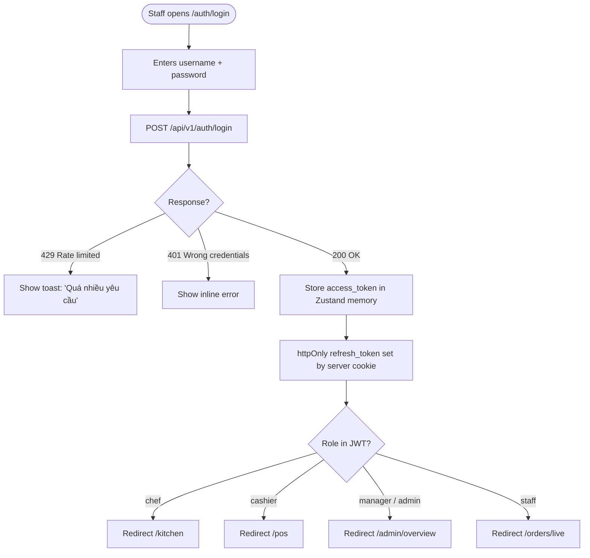

**Key rules:**
- Rate limit: 5 attempts / min / IP
- `access_token` stored **in memory only** (Zustand) — never localStorage
- `refresh_token` is httpOnly cookie (XSS-safe)
- JWT payload: `sub` (staff_id) · `role` · `jti` · `exp` (24 h)

---

### 1.2 Auto Token Refresh

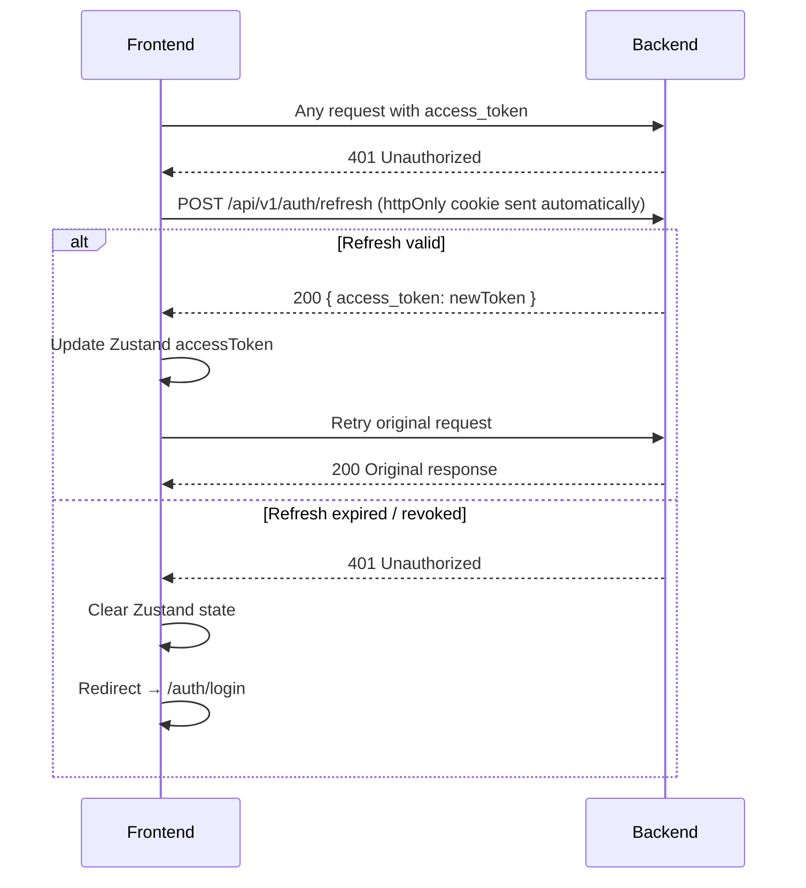

---

### 1.3 Guest QR Auth

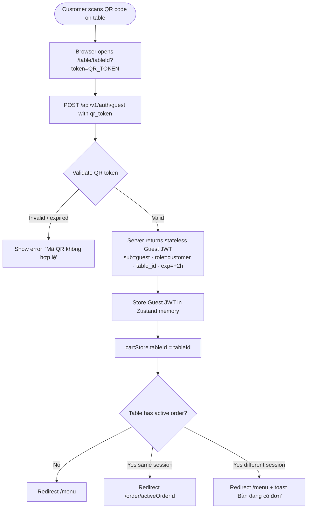

**Key rules:**
- Guest JWT is **stateless** — no Redis lookup, verified by HMAC only
- Expires in 2 hours — no refresh mechanism; customer re-scans QR to renew
- Scope locked: can only POST `/orders` for own `table_id`

---

### 1.4 Logout

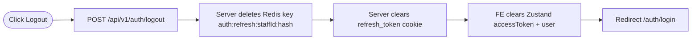

**Multi-session note:** Logging out on Device A does **not** affect Device B — each device holds its own refresh token.

---

### 1.5 Account Deactivation

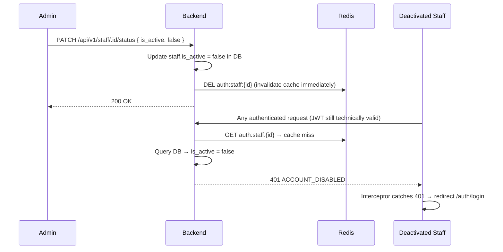

---

## 2. Customer QR Ordering Flow

### 2.1 Full Customer Journey

```mermaid
flowchart TD
    QR([Scan QR]) --> AUTH[Guest JWT auth\nsee flow 1.3]
    AUTH --> MENU[/menu — Browse products]

    MENU --> CAT[Select category tab\nTất cả / Bánh Cuốn / Chả / Combo]
    CAT --> CARD[Click product card]
    CARD --> AVAIL{is_available?}
    AVAIL -- false --> BADGE[Show 'Hết hàng' badge — no action]
    AVAIL -- true --> HAS_TOP{Has toppings?}
    HAS_TOP -- Yes --> TOP_MODAL[ToppingModal\nMulti-select checkboxes\nRunning total updates]
    HAS_TOP -- No (combo) --> COMBO_MODAL[ComboModal\nFixed price\nItems list]
    TOP_MODAL --> ADD_CART[cartStore.addItem]
    COMBO_MODAL --> ADD_CART
    ADD_CART --> MORE{Add more?}
    MORE -- Yes --> MENU
    MORE -- No → open cart --> CART[CartDrawer FAB\nItem list · qty adjusters · total]

    CART --> CHECKOUT[/checkout]
    CHECKOUT --> FORM[Fill form\ncustomer_name · phone · note · payment_method]
    FORM --> VALIDATE{Zod validation}
    VALIDATE -- Fail --> ERR[Inline field errors]
    VALIDATE -- Pass --> POST_ORDER[POST /api/v1/orders]
    POST_ORDER --> ORDER_ERR{Response?}
    ORDER_ERR -- 409 Table busy --> TOAST_BUSY[Toast 'Bàn đang có đơn']
    ORDER_ERR -- 4xx/5xx --> TOAST_ERR[Toast error]
    ORDER_ERR -- 201 Created --> CLEAR_CART[Clear cartStore]
    CLEAR_CART --> TRACK[Redirect /order/orderId]

    TRACK --> SSE[Connect SSE\nGET /api/v1/orders/:id/events]
    SSE --> DISPLAY[Show order details\nProgress bar · Item status dots · Total]
    DISPLAY --> EVENTS{SSE event?}
    EVENTS -- item_progress --> UPDATE_ITEM[Update qty_served · status dot]
    EVENTS -- order_status_changed --> UPDATE_STATUS[Update order status badge]
    EVENTS -- order_completed --> DONE[Order ready — all items served]

    DISPLAY --> CANCEL{Progress < 30%?}
    CANCEL -- Yes --> BTN_CANCEL[Show 'Huỷ đơn' button]
    BTN_CANCEL --> CONFIRM[Confirmation modal]
    CONFIRM --> DELETE[DELETE /api/v1/orders/:id]
    DELETE --> REDIRECT_MENU[Redirect /menu]
    CANCEL -- No --> NO_BTN[Button hidden]
```

---

### 2.2 Add Items to Existing Order

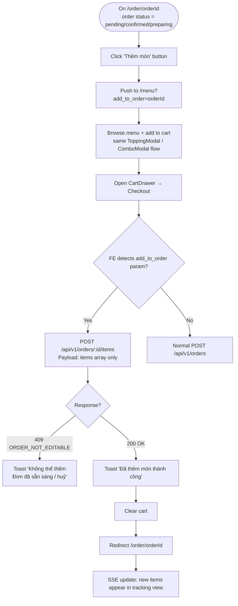

---

## 3. Kitchen Display System (KDS)

```mermaid
flowchart TD
    LOGIN([Chef logs in]) --> GUARD{Role = chef or staff?}
    GUARD -- No --> FORBIDDEN[403 — redirect /auth/login]
    GUARD -- Yes --> KDS[/kitchen — KDS page]

    KDS --> FETCH[GET /api/v1/orders/live\nInitial load of active orders]
    KDS --> WS[Connect WebSocket\nws://api/v1/ws/kds?token=JWT]

    WS --> WS_EVT{WS event?}
    WS_EVT -- new_order --> ADD_CARD[Add order card\nto 'Chờ xác nhận' column]
    WS_EVT -- item_updated --> UPDATE_DOT[Update item status dot\n■ gray=pending · ■ yellow=preparing · ■ green=done]
    WS_EVT -- order_cancelled --> REMOVE_CARD[Remove order card + toast]

    ADD_CARD --> CHEF_ACT
    UPDATE_DOT --> CHEF_ACT
    CHEF_ACT{Chef action?}
    CHEF_ACT -- Click item --> CYCLE[PATCH /orders/:id/items/:item_id/status\nServer increments qty_served]
    CHEF_ACT -- Click flag 🚩 --> FLAG[PATCH /orders/:id/items/:item_id/flag\nHighlights item in orange]

    CYCLE --> DERIVE{qty_served vs quantity?}
    DERIVE -- 0 < x < qty --> YELLOW[Status: preparing]
    DERIVE -- x = qty (last item) --> GREEN[Status: done]
    GREEN --> CHECK_ALL{All items done?}
    CHECK_ALL -- Yes --> AUTO_READY[Server: order.status = ready\nBroadcast order_completed SSE → customer notified\nBroadcast WS → POS notified]
    CHECK_ALL -- No --> PARTIAL[Partial completion shown]
```

**Combo display rule:** Backend expands combos into sub-item rows. KDS only shows sub-items (`combo_ref_id IS NOT NULL`) — chef cooks individual dishes, not combo headers.

---

## 4. POS & Payment Flow

### 4.1 Cashier POS

```mermaid
flowchart TD
    LOGIN([Cashier logs in]) --> GUARD{Role = cashier or staff?}
    GUARD -- No --> FORBIDDEN[403]
    GUARD -- Yes --> POS[/pos — 3-panel layout]

    POS --> LEFT[Left: Table grid\nEmpty=gray · Active=orange · Ready=green]
    POS --> MIDDLE[Middle: Current order details]
    POS --> RIGHT[Right: Menu panel]

    LEFT --> SELECT_TABLE[Click table]
    SELECT_TABLE --> LOAD_ORDER[Load table's active order\ninto Middle panel]

    RIGHT --> ADD_ITEM[Click product → add to current order]
    ADD_ITEM --> QTY_UPDATE[Update Middle panel totals]

    LOAD_ORDER --> PAY_BTN{Order status = ready?}
    PAY_BTN -- Yes --> PAY_HIGHLIGHT[Highlight 'Thanh Toán' button green]
    PAY_BTN -- No --> PAY_NORMAL['Thanh Toán' button normal]

    PAY_HIGHLIGHT --> NAVIGATE[Navigate /cashier/payment/orderId]
    PAY_NORMAL --> NAVIGATE

    POS --> NEW_ORDER[Click 'Tạo đơn mới']
    NEW_ORDER --> FORM[Optional: customer_name · phone · note]
    FORM --> POST_POS[POST /api/v1/orders\nsource=pos · created_by_role=cashier]
    POST_POS --> KDS_WS[WS event → KDS: new_order]
```

---

### 4.2 Payment Processing

```mermaid
flowchart TD
    PAY_PAGE([/cashier/payment/orderId]) --> SHOW_TOTAL[Show order total\nPayment method radio buttons]
    SHOW_TOTAL --> METHOD{Select method}

    METHOD -- Cash COD --> COD[Click 'Xác nhận COD']
    COD --> POST_COD[POST /api/v1/payments\n{ order_id, method: cod }]
    POST_COD --> COD_OK{Response?}
    COD_OK -- 200 success --> COD_DONE[Order → delivered\nwindow.print receipt\nRedirect /pos]
    COD_OK -- error --> COD_ERR[Toast error]

    METHOD -- VNPay / MoMo / ZaloPay --> QR_BTN[Click 'Tạo mã QR']
    QR_BTN --> POST_QR[POST /api/v1/payments\n{ order_id, method: vnpay|momo|zalopay }]
    POST_QR --> QR_RESP[Response: { qr_code_url, status: pending }]
    QR_RESP --> SHOW_QR[Display QR image on screen]
    SHOW_QR --> CUSTOMER[Customer scans QR on phone\nCompletes payment on gateway]
    CUSTOMER --> WEBHOOK[Gateway → POST /api/v1/webhooks/vnpay\nBackend verifies HMAC]
    WEBHOOK --> WS_PAY[Backend broadcasts WS: payment_success]
    WS_PAY --> FE_RECV[FE receives payment_success event]
    FE_RECV --> PAY_DONE[Toast 'Thanh toán thành công'\nwindow.print receipt\nRedirect /pos]

    METHOD -- VNPay / MoMo / ZaloPay --> PROOF[Optional: Upload transfer screenshot]
    PROOF --> PATCH_PROOF[PATCH /api/v1/payments/:id/proof\nmultipart image upload]
```

---

## 5. Admin Dashboard Flows

### 5.1 Admin Overview (Live Floor)

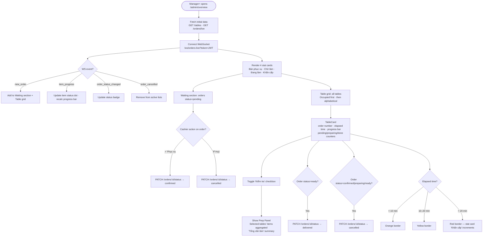

---

### 5.2 Staff Management

```mermaid
flowchart TD
    A([Admin+ opens /admin/staff]) --> B[GET /api/v1/staff — list all staff]
    B --> C[Render staff table\nName · Role · Status · Actions]

    C --> CREATE[Click 'Tạo nhân viên']
    CREATE --> FORM_NEW[Form: username · password · full_name · role · phone · email]
    FORM_NEW --> VALIDATE_NEW{Zod validation\nusername 3-50 chars\npassword 8+ uppercase+number}
    VALIDATE_NEW -- Fail --> FORM_ERR[Inline errors]
    VALIDATE_NEW -- Pass --> POST_STAFF[POST /api/v1/staff]
    POST_STAFF --> REFRESH[Refresh list]

    C --> EDIT[Click Edit staff]
    EDIT --> FORM_EDIT[Form: full_name · phone · email · role\nNote: username immutable]
    FORM_EDIT --> PERM_CHECK{Requester role}
    PERM_CHECK -- Staff editing self --> ROLE_LOCKED[Role field disabled]
    PERM_CHECK -- Manager editing staff < manager --> ROLE_ALLOWED[Role field editable]
    PERM_CHECK -- Admin --> FULL_EDIT[All fields editable except self]
    ROLE_LOCKED --> PATCH_STAFF[PATCH /api/v1/staff/:id]
    ROLE_ALLOWED --> PATCH_STAFF
    FULL_EDIT --> PATCH_STAFF

    C --> DEACTIVATE[Click Deactivate]
    DEACTIVATE --> CONFIRM[Confirmation dialog]
    CONFIRM --> PATCH_STATUS[PATCH /api/v1/staff/:id/status\n{ is_active: false }]
    PATCH_STATUS --> REDIS_DEL[Server deletes Redis cache\nauth:staff:id immediately]
    REDIS_DEL --> EFFECT[Staff's next request → 401 ACCOUNT_DISABLED\nStaff redirected to login]

    C --> SESSIONS[Click 'Phiên đăng nhập']
    SESSIONS --> GET_SESSIONS[GET /api/v1/staff/:id/sessions]
    GET_SESSIONS --> SESSION_LIST[Show: user_agent · IP · created_at · expires_at]
    SESSION_LIST --> REVOKE[Click Revoke session]
    REVOKE --> DELETE_SESSION[DELETE /api/v1/staff/:id/sessions/:session_id]
```

---

### 5.3 Product/Category/Topping CRUD

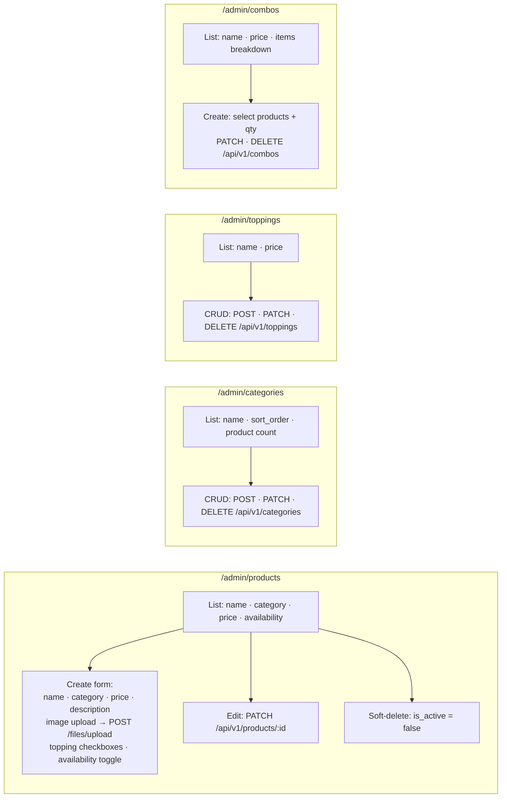

---

### 5.4 QR Marketing

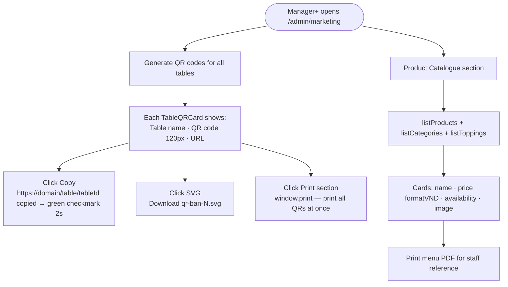

---

## 6. Real-Time Event Flows

### 6.1 SSE — Customer Order Tracking

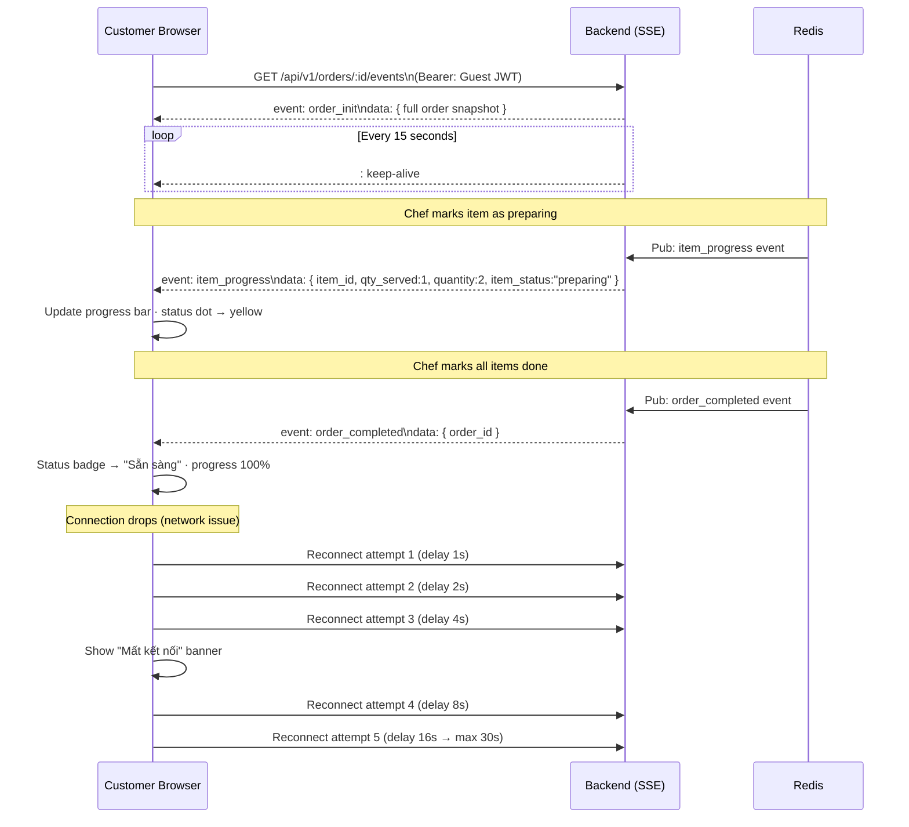

**SSE event types:**

| Event | When |
|---|---|
| `order_init` | First connection — full snapshot |
| `order_status_changed` | Order status transitions |
| `item_progress` | Chef updates `qty_served` |
| `order_completed` | All items done → order = ready |
| `: keep-alive` | Every 15 s |

---

### 6.2 WebSocket — Chef Updates Item → Customer Sees It

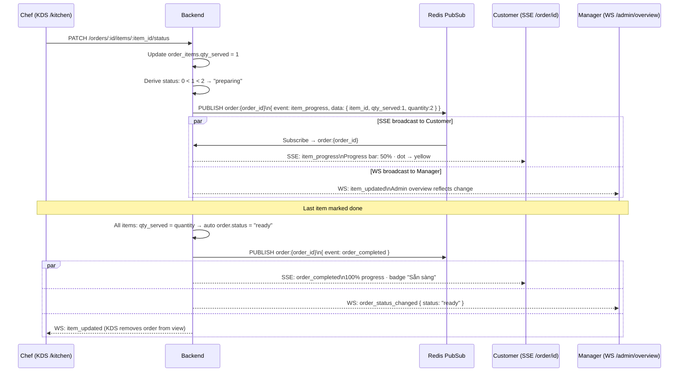

---

## 7. Role × Route Access Matrix

| Route | public | guest | chef | cashier | staff | manager | admin |
|---|:---:|:---:|:---:|:---:|:---:|:---:|:---:|
| `/auth/login` | ✅ | ✅ | ✅ | ✅ | ✅ | ✅ | ✅ |
| `/table/[tableId]` | ✅ | ✅ | — | — | — | — | — |
| `/menu` | — | ✅ | — | — | — | — | — |
| `/menu/product/[id]` | — | ✅ | — | — | — | — | — |
| `/menu/combo/[id]` | — | ✅ | — | — | — | — | — |
| `/checkout` | — | ✅ | — | — | — | — | — |
| `/order/[id]` | — | ✅ | — | — | — | — | — |
| `/privacy-policy` | ✅ | ✅ | ✅ | ✅ | ✅ | ✅ | ✅ |
| `/terms` | ✅ | ✅ | ✅ | ✅ | ✅ | ✅ | ✅ |
| `/kitchen` | — | — | ✅ | — | ✅ | ✅ | ✅ |
| `/pos` | — | — | — | ✅ | ✅ | ✅ | ✅ |
| `/cashier/payment/[id]` | — | — | — | ✅ | ✅ | ✅ | ✅ |
| `/orders/live` | — | — | — | — | ✅ | ✅ | ✅ |
| `/admin/overview` | — | — | — | — | — | ✅ | ✅ |
| `/admin/products` | — | — | — | — | — | ✅ | ✅ |
| `/admin/categories` | — | — | — | — | — | ✅ | ✅ |
| `/admin/toppings` | — | — | — | — | — | ✅ | ✅ |
| `/admin/combos` | — | — | — | — | — | ✅ | ✅ |
| `/admin/staff` | — | — | — | — | — | ✅ | ✅ |
| `/admin/marketing` | — | — | — | — | — | ✅ | ✅ |
| `/admin/summary` | — | — | — | — | — | ✅ | ✅ |

> Role hierarchy: `guest < chef = cashier < staff < manager < admin`
> A ✅ means this role (or any role above it in the hierarchy for staff roles) can access the route.

---

*Generated from specs: `Spec1_Auth_Updated_v2.md` · `Spec_3_Menu_Checkout_UI_v2.md` · `Spec_4_Orders_API.md` · `Spec_5_Payment_Webhooks.md` · `Spec_6_QR_POS.md` · `Spec_7_Staff_Management.md` · `Spec_9_Admin_Dashboard_Pages.md`*
